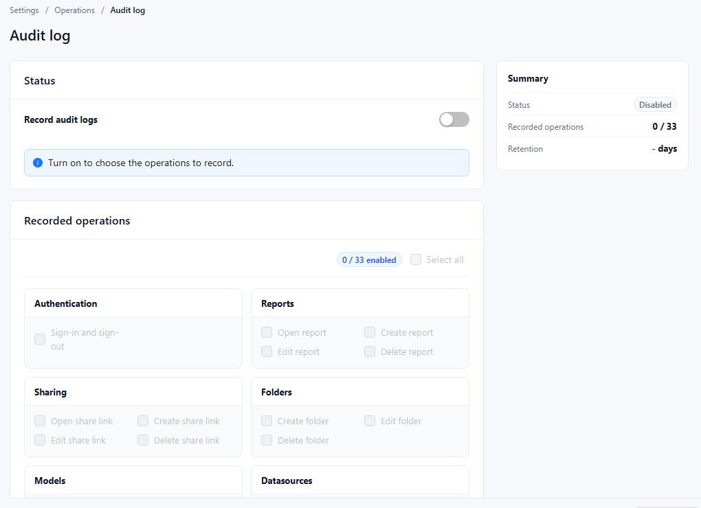

# Audit Log

The audit log records who performed which operation and when, for example who opened a report, deleted a model or changed a row security policy. Administrators decide which operations are recorded and how long records are kept.

## Set up recording

Open **Settings › Operations › Audit log** as an administrator. The page appears when the `datafor-audit` plugin is installed.

| Area | What to set |
| --- | --- |
| **Status** › **Record audit logs** | Turn on to record anything. While it is off, the operations cannot be chosen ("Turn on to choose the operations to record."). |
| **Recorded operations** | Tick the operations to record. **Select all** ticks every operation; the counter shows how many are enabled. |
| **Retention** › **Keep records for** | Number of days to keep records. |
| **Retention** › **Clear records** | Opens **Clear audit logs**: enter **Keep logs from the last** *n* days. Older records are removed immediately. |
| **Summary** | Shows the status, the number of recorded operations, and the retention. |

Click **Save** to apply the switch, the operation selection, and the retention.

An operation is recorded only while **Record audit logs** and that operation are both on. Turning recording on later does not reconstruct earlier operations.

## Operations you can record

| Group | Operations |
| --- | --- |
| **Authentication** | **Sign-in and sign-out** |
| **Reports** | **Open report**, **Create report**, **Edit report**, **Delete report** |
| **Sharing** | **Open share link**, **Create share link**, **Edit share link**, **Delete share link** |
| **Folders** | **Create folder**, **Edit folder**, **Delete folder** |
| **Models** | **Create model**, **Edit model**, **Delete model** |
| **Datasources** | **Create data source**, **Edit data source**, **Delete data source** |
| **Security** | **Create row security**, **Edit row security**, **Delete row security**, **Create object security**, **Edit object security**, **Delete object security** |
| **Dictionaries** | **Create dictionary**, **Edit dictionary**, **Delete dictionary** |
| **Other operations** | **Create parameter**, **Edit parameter**, **Delete parameter**, **Create token**, **Edit token**, **Delete token**, **System settings changes** |

The page lists the operations the server reports, so a server with other plugins may show more or fewer.

## Viewing the records

The console has no page that lists or exports audit records. The **Audit log** page only controls what is recorded and how long it is kept.

## Auditing permission and configuration changes

| Change | Recorded operation (group) |
| --- | --- |
| Row security (RLS) policy created, edited or switched on or off, deleted | **Create row security**, **Edit row security**, **Delete row security** (Security) |
| Object security (OLS) policy created, edited or switched on or off, deleted | **Create object security**, **Edit object security**, **Delete object security** (Security) |
| Saved changes on **Settings › General › System configuration** | **System settings changes** (Other operations) |

Data Security records identify the user, the operation, the target and the operation's progress, but they are not a snapshot of the rules before and after the change.

A **System settings changes** record lists each changed setting with its value before and after the save. If the audit entry cannot be written, the settings are still saved and the page shows "Settings were saved, but the audit entry failed. Check the audit service." See [System Configuration](/documentation/System/System-Configuration/).

File and folder ACL edits, role membership changes, User Type changes, ownership changes, and model security-setting changes have no equivalent entries. Keep a separate change record for them, and keep the identity provider's audit records when memberships come from an external system. For how these permissions combine, see [Permission Evaluation Overview](/documentation/System/Permission-Evaluation-Overview/).
