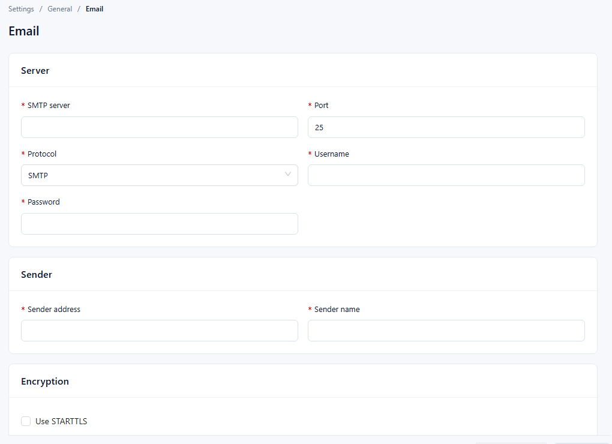

# Mail Server Configuration

Datafor sends all its email through the SMTP server configured on the **Email** page:

- alert notifications;
- verification codes for a forgotten password;
- verification codes for self-registration, when registration is allowed;
- the result of a data upload approval, sent to the user who uploaded the file.

Without a working mail server, these emails are not sent. Only administrators can open the page.

## 1. Open the Email page

Go to **Settings › General › Email**.

## 2. Fill in the settings

All fields in **Server** and **Sender** are required.

| Section | Field | What to enter | Notes |
| --- | --- | --- | --- |
| Server | **SMTP server** | Host name of the SMTP server, e.g. `smtp.example.com`. | |
| Server | **Port** | SMTP port. Common values: `25` (unencrypted), `465` (SSL), `587` (STARTTLS). | The form starts with `25`. |
| Server | **Protocol** | **SMTP** or **SMTPS**. | Use the one your mail provider requires. |
| Server | **Username** | Account used to sign in to the SMTP server. | |
| Server | **Password** | Password of that account. | Some providers require an app password instead of the mailbox password. |
| Sender | **Sender address** | Address that appears as the sender, usually the same mailbox as **Username**. | Must be a valid email address ("Enter a valid email address"). |
| Sender | **Sender name** | Display name of the sender. | |
| Encryption | **Use STARTTLS** | Select to upgrade the connection with STARTTLS. | Optional. |
| Encryption | **Use SSL/TLS** | Select to connect over SSL/TLS. | Optional. |

## 3. Test the connection

Click **Test connection** at the bottom of the page.

- The test uses the values **currently in the form**, including changes you have not saved, so you can try settings before saving them.
- All required fields must be filled in before the test runs.
- The server sends a test message with those values to the **Sender address**. The result appears as **Test passed**, or as **Test failed** with the reason returned by the mail server.

## 4. Save

Click **Save**. The button is available once you have changed something. If you leave the page with unsaved changes, Datafor asks you to keep editing, discard the changes, or save and leave.

## 5. Troubleshooting

| Problem | Likely cause | What to do |
| --- | --- | --- |
| **Test failed** with an authentication error | Wrong **Username** or **Password**, or the provider requires an app password | Check the account, and generate an app password if the provider uses them. |
| **Test failed** with a connection or timeout error | Wrong **SMTP server** or **Port**, or a firewall blocks the port | Check the host and port with your provider, and allow outbound traffic to that port. |
| SSL/TLS errors | Encryption options do not match the port | Match **Use SSL/TLS** or **Use STARTTLS** and **Protocol** to what the provider requires for that port. |
| Emails are blocked or never arrive | Provider security policy | Allow SMTP or third-party access for the account, and check the recipient's spam folder. |
