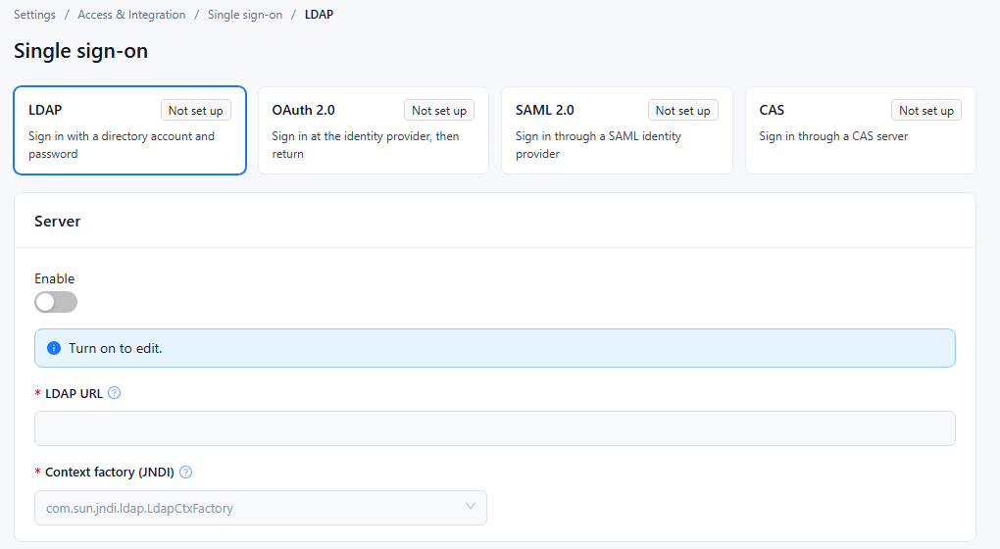

## Single sign-on page

LDAP, OAuth 2.0, SAML 2.0 and CAS are configured on one page: **Settings › Access & Integration › Single sign-on**. A card per method at the top shows its status: **On** (enabled), **Off** (configured but not enabled), or **Not set up** (the method's address field is empty: **LDAP URL**, **Authorization endpoint**, **IdP SSO URL** or **CAS server URL**); **Unknown** means the status could not be read. Select a card to show that method's settings below it; if the current method has unsaved changes, Datafor asks you to save or discard them first. The cards refresh after each save. Each method has an **Enable** switch; while it is off, the fields are locked and the page shows "Turn on to edit." The **New users** group sets up accounts for first-time users: **Create users on first sign-in**, **Default user type** and **Default role**.

## 1. LDAP settings

Select the **LDAP** card ("Sign in with a directory account and password"). Fields marked * are required while **Enable** is on.

| Section | Field | What to enter | Notes |
| --- | --- | --- | --- |
| Server | **Enable** | Turn on to use LDAP sign-in. | Turn on before editing the other fields. |
| Server | **LDAP URL** * | Directory server address with protocol and port, e.g. `ldap://127.0.0.1:389` or an `ldaps://` address. | While empty, the card shows **Not set up**. |
| Server | **Context factory (JNDI)** * | `com.sun.jndi.ldap.LdapCtxFactory` | The only option, selected by default. |
| Authentication | **Authentication method** * | **Simple authentication** or **Anonymous authentication**. | |
| Authentication | **Bind DN** | DN of the account Datafor uses to connect to the directory, e.g. `cn=admin,dc=example,dc=com`. | |
| Authentication | **Bind password** | Password of the **Bind DN** account. | |
| New users | **User DN pattern** * | Template that builds a user's DN from the name typed at sign-in, e.g. `cn=${username},dc=example,dc=com`. | `${username}` is replaced by the sign-in name. |
| New users | **Create users on first sign-in** | Select to create the Datafor user automatically the first time a directory user signs in. | |
| New users | **Default user type** | User type given to users created this way, e.g. `Reader`. | Available only when **Create users on first sign-in** is selected. |
| New users | **Default role** | One or more roles given to users created this way. | Same as above. |

## 2. Test and save

1. Click **Test connection** to check the connection to the LDAP server with the values currently in the form; you don't have to save first. The button is available only while **Enable** is on. A successful check shows **Validation successful**; otherwise the error is shown.
2. Click **Save**. The button is available once something has changed.

- To switch LDAP off, turn off **Enable** and click **Save**. With **Enable** off, Datafor saves without checking the required fields.
- If **Create users on first sign-in** is cleared when you save, **Default user type** and **Default role** are cleared as well.

## 3. Troubleshooting

| Problem | Likely cause | What to do |
| --- | --- | --- |
| **Test connection** fails to reach the server | Wrong **LDAP URL**, port or protocol, or a firewall in between | Check the address and that the Datafor server can reach the directory port. |
| **Test connection** reports an authentication error | Wrong **Bind DN** or **Bind password**, or the wrong **Authentication method** | Check the bind account, or use **Anonymous authentication** if the directory allows it. |
| Users cannot sign in | **User DN pattern** does not match the directory structure | Compare the pattern with a real user DN in the directory. |
| No Datafor user is created on first sign-in | **Create users on first sign-in** is off | Select it, set **Default user type** and **Default role**, then save. |
