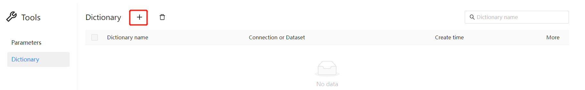
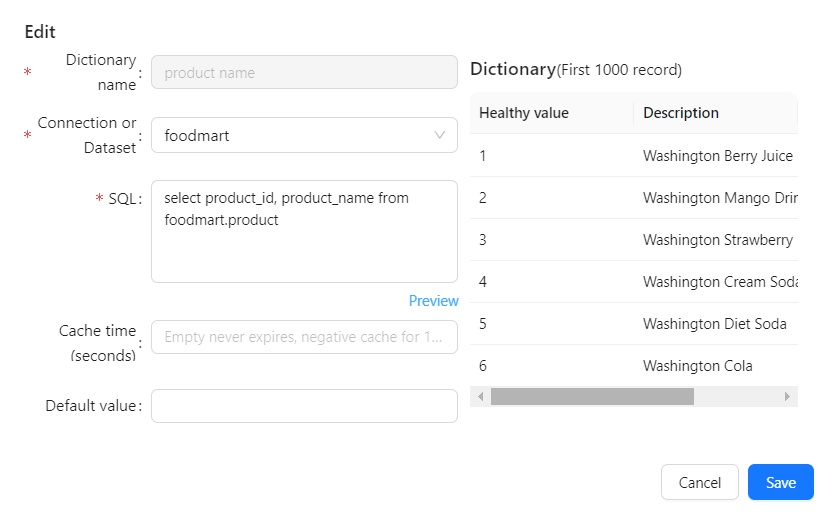
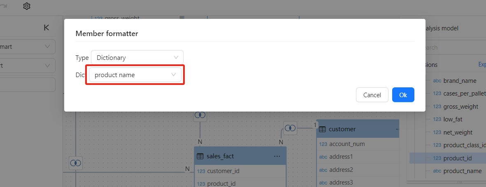
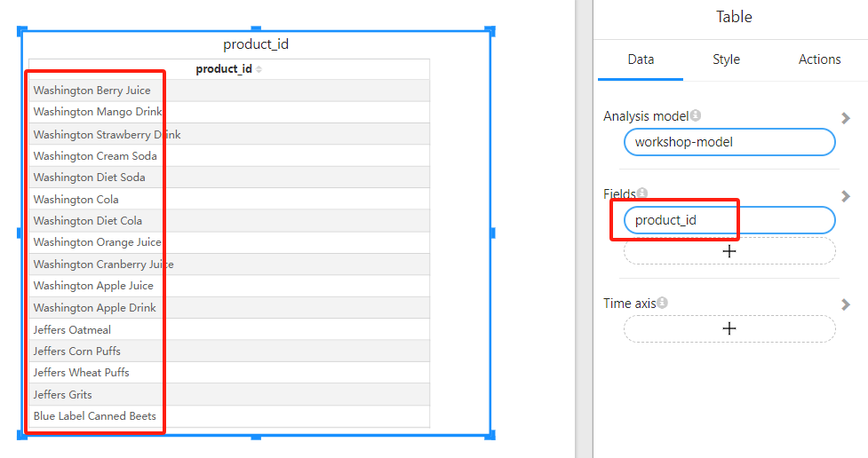

# Data Dictionary

A data dictionary maps stored keys, such as product IDs or status codes, to the text that reports show instead. It is defined by a SQL query whose first column is the key and whose second column is the display value.

Use a dictionary when the display text is not in the Attribute's own table, for example when it lives in another table or another datasource. If the text is in the same table, set the Attribute's **Caption column** instead; no dictionary is needed.

## Create a dictionary

Dictionaries are managed in **Tools › Dictionary**, which is available to users with the **Create content** capability (not in the Community edition).

1. Click **+** (**New**).

   

2. Fill in the dialog:

   | Field | What to enter |
   | --- | --- |
   | **Dictionary name** | Unique name. It cannot be changed later. |
   | **Connection or Dataset** | The datasource the SQL runs on. |
   | **SQL** | A query that returns two columns: the key first, the display value second, for example `select product_id, product_name from product`. Further columns are ignored. |
   | **Cache time (seconds)** | How long the values are cached. As the field hint says: empty never expires; a negative value caches for 1 day. |
   | **Default value** | Text shown for members whose key the dictionary does not contain. |

3. Click **Preview** to check the result. The preview shows the first 1,000 records and reports "Two columns data required" if the query returns fewer than two columns.

   

4. Click **Save**.

To change a dictionary, click its name or choose **Edit** in its row menu. **Delete** in the same menu removes it; check first that no model uses it as a member formatter.

## Apply a dictionary to an Attribute

1. Open the Analysis Model and select the Attribute that holds the keys, for example `product_id`.
2. In the properties pane, expand **Advanced** and click **Member formatter**.
3. Set **Type** to **Dictionary** and choose the dictionary in **Dict**.

   

4. Click **OK**, then save the model.

Reports that use the Attribute now show the dictionary values in place of the keys:

For the other member formatter types, see [Business Semantics for AI](/documentation/Model/Business-Semantics-for-AI/).
