# 🌍 GeoJSON Map

## Feature Overview

Datafor provides a visual tool for managing and maintaining GeoJSON map data. Through this interface, you can:

- Add world or country/region administrative maps  
- Bind GeoJSON map data files  
- Set map and region aliases to match your data fields  
- Define the central coordinates (latitude and longitude) of each administrative area for GeoJSON map markers  
- Add sub-regions to maps (Datafor's GeoJSON map component supports drill-down)

<div align="left">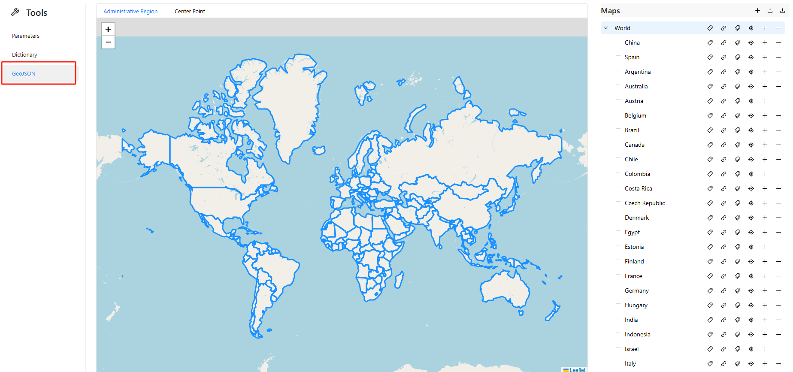</div>


## Common Operations Guide

### 1️⃣ Add a Country Map

1. Click the `➕` icon in the top-right corner of the “Maps” panel to add a country or region map.

<div align="left">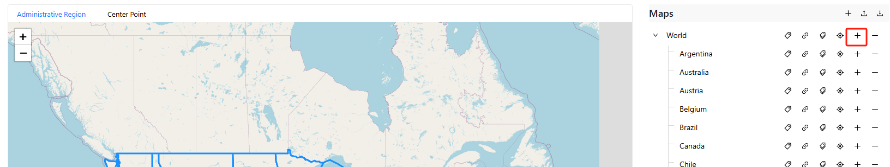</div>

2. The list shows countries or regions included in the “World” map.

<div align="left">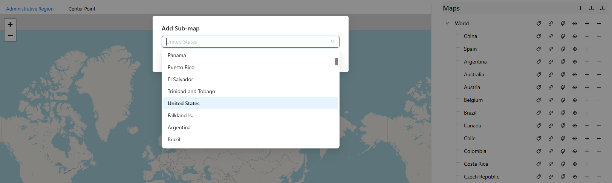</div>

3. For example, select “United States”.

<div align="left">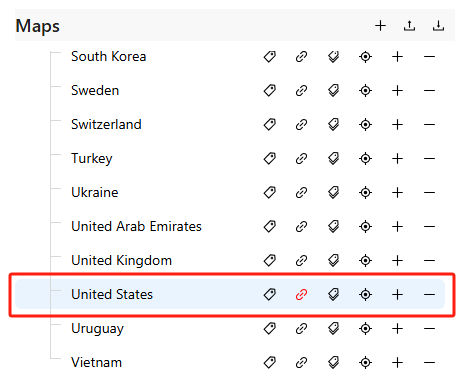</div>

### 2️⃣ Bind GeoJSON Map Data File

1. Locate the target map entry (e.g., United States) and click the 📎 icon to bind a data file.

   <div align="left">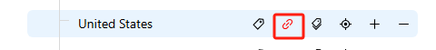</div>

2. In the upload window, select your GeoJSON file (must be under 1MB).

   <div align="left">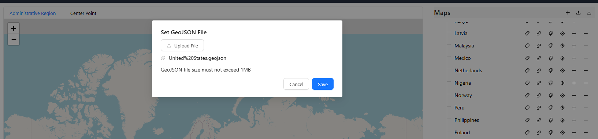</div>

3. Click **Save** to complete the binding.

   <div align="left">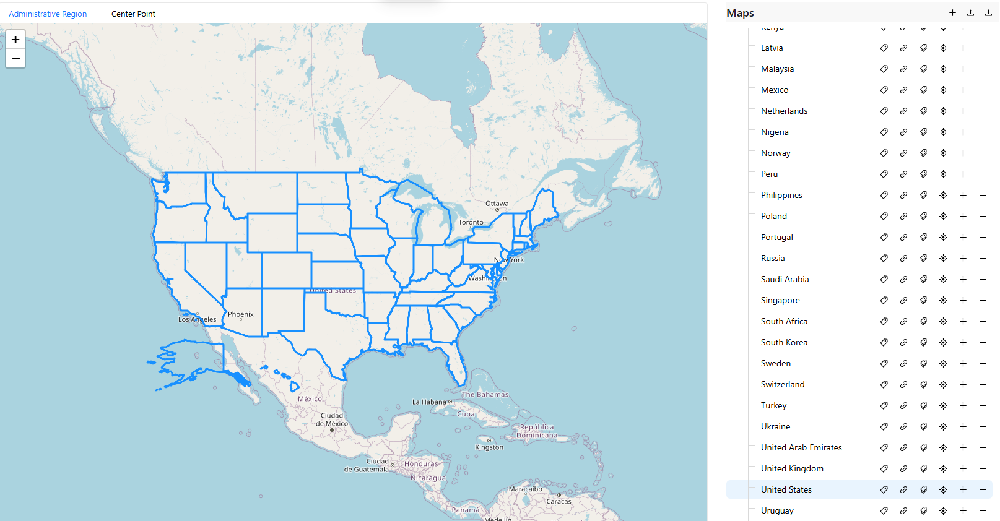</div>

### 3️⃣ Set Map Alias

To ensure consistency with your data fields, you can configure a map alias:

1. Click the ✏️ icon next to the target map.

   <div align="left">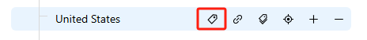</div>

2. Enter aliases such as `USA/United States/America` in the pop-up input box.

   <div align="left">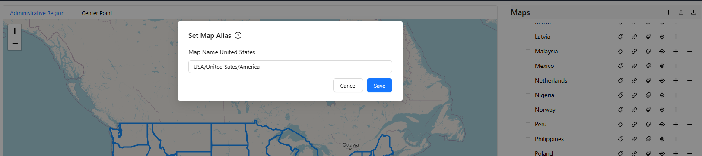</div>

3. Click **Save** to apply changes.


### 4️⃣ Set Region Aliases

If your map includes sub-regions (e.g., states or provinces), you can assign aliases for each:

1. Click the second ✏️ icon next to the target map.


   <div align="left">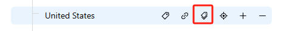</div>

   

2. In the pop-up window, enter aliases for each sub-region (batch import supported).

   <div align="left">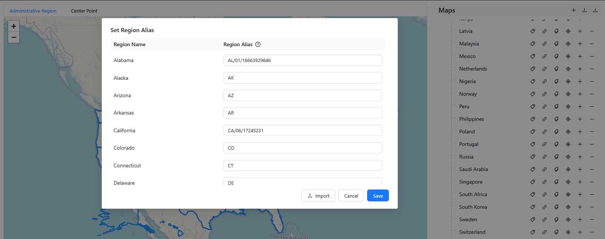</div>

3. Click **Save** to confirm.


### 5️⃣ Add Sub-region Maps (Drill-down Support)

You can use the GeoJSON map component to add drill-down sub-region maps (e.g., US states):

1. Click the ➕ icon next to the parent map.

   <div align="left">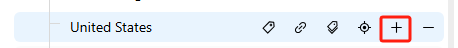</div>

2. In the “Add Sub-map” dropdown, search and select a sub-region (e.g., California).

   <div align="left">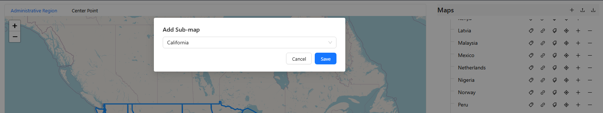</div>

3. The added sub-map will appear under the parent map.

   <div align="left">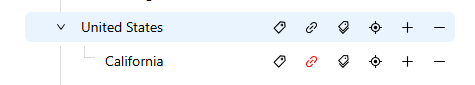</div>

4. You’ll also need to bind GeoJSON data for sub-regions using the same method.

   <div align="left">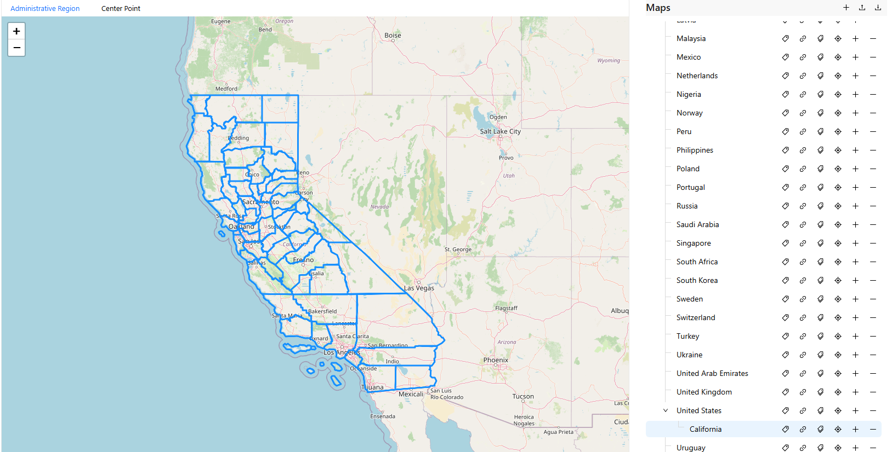</div>


### 6️⃣ Set Region Center Coordinates

Switch to the **Center Point** tab at the top of the map to define region center points:

1. All regions will be displayed as point markers on the map.

   <div align="left">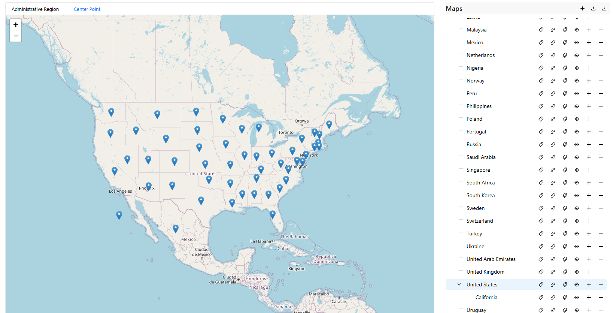</div>

2. Click the 📍 icon on the right to open the coordinate input window.


   <div align="left">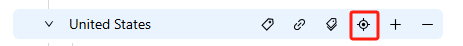</div>

3. You can manually enter latitude and longitude or use batch import.

   <div align="left">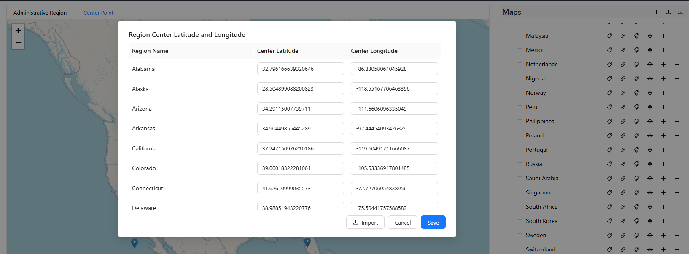</div>


## GeoJSON File Format Requirements

Uploaded map data must comply with standard GeoJSON structure as shown below:

```json
{
  "type": "FeatureCollection",
  "features": [
    {
      "type": "Feature",
      "properties": {
        "name": "California",
        "aliases": ["CA", "California"],
        "center": [-119.4179, 36.7783]
      },
      "geometry": {
        "type": "Polygon",
        "coordinates": [...]
      }
    }
  ]
}
```

### Field Descriptions:

| Field      | Description                                            |
| ---- |  |
| `name`     | Region name (system identifier)                        |
| `aliases`  | Region aliases for matching business data              |
| `center`   | Center coordinates of the region [longitude, latitude] |
| `geometry` | Region boundary; supports Polygon / MultiPolygon       |

## Recommendations

- Setting correct map and region aliases is crucial for accurate chart display.