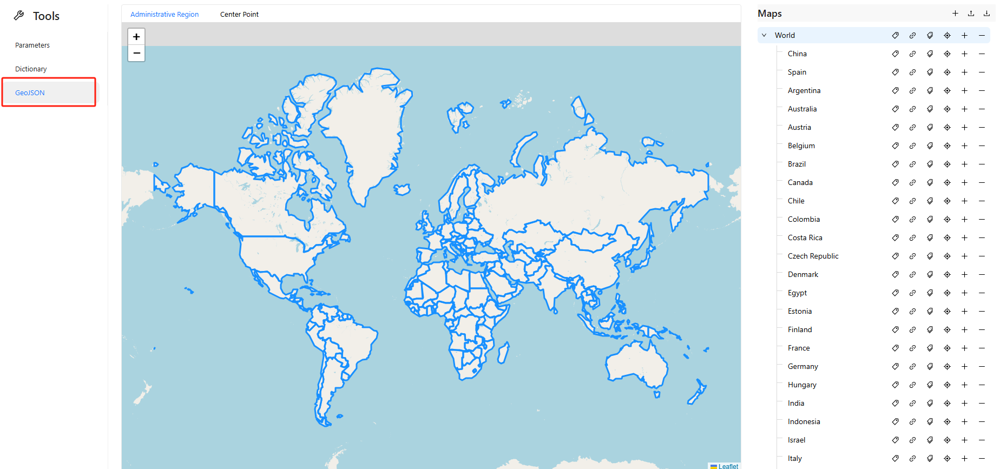
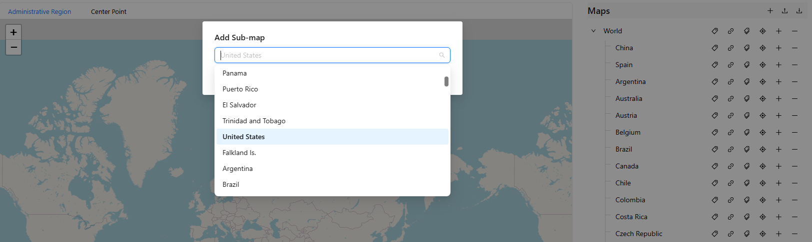
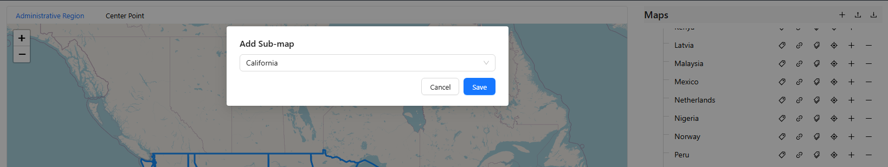
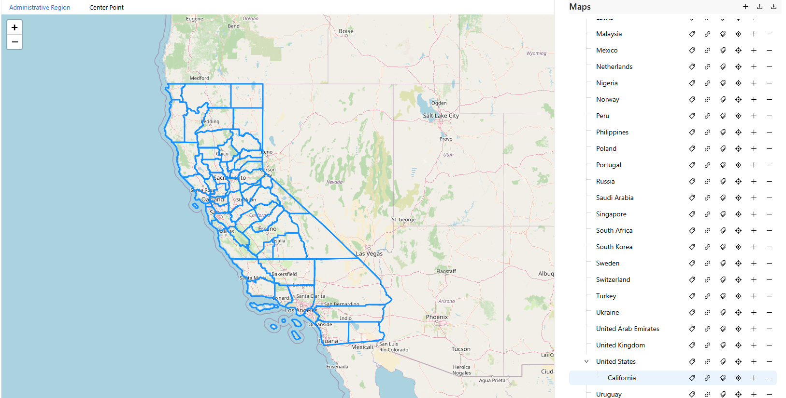
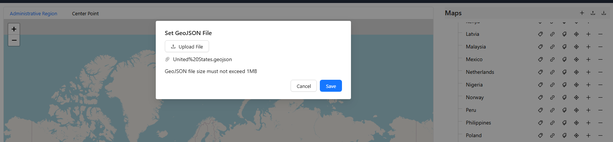
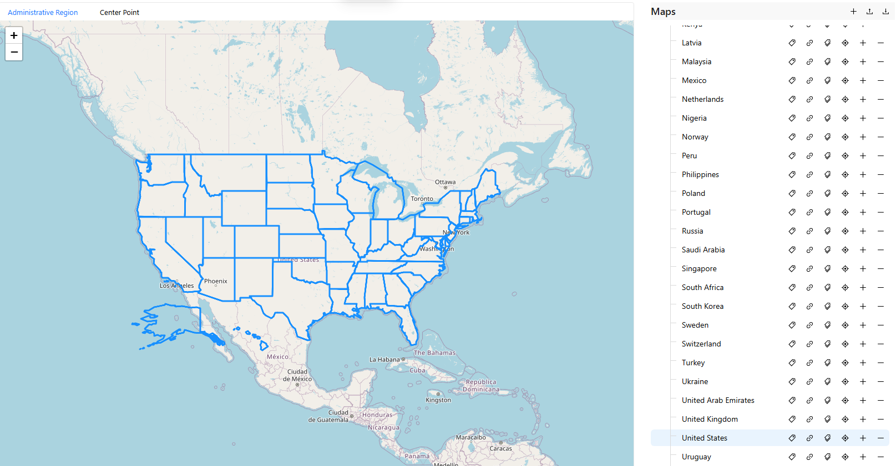
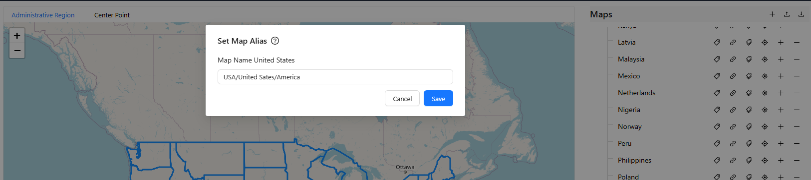
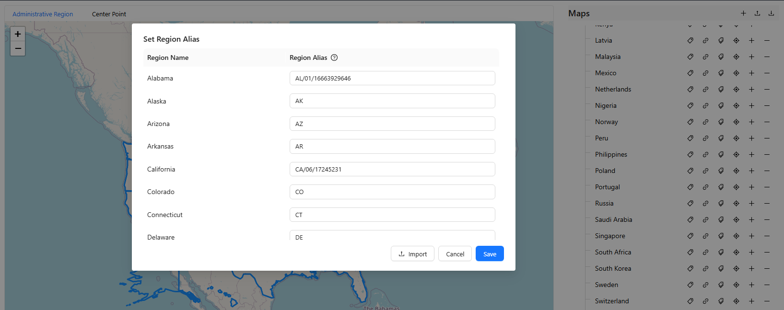
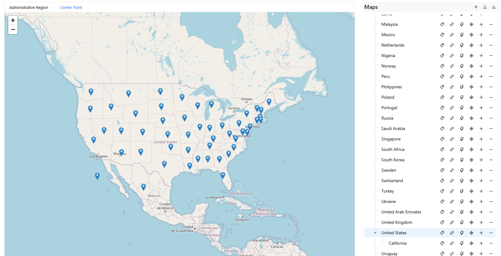
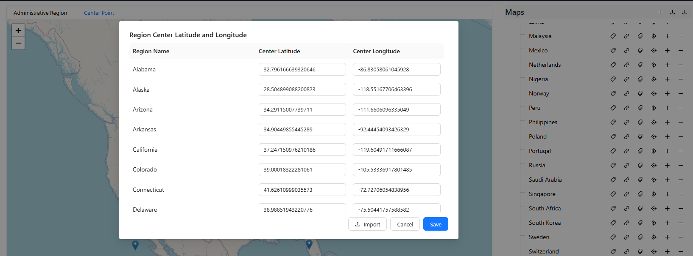

# GeoJSON Map

**Tools › GeoJSON** maintains the maps that the GeoJSON **Filled map** and **Marker map** components draw. Here you can:

- add maps and sub-maps for drill-down (for example **World → United States → California**);
- upload the GeoJSON file of each map;
- set aliases for a map and for its regions so that the names in your data match;
- set the centre (latitude and longitude) of each region, where marker maps place their points.

<div align="left"></div>

The map view on the left has two tabs: **Administrative Region** shows the region boundaries of the selected map, **Center Point** shows each region's centre as a point.

## The Maps tree

The buttons at the top of the **Maps** panel act on all maps:

| Button | Action |
| --- | --- |
| **Add Map** (+) | Add a new top-level map by name. |
| **Import** | Upload a `.zip` exported from this tool. Maps in the archive replace maps with the same name; other maps are kept. |
| **Export** | Download all maps as a `.zip`, for example to copy them to another server. |

Each map in the tree has these buttons (hover for the name):

| Button | Action |
| --- | --- |
| **Set Map Alias** | Other names of the map, separated by `/`. |
| **Set GeoJSON File** | Upload the map's GeoJSON file. The icon is red while no file is bound. |
| **Set Region Alias** | Other names for each region of the map. |
| **Set Region Center** | Latitude and longitude of each region's centre. |
| **Add Map** (+) | Add a sub-map, chosen from the regions of this map. |
| **Delete Map** (−) | Delete the map and all its sub-maps, after confirmation. |

## Add a map or sub-map

1. On the parent map (for example **World**), click **Add Map** (+).
2. In **Add Sub-map**, search for and select the region, for example **United States**, and click **Save**.

   <div align="left"></div>

3. The new map appears under its parent. Bind its GeoJSON file (next section) before using it in a report.

The list in **Add Sub-map** comes from the parent's GeoJSON file, so a parent needs its file before you can add sub-maps to it. On **United States**, for example, it lists the states:

<div align="left"></div>

<div align="left"></div>

Sub-maps are what a GeoJSON map drills down to when a user clicks a region.

## Upload the GeoJSON file

1. Click **Set GeoJSON File** on the map.
2. Click **Upload File** and choose a `.json` or `.geojson` file. The file must not exceed 1 MB.

   <div align="left"></div>

3. Click **Save**. The map view shows the boundaries of the uploaded file.

   <div align="left"></div>

## Set aliases

**Set Map Alias** takes other names of the map separated by `/`, for example `USA/United States/America`.

<div align="left"></div>

**Set Region Alias** lists every region of the map by **Region Name**. Enter the other spellings your data uses in **Region Alias**, separated by `/`, for example `CA/06` for California, and click **Save**.

<div align="left"></div>

How report values are matched against region names, codes and aliases is described in [GeoJSON Filled Map](/documentation/Visualization/GeoJSON-Filled-Map/#how-region-values-are-matched). Do not give a region an alias that equals another region's name or code; that alias is never used, because the other region matches first.

## Set region centres

Click **Set Region Center** on the map and enter **Center Latitude** and **Center Longitude** for each region, then click **Save**. Switch the map view to **Center Point** to check the positions.

<div align="left"></div>

<div align="left"></div>

## Import aliases or centres from a file

Both region dialogs have an **Import** button that reads a `.xlsx`, `.xls` or `.csv` file:

- Only the first sheet is read.
- Column A is the region name. It must equal the **Region Name** shown in the dialog exactly; rows that match no region are ignored.
- For **Set Region Alias**, column B holds the aliases, separated by `/`. They are added to the aliases already entered; duplicates are dropped.
- For **Set Region Center**, column B is the latitude and column C the longitude. They replace the current values.

| A | B | C |
| --- | --- | --- |
| California | CA/06 | |
| Texas | TX/48 | |

Importing only fills the dialog. Click **Save** to keep the result.

## GeoJSON file format

Uploaded map data must be a standard GeoJSON `FeatureCollection`:

```json
{
  "type": "FeatureCollection",
  "features": [
    {
      "type": "Feature",
      "properties": {
        "name": "California",
        "aliases": ["CA", "California"],
        "center": [-119.4179, 36.7783]
      },
      "geometry": {
        "type": "Polygon",
        "coordinates": [...]
      }
    }
  ]
}
```

| Field | Description |
| --- | --- |
| `name` | Region name (system identifier) |
| `adcode` | Optional administrative code, such as the 6-digit code of a Chinese administrative division (110000 for Beijing) |
| `aliases` | Region aliases for matching business data |
| `center` | Center coordinates of the region [longitude, latitude] |
| `geometry` | Region boundary; supports Polygon / MultiPolygon |
