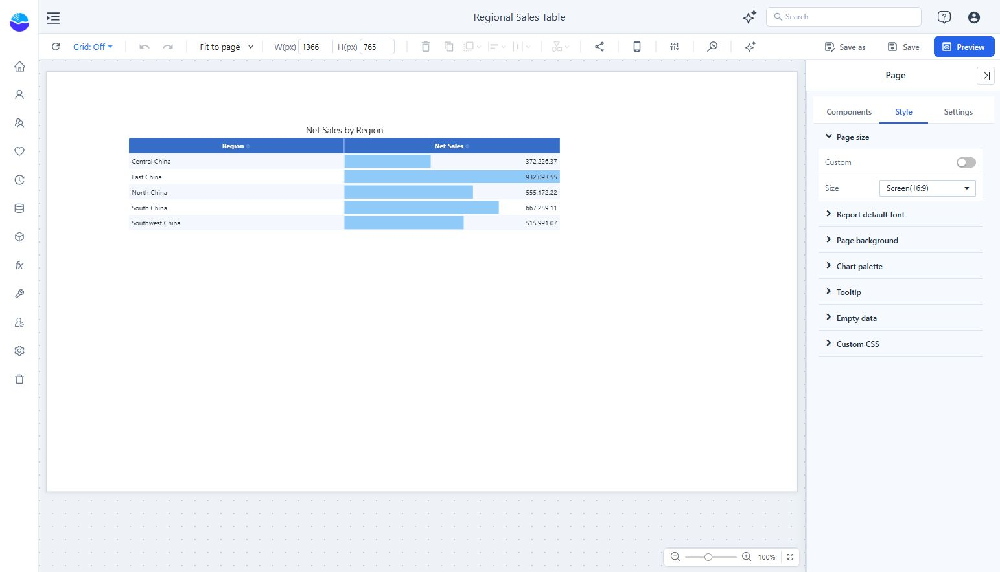
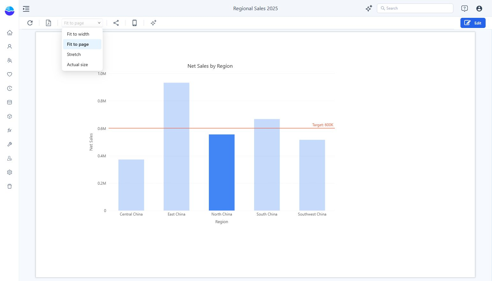

# Report Page Size and Display Settings

Set the design canvas size separately from the way the report fits the viewer’s window.

## Set the canvas size

1. In Edit mode, click an empty part of the canvas so the panel shows **Page**.
2. Open **Style → Page size**.
3. Choose a **Size** preset, or enable **Custom** and set the dimensions. The toolbar also shows **W (px)** and **H (px)** for the selected page or component.
4. Arrange the components inside the canvas and check the result in Preview.

Select the page before changing its dimensions. When a component is selected, the toolbar dimensions refer to that component.

## Choose the display mode

Use the toolbar’s display dropdown:

| Mode | Use it when |
| --- | --- |
| **Fit to page** | The whole canvas should fit within the available view. |
| **Fit to width** | The report should use the available width; a tall page may need scrolling. |
| **Actual size** | You need to inspect the design at its original size. |
| **Stretch** | The report should fill the available area; check the resulting proportions. |

Use a [mobile layout](/documentation/Visualization/Mobile-Layout-View/) when phone users need a different arrangement.
