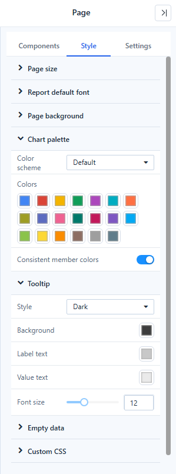
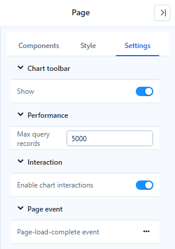

# Page Settings

Page settings apply to the whole report page. Click an empty part of the canvas: the panel title changes to **Page** and shows three tabs, **Components**, **Style** and **Settings**.

## Style tab

| Group | Settings | Notes |
| --- | --- | --- |
| **Page size** | **Custom**, **Size** (Screen(16:9), Screen(4:3), Pad, Phone, LED screen), width and height | See [Page size](#page-size) below. |
| **Report default font** | **System default** or a font from the list | Used by every chart element that has no font of its own, including tooltips. |
| **Page background** | **Background Color**, **Image** | |
| **Chart palette** | **Color scheme**, **Colors**, **Consistent member colors** | See [Colors and Color Schemes](/documentation/Visualization/Colors/). |
| **Tooltip** | **Style** (Dark, Light, Custom), **Background**, **Label text**, **Value text**, **Font size** (10–16 px, default 12) | Applies to the data tooltips of all charts on the page. See [Tooltips](/documentation/Visualization/Tooltips-for-Chart-Components/). |
| **Empty data** | **Show empty data message**, **Empty data text**, **Font** | The default for all components; a component can override it. See [Empty Data and Error Messages](/documentation/Visualization/Empty-Data-and-Errors/). |
| **Custom CSS** | CSS for the page | |

New reports take their font, colour scheme, tooltip style and empty-data message from **Settings › General › System configuration › Reports**. Changing those settings does not change existing reports.

## Settings tab

| Group | Setting | Default | What it does |
| --- | --- | --- | --- |
| **Chart toolbar** | **Show** | On | Shows the component toolbar (zoom, export, conditions…) on the components. |
| **Performance** | **Max query records** | 5,000 (from System configuration) | The most rows one component query returns. A component that hits the limit shows a warning icon: *Showing the first … of … rows*. Range 100–200,000. |
| **Interaction** | **Enable chart interactions** | On | Lets a click on a chart filter the other charts. See [Cross-filtering](/documentation/Analysis/Cross-Filtering/). |
| **Page event** | **Page-load-complete event** | Empty | A script that runs when the page has loaded. |

## Page size

1. Open **Style → Page size**.
2. Choose a **Size**, or turn on **Custom** and enter the width and height.
3. Check the layout in **Preview**.

The toolbar fields **W(px)** and **H(px)** show the size of whatever is selected: the page when nothing is selected, otherwise the component.

## Display mode

The toolbar list next to the zoom controls sets how the page fits the reader's window:

| Mode | Result |
| --- | --- |
| **Fit to page** | The whole page fits in the window. |
| **Fit to width** | The page uses the window width; tall pages scroll. |
| **Stretch** | The page fills the window; proportions can change. |
| **Actual size** | The page is shown at its designed size. |

For phones, design a separate [mobile layout](/documentation/Visualization/Mobile-Layout-View/).

Related: [Adding Components](/documentation/Visualization/Adding-Charts/) · [Report Editor Basics](/documentation/Start/Basic-Operations-for-Report-Design/)
