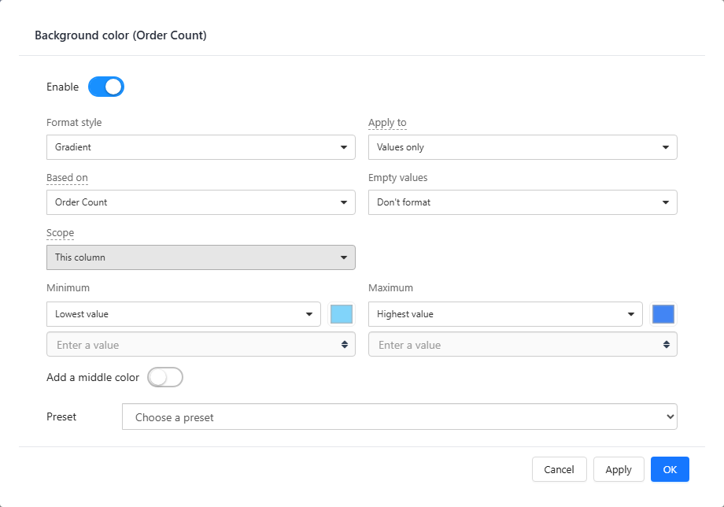
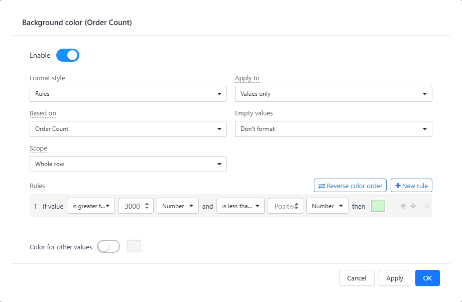
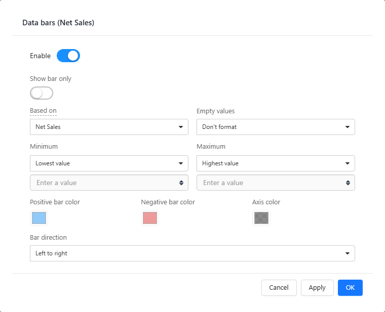
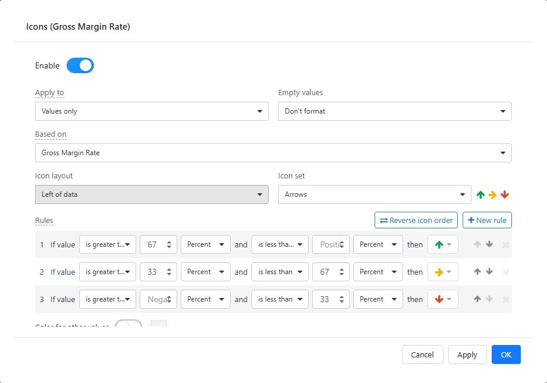

# Conditional Formatting

Conditional formatting changes how a cell looks based on its value. On **Table** and **Pivot table** measures there are four kinds, all in the measure's field menu (**Data → Fields → ⋮**):

| Item | Result |
| --- | --- |
| **Font color** | Colours the text. |
| **Background color** | Fills the cell, or the whole row. |
| **Data bars** | Draws a bar under the number, proportional to the value. |
| **Icons** | Shows an arrow, flag, star or other icon chosen by rules. |

Tree tables and parent-child tables do not have conditional formatting. Charts, maps, the decomposition tree and KPI cards colour data with the same rules editor in their **Style** panel.

All four dialogs start with **Enable** and end with **Apply**, **OK** and **Cancel**. **Cancel** after **Apply** restores the settings you had when you opened the dialog.

## Font color and Background color

| Setting | Options |
| --- | --- |
| **Format style** | **Gradient**: colours along a scale. **Rules**: one colour per value range. |
| **Apply to** | **Values only** (default), **Values and totals**, **Totals only**. Gradients always apply to values only. |
| **Based on** | The measure that decides the colour. Defaults to the column's own measure; choose another measure to colour this column by it. |
| **Empty values** | **Don't format** (default), **As zero**, or **Specific color**. |
| **Scope** (rules only) | **This column** or **Whole row**. |

### Gradient

- Set **Minimum** and **Maximum**: **Lowest value** / **Highest value** (from the data), a fixed **Number**, or a **Percent** of the range. Each end has its own colour.
- Turn on **Add a middle color** for a three-colour scale; the midpoint defaults to halfway.
- **Preset** fills the colours: sequential Blues, Greens, Oranges, Purples, or diverging Red–blue, Orange–purple, Brown–teal, Pink–green (with a middle colour).

With data-based ends, the colours stretch to whatever data the filters leave, so the same colour can mean different values on different selections. Use fixed numbers when a colour must always mean the same value. Values beyond a fixed end get the end colour.

### Rules

- Click **New rule**. Each rule reads *If value [is greater than] [3000] [Number] and [is less than] [ ] then [colour]*. Each boundary is a **Number** or a **Percent** of the range between the lowest and highest value.
- When rules overlap, the first rule wins. A warning icon marks a rule that overlaps an earlier one; use the arrows to reorder. **Reverse color order** swaps the colours top to bottom.
- **Color for other values** (off by default) colours values that match no rule.
- A boundary of 0 is a real boundary: *greater than 0* does not match negative values.

**Whole row** colours every cell of the row, including the dimension columns, when the rule matches. A cell's own *This column* rule wins over a whole-row rule. Whole-row colours apply to detail rows, not to subtotals and totals.

On a coloured background without a font rule, the text turns white when that reads better.

## Data bars

- **Minimum** and **Maximum**: **Lowest value** / **Highest value** or a fixed **Number** or **Percent**.
- When all values have the same sign, bars start at 0. With positive and negative values, 0 becomes the axis: positive bars go right, negative bars left, in **Positive bar color** and **Negative bar color**.
- **Show bar only** hides the number; the tooltip still shows it.
- **Bar direction**: **Left to right** or **Right to left**.

Bars are drawn on detail rows only.

## Icons

- **Icon set**: **Arrows**, **Triangles**, **Circles**, **Check marks**, **Flags** or **Stars**.
- **Icon layout**: **Left of data**, **Right of data**, or **Icon only**.
- The default rules split the range into thirds: top third green up arrow, middle yellow right arrow, bottom third red down arrow. Click a rule's icon to choose another icon or colour. **Reverse icon order** swaps them.

## Performance

**Lowest value**, **Highest value**, a middle point and any **Percent** boundary need the overall minimum and maximum, so the table runs two extra queries. Fixed **Number** ends avoid them. Changing only colours or the bar direction redraws without querying again.

## In exports

**Export as Excel** writes font and background colours as fixed cell colours, and data bars as Excel data bars when **Based on** is the measure itself. Icons are not exported. See [Export](/documentation/Visualization/Export/).

Related: [Table](/documentation/Visualization/Table/) · [Pivot table](/documentation/Visualization/Pivot-Table/) · [Table Styles](/documentation/Visualization/Table-Styles/)
