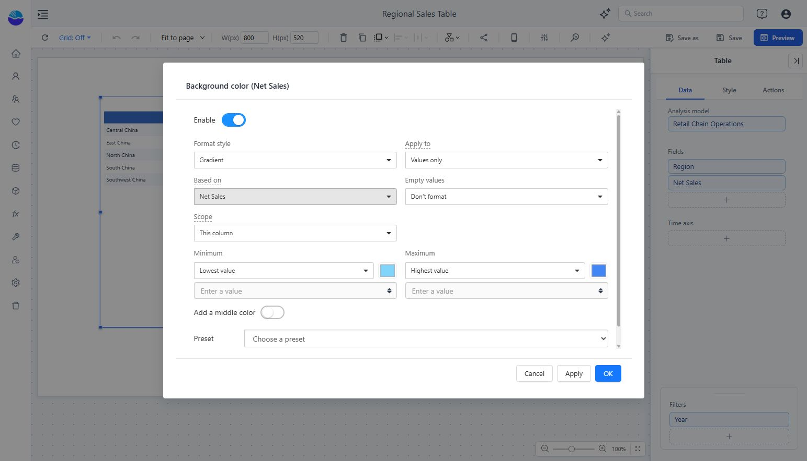
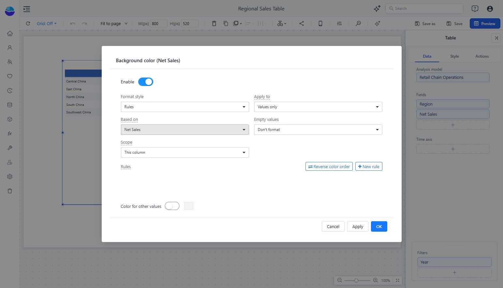

# Conditional Colors

Highlight table values using a gradient or explicit rules.

1. Select the table and open **Data**.
2. Open the measure’s **More** menu and choose **Font color** or **Background color**.
3. Turn on **Enable**.
4. Choose **Format style**, **Apply to**, **Based on**, **Empty values**, and **Scope**.
5. Configure the colors, click **Apply** to inspect the result, then **OK**.
6. Save the report and test with different filters.

## Gradient

Choose **Gradient** to map low and high values to colors. Set **Minimum** and **Maximum**, optionally **Add a middle color**, or choose a **Preset**.

Use a sequential palette for magnitude. Use a diverging palette around a meaningful midpoint, such as zero change. If bounds follow the lowest and highest values, filtering can change what each color represents.

## Rules

Choose **Rules**, then **New rule** to define thresholds and colors. Review **Color for other values** so unmatched values remain understandable.

Test values below, on, and above each boundary. **Based on** identifies the field that drives the formatting; it can differ from the field whose appearance is being changed. Treat empty values deliberately instead of silently presenting them as zero.

For length-based comparisons, use the measure menu’s **Data bars** option. See [Table](/documentation/Visualization/Table/).
