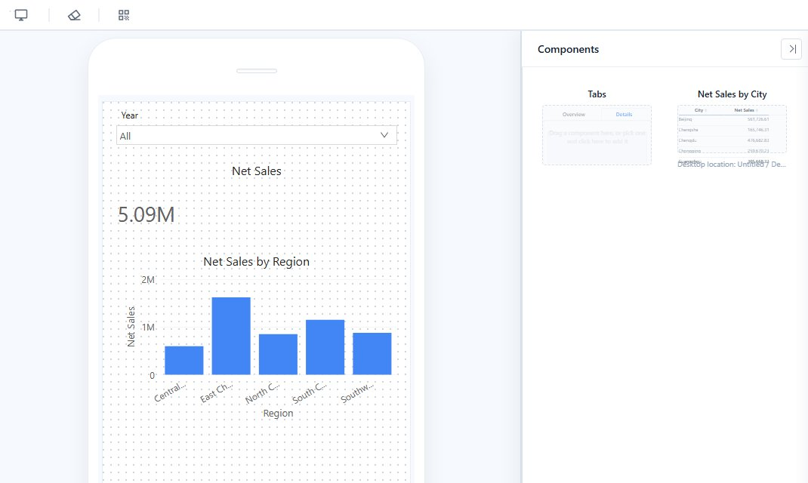

# Mobile Layout View

A report can have a mobile layout in addition to its desktop page. The mobile layout reuses the report's components, with the same data, filters, and interactions. You decide which components appear on the phone, where they go, and how large they are. You can also override their formatting for mobile only. Nothing you do in the mobile layout changes the desktop page.

## Open the mobile designer

1. Open the report in Edit mode. Save a new report first; the button stays disabled until the report has been saved.
2. On the toolbar, click **Mobile layout** (phone icon). If the desktop page has unsaved changes, you are asked to save them first.

The designer has three areas:

| Area | Purpose |
|---|---|
| Phone canvas (left) | The mobile page. It scrolls vertically and has no fixed height. |
| **Components** | Every component that is not yet on the phone, shown as a preview card. Components that sit inside a desktop Tabs container show **Desktop location: *tabs / page***. |
| Formatting panel (right) | Style settings of the selected component, applied to the mobile layout only. |

Toolbar: **Web layout** returns to the desktop designer, **Clean all** removes every component from the phone canvas, the QR code button opens a phone preview link, and **Save** saves the report.

## Build the layout

- **Add**: point to a card in **Components** and click **+**. The component is placed below the lowest component on the canvas, at full width, and is selected. Scroll the canvas down if you do not see it.
- **Move**: drag the component. It stays within the screen width.
- **Resize**: drag its lower-right corner. Most charts read best at the full width.
- **Remove**: select it and click **×**, or press **Delete**. It returns to **Components**; nothing is deleted from the report.
- **Start over**: **Clean all** returns every component to **Components** after you confirm.

Positions and sizes are stored relative to the screen width, so the same layout fits any phone. A component keeps its proportions: when the screen is wider, it also gets taller.

## Format for mobile

Select a component on the canvas. The formatting panel shows its **Style** settings, without the **Data**, **Analytics** or **Actions** tabs. Every change is saved as a mobile-only override; setting a value back to the desktop value removes the override.

Settings that define content or behavior are inherited from the desktop page and shown as read-only, for example:

- Title text and axis titles
- Axis minimum and maximum
- Number formats of data labels
- Conditional colors, colors by field, and series colors
- Tooltip fields, toolbar and interaction options, zoom sliders

Change these in the desktop designer. Typical mobile adjustments are font sizes, title alignment, legend position, data labels, padding, and borders.

## Tabs on the phone

Add the Tabs container itself to the canvas, then fill each tab separately for mobile:

1. Double-click the container's content area, or click **Edit tab contents**. A bar shows **Editing "*tab name*" | Done**.
2. Click a tab label to choose the page you are filling.
3. Click **+** on a card in **Components**. The component is added to the current page at the full tab width. Move and resize it inside the page.
4. Click **Done**, press **Esc**, or click outside the phone to finish.

On phones, the tab labels are always at the top and scroll sideways when they do not fit. Tabs cannot be nested in the mobile layout. Removing a Tabs container from the canvas also returns the components inside it to **Components**.

## Preview and share

- **QR code**: scan the code with a phone to open the report in its mobile layout. The link is temporary and stops working when you close the dialog. The phone must be able to reach the server: if you opened Datafor through `localhost`, the code also points to `localhost`; open Datafor through its network address before generating the code.
- **Preview on a computer**: open the report in View mode and click the phone icon on the toolbar. The mobile layout opens in a phone frame; **Web layout** goes back.
- **Links for phone users**: a phone opens the mobile layout automatically when the report has one. To force the mobile layout in any browser, add `__device=mobile` to the report or share URL, for example `.../api/open/<report>?__device=mobile`. The QR code link already includes it.

A phone shows only the components placed in the mobile layout. If the report has no mobile layout, the phone opens the desktop page instead. A link with `__device=mobile` shows a "no mobile layout yet" message for such a report.

Tablets (iPad, Android tablets) always open the desktop page. To see the mobile layout on a tablet, use a link with `__device=mobile`.

## How reports behave on a phone

- Swipe to scroll the page. Tables, wide decomposition trees, and the tab bar scroll inside their own area.
- Tap a bar, slice, or point to see its tooltip and filter the other components; tap it again to clear. Filters work as on the desktop.
- Tap a component to show its toolbar, for example to turn on drill-through, enlarge the component, or open **More**.
- When the phone rotates, the page is laid out again for the new width.

## Tips for a readable mobile page

- Use the full width for charts and tables. Keep half width for cards, KPIs, and small filters.
- Give charts a height of about 0.6–0.8 of their width, and limit categories so labels stay readable.
- For a button group with many options, set **Style → Layout → Count** so each button has room for its label.
- Do not let a map or a long table fill the whole screen. Leave room above or below it so users can scroll past.

Related: [Tabs](/documentation/Visualization/Multi-Tabbed-Page/)
