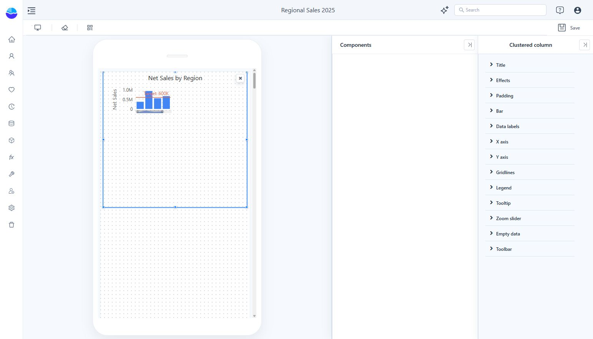

# Mobile Layout View

Arrange existing report components for a phone-sized canvas and adjust their mobile presentation.

1. Open the report in Edit mode and click the toolbar’s **Mobile layout** icon.
2. In **Components**, point to a component card and click its **+** button to add it to the phone canvas.
3. Drag and resize the component. Select it to open its formatting panel.
4. Make labels and controls readable at the smaller size. The panel identifies these as mobile-layout changes.
5. Click **Save**. Use the monitor icon to return to the desktop designer.

Use the component’s **×** control to remove it from this layout. Keep the mobile page focused: place filters near the charts they control, avoid wide tables where possible, and check long labels on an actual phone before sharing.
