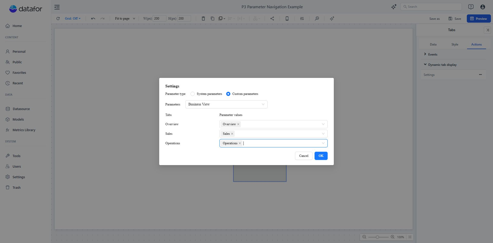
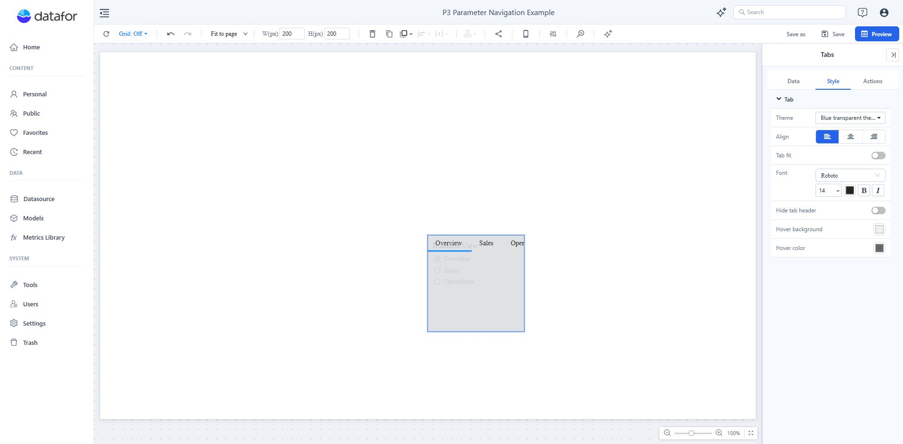

# Parameter-Driven Tab Switching

Use **Dynamic tab display** to activate a tab from the current user, one of the user's roles, or a parameter value. The action switches the active tab; it does not hide individual tabs or restrict access to their content.

## Choose the control source

| Source | Match value | Use it for |
| --- | --- | --- |
| **User** | A user name | A user-specific landing tab. |
| **Role** | A role assigned to the current user | A role-specific landing tab. |
| **Custom parameters** | The current value of one Report or Global Parameter | Interactive navigation controlled from the report. |

Use access permissions—not tab switching—when content must be protected from unauthorized users.

## Switch tabs with a parameter

This example uses a Text parameter named `Business View` with the values `Overview`, `Sales`, and `Operations`.

1. Create the parameter with **Suggested values** set to **List of values** and set a **Default value**.
2. Add a **List/Dropdown** Parameter Controller to the same report page and bind its **Parameter** field to `Business View`.
3. Add a **Tabs** component, then add and name its tabs.
4. Select the Tabs component and open **Actions > Dynamic tab display > Settings**.
5. Select **Custom parameters**, choose `Business View`, and assign the matching parameter value to each tab.
6. Click **OK**, preview the report, and save it.

Keep the controller and the Tabs component on the same page. During initial loading, when more than one compatible controller is bound to the same parameter, the first one found on the page supplies the initial value. At runtime, a matching controller can switch tabs when it publishes a new value. Use one navigation controller per parameter to avoid conflicting behavior.

## Switch tabs by user or role

1. Select the Tabs component and open **Actions > Dynamic tab display > Settings**.
2. Select **System parameters**.
3. Choose **User** or **Role**.
4. Assign the required user names or roles to each tab.
5. Click **OK**, preview with the intended account, and save the report.

If several roles match different tabs, the first matching tab in tab order is activated. For predictable results, do not map the same user, role, or parameter value to multiple tabs.

## Runtime behavior

| Situation | Result |
| --- | --- |
| A value matches more than one tab | The first matching tab in tab order is activated. |
| A multi-select controller supplies several values | Only the first selected value is used for tab switching. |
| No value matches when the report opens | The saved active tab is used; if it is unavailable, the first tab is used. |
| The parameter changes to an unmapped value | The current tab remains active. |
| The control source or selected custom parameter changes | Existing mappings are cleared and must be configured again. |

Do not use an empty value or numeric `0` as a tab-navigation value. These values do not trigger a runtime switch.

## Hide the tab header

The **Hide tab header** setting is under **Style > Tab**.

Turn it on when users should navigate only through the controller. It hides the entire tab navigation header in the viewer. Before enabling it, verify that every intended viewer receives a mapped value and can reach the required tab through a visible controller or another navigation action.

## Troubleshooting

| Symptom | Check |
| --- | --- |
| Changing the controller does not switch tabs. | Confirm that the controller is on the same page, is bound to the selected parameter, and produces an exactly mapped value. |
| The wrong tab opens for a multi-select parameter. | Use a single-select controller. Tab switching reads only the first selected value. |
| The wrong tab opens for a user with several roles. | Remove overlapping role mappings or move the preferred tab earlier in the tab order. |
| The mappings disappeared. | Selecting another control source or custom parameter clears the previous mappings. Configure them again. |
| Users must not open another tab's content. | Apply access permissions to the protected content. Hiding the header and role-based tab switching are navigation settings, not authorization. |

## Related topics

- [Creating Parameters](/documentation/Analysis/Creating-Parameters/)
- [Parameter Controllers](/documentation/Analysis/Parameter-Controllers/)
- [Multi-Tabbed Page](/documentation/Visualization/Multi-Tabbed-Page/)
- [Access Control List](/documentation/System/Access-Control%20List/)
