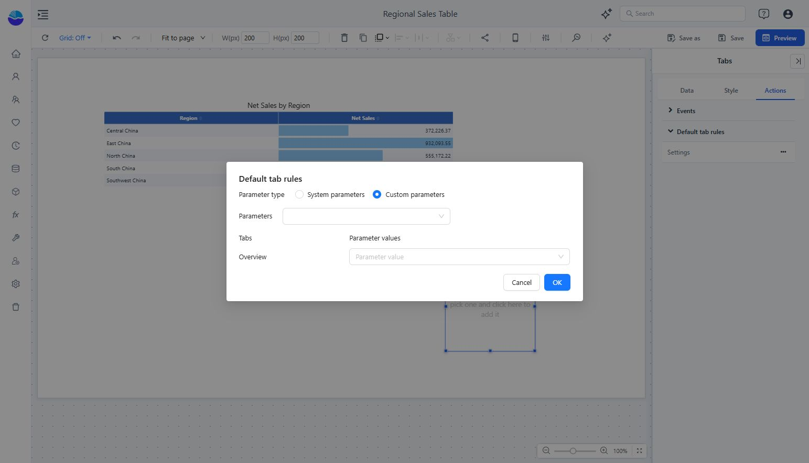

# Default Tab Rules

Choose a tab using a system value or a report/global parameter. The current entry is **Actions → Default tab rules**.

1. Add and name the tabs under **Data**.
2. Open **Actions → Default tab rules → Settings** using the ellipsis button.
3. Choose **Parameter type → System parameters** or **Custom parameters**.
4. Select the parameter under **Parameters**.
5. Map each tab to its **Parameter values**, then click **OK**.
6. Preview with the intended value and save the report.

For parameter navigation, create a Text parameter with a list such as Overview and Details, then bind a Dropdown or List box to that parameter. Use a single selection and distinct mapped values. Check both the initial tab and the result after changing the controller.

The regular **Data → Default tab** setting can select a named tab or **Same as when saved**. Review that default for values that do not match a rule.

Under **Style → Tab**, **Hide header** hides the tab navigation. Enable it only after another visible control can reach every required tab. Rules and hidden headers control navigation; use resource permissions to control access.

See [Creating Parameters](/documentation/Analysis/Creating-Parameters/), [Parameter Controllers](/documentation/Analysis/Parameter-Controllers/), and [Multi-Tabbed Page](/documentation/Visualization/Multi-Tabbed-Page/).
