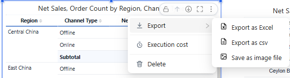

# Export

| To get | Use | Where |
| --- | --- | --- |
| The whole page as it looks | **Export pdf** | Report toolbar (PDF icon), in Preview or the saved report |
| The data of one component, with table formatting | **Export as Excel** | Component **⋮ → Export** |
| The data of one component, plain | **Export as csv** | Component **⋮ → Export** |
| A picture of one component | **Save as image file** | Component **⋮ → Export** |

To show the component menu, point to the component; **⋮** appears in its top-right corner. **Data preview** in the same menu lists the query result with formatted values before you export. Which items appear depends on the component and on its **Style → Toolbar** settings.

Exports use the current filters and parameters. Excel and CSV exports run the query again on the server and contain all rows, not only the rows loaded on screen.

## Excel export of tables

For **Table**, **Pivot table**, **Tree table** and **Parent-child table**, **Export as Excel** writes the table's look into the workbook:

| Kept in Excel | Notes |
| --- | --- |
| Table style and your style changes | Header, row, subtotal and total fills and fonts, banding, grid lines, dividers and rules. Dark templates export dark. |
| Row height, column widths, alignment | Columns you resized keep their width; others are auto-fitted. |
| Frozen panes | Header rows; plus **Freeze columns** (Table), the row-field columns (Pivot table) or the tree column (Tree table). |
| Number formats | As on the page. |
| Font and background conditional colours | Written as fixed colours, so they do not change if you edit numbers in Excel. |
| Data bars | As Excel data bars, when **Based on** is the measure itself. Negative bar colour, axis and right-to-left direction are not exported. |
| Tree structure | Tree tables export one indented tree column with Excel outline groups. |

Not exported: icons, **Empty values as** placeholders (the cells stay empty), hover and selection highlights, and merged row cells (Excel repeats the value on every row). Parent-child tables export their query rows, not the tree.

Subtotal and total names are written once, in the first dimension cell of the row.

::: warning Install the server update too
Styled Excel export needs the 10.00 browser and server components together. With an older server the file has no styles, and tables with conditional formatting can show extra `UUID-…` columns.
:::

## CSV

CSV contains values only, without styles. Subtotal and total names are written once, in the first dimension cell.

## Image files

**Save as image file** saves the component as it looks on screen, without the selection frame, toolbar or resize handles, also in the report editor.

Related: [Table](/documentation/Visualization/Table/) · [Conditional Formatting](/documentation/Visualization/Conditional-Colors/) · [Table Styles](/documentation/Visualization/Table-Styles/)
