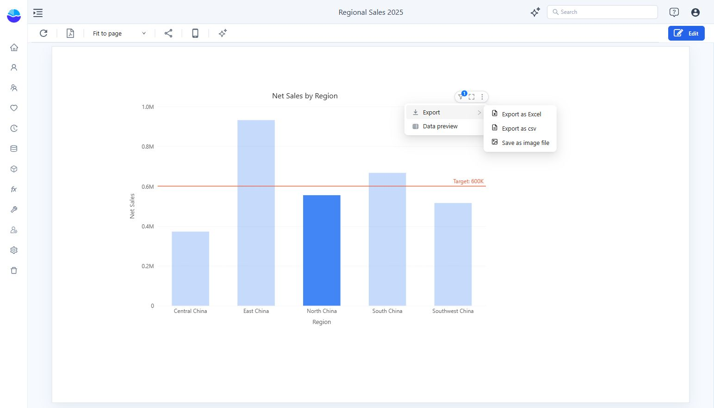

# Export

## Export the report

Open the saved report or Preview and click the toolbar’s **Export pdf** action (the PDF icon). Check the exported page size and labels before distributing the file.

## Export one component

1. Point to the component to reveal its toolbar.
2. Open **More → Export**.
3. Choose **Export as Excel**, **Export as csv**, or **Save as image file** when available.

Choose a spreadsheet or CSV when you need data; choose an image or report PDF when the visual layout matters. Review the current filters before exporting. Available actions depend on the component and its toolbar configuration.

Use **More → Data preview** to inspect the component’s result before export.
