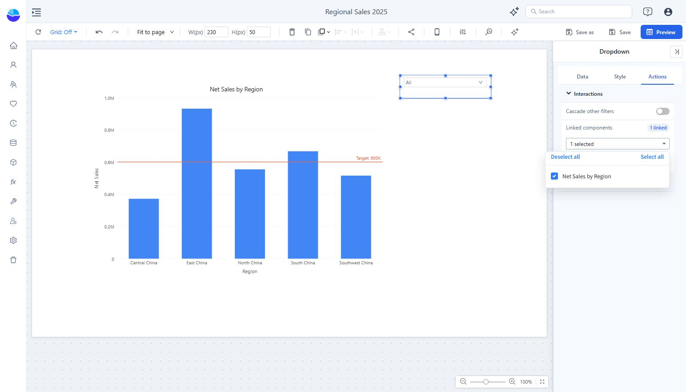
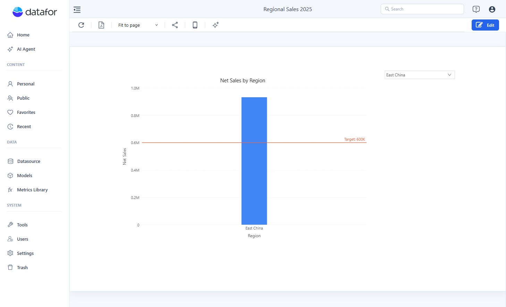

# Link Filters and Charts

Use **Linked components** to choose which components respond to a filter or chart selection.

## Configure the source

1. Select the filter control or chart that will send the selection.
2. Open **Actions → Interactions**.
3. Open **Linked components** and choose the intended targets.
4. Preview the report and change the source selection. Check each target's values.

The filter panel shows a linked-component count. Check the actual selection rather than assuming that every component on the page is linked. Leave an overall KPI unlinked if it must continue to show the unfiltered total.

For filters, **Cascade other filters** controls the relationship with other filter controls. Test the available choices in those controls as well as the resulting charts.

## Example: select one region

Bind a Dropdown to **Region** in **Retail Chain Operations**, then link the **Net Sales by Region** chart. In Preview, select **East China**: the chart should show only that region. Select **All** to restore all regions allowed by the chart's other filters.

## Diagnose an unexpected result

- **A chart does not change:** check the source's target selection and the target's model and fields.
- **A chart becomes empty:** inspect its existing component filters; the combined conditions may have no matching rows.
- **A summary changes unexpectedly:** remove it from the source's linked components.

For filters across different models, review [Cross-Model and Cross-Data-Source Analysis](/documentation/Analysis/Cross-Model/) and test the field mapping.
