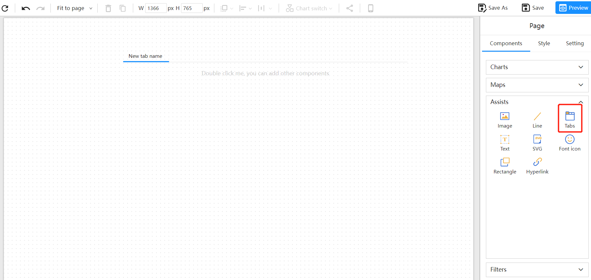
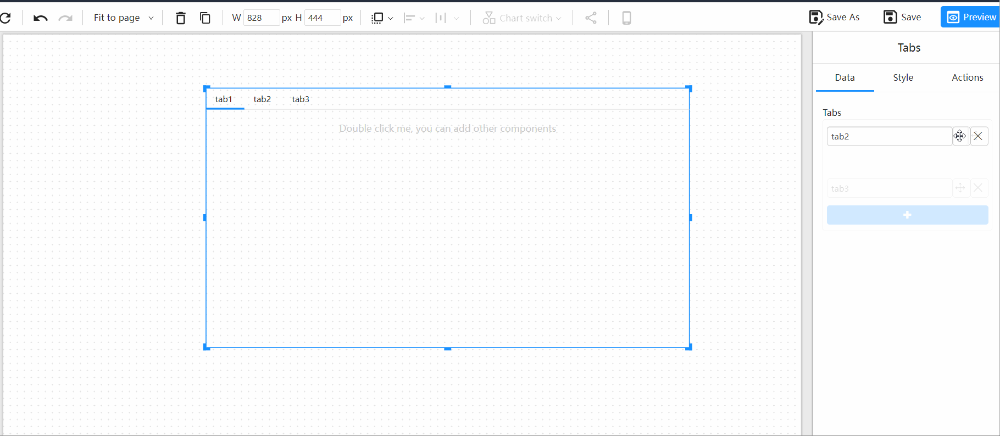
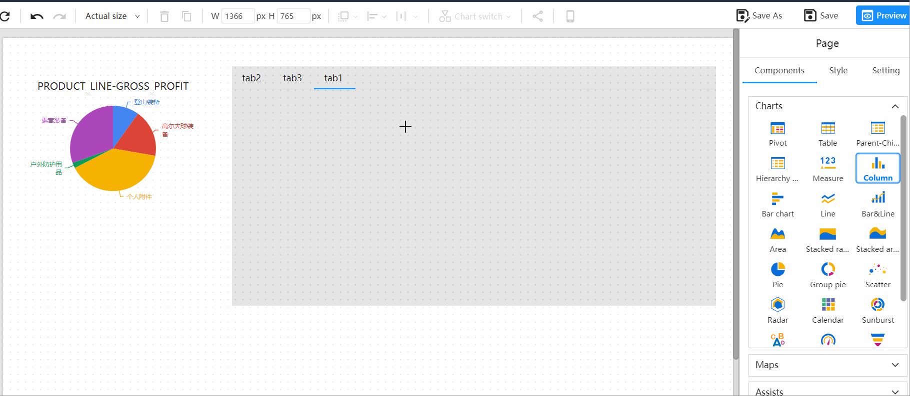
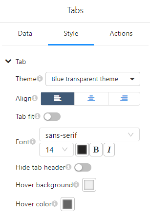

# Tabs (Multi-Tabbed Page)

## Overview

The **Tabs** component (also called **Multi-Tabbed Page**) lets you organize an analytic report into multiple tabbed sections. Each tab can host its own set of visualizations and controls, making it easy to compare scenarios or segment content without overcrowding a single page.

Use Tabs when:

- You need parallel views (e.g., “Overview”, “By Region”, “Trends”).
- Different audiences should see different visual groups in one report.
- You want fast, in-place switching instead of navigating to separate pages.

## Add the Tabs component

1. Open the **Component Panel**.

2. Select **Tabs** and place it on the canvas.

   

> Tip: Resize the Tabs frame after placing it so future charts fit comfortably inside each tab.

## Configure tabs & change their order

With the Tabs component selected:

- **Create/rename tabs**: Add the tabs you need and give each a clear, concise label.

- **Reorder**: Drag a tab label left or right to change the sequence.

  

## Add content to a tab

1. **Double-click** a tab to enter **Edit Mode** (you’ll be editing *inside* that tab).

2. Add visual components to the tab—draw new charts, or **copy & paste** existing ones.

3. Click outside the tab to exit Edit Mode.

   

Notes

- Each tab can contain any mix of supported visuals and controls.
- Components added while a tab is in Edit Mode belong only to that tab.

## Style & layout

Select the Tabs component, then open the **Style Panel** (right side) to adjust:

- **Theme**
   Choose **Transparent** or **Opaque** depending on your page background.
- **Text alignment**
   Set tab label alignment (left/center/right).
- **Stretch**
   Expand tabs to use the full row width.
- **Hide tab header**
   Hide the tab strip in **Preview** when you want to drive navigation via parameters instead of clicks.
   See: [**Parameter-driven tab switching**](/documentation/Visualization/Parameter-Driven-Tab-Switching/)

## Troubleshooting

- **I can’t drop a chart into a tab**
   Make sure you’ve **double-clicked** the tab to enter **Edit Mode** first.
- **My chart appears on all tabs**
   It was placed outside the Tabs component. Drag it inside a tab while in Edit Mode.
- **Tab labels wrap or get cut off**
   Shorten labels or enable **Stretch** to give the tab strip more room.
- **Users shouldn’t click tabs**
   Turn on **Hide tab header** and switch tabs via a parameter control instead.