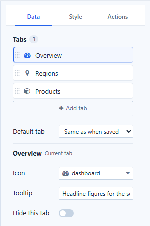
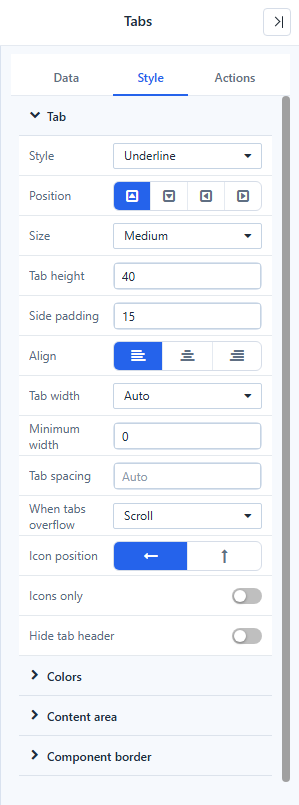
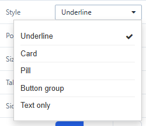

# Tabs

The **Tabs** component holds several pages of content in one area of the report. Readers switch between them with the tab bar, or with buttons and rules you set up.

## Create the tabs

1. In **Components → Assists**, click **Tabs** and click the canvas. Resize the component to the area it should fill.
2. On **Data → Tabs**, click **Add tab** for each tab. New tabs are named *Tab 2*, *Tab 3*…
3. Click a name to rename it; **Enter** keeps the change, **Esc** cancels it.
4. Drag a row by its handle to change the order.
5. For the selected tab, under **Current tab**, set an **Icon**, a **Tooltip**, or **Hide this tab**.

Hover a row for the eye (hide) and trash (delete) buttons. A report needs at least one tab, and at least one visible tab. Deleting a tab that holds components asks first and says how many components will be deleted with it.

Selecting a row shows that tab on the canvas, and clicking a tab on the canvas selects its row.

## Put components on a tab

| To | Do this |
| --- | --- |
| Add a new component to a tab | Show the tab, pick a component in the palette and click inside the tab's content area. |
| Move a component into a tab | Drag it over the content area until *Drop into "{tab}"* appears, then release. Hover a tab header for a moment while dragging to switch to that tab. |
| Move it out | Drag it beyond the edge of the tab until *Move out to page* appears. |
| Place it on top of the tabs without putting it inside | Hold **Alt** while clicking or dropping. |
| Paste into a tab | Select the Tabs component, then paste: the copy goes onto the current tab. |

While you work inside a tab, a bar *Editing "{tab}"* with **Done** appears above the component. Click **Done**, click outside, or press **Esc** to return to the page. Undo returns a moved component to where it was.

Tabs can be nested: a tab can hold another Tabs component.

## Which tab opens

When the report opens, the first match wins:

1. [Default tab rules](/documentation/Visualization/Parameter-Driven-Tab-Switching/) (by user, role or parameter), under **Actions → Default tab rules**.
2. **Data → Default tab**: a named tab, or **Same as when saved**.
3. The tab that was showing when the report was saved (hidden tabs are skipped).
4. The first visible tab.

## Style

**Style → Tab** controls the tab bar:

| Setting | Options and defaults |
| --- | --- |
| **Style** | **Underline** (default), **Card**, **Pill**, **Button group**, **Text only** |
| **Position** | Top (default), bottom, left or right. Left and right stack the tabs; **Vertical bar width** (0 = fit the longest name, at most 40% of the component). |
| **Size** | **Small**, **Medium** (default), **Large**, **Custom**. **Tab height** (default 40) and **Side padding** (default 15); editing either switches to Custom. |
| **Align** | Left, centre or right |
| **Tab width** | **Auto** (with **Minimum width**), **Fill equally**, **Fixed** (with **Fixed width**; long names are cut) |
| **Tab spacing** | Empty = the style's default |
| **When tabs overflow** | **Scroll** (arrows and mouse wheel) or **Wrap** |
| **Icon position**, **Icons only** | Icon left of or above the name; **Icons only** hides the names of tabs that have an icon and shows them as a tooltip. |
| **Hide tab header** | Hides the tab bar in the report. In the editor it stays visible, semi-transparent, marked *Hidden in preview*. |

**Colors** sets the font, **Accent color**, active and hover colours, tab and bar backgrounds, **Tab bar line**, **Indicator thickness** and **Corner radius**. With **Auto active text color** on, Pill and Button group pick white or dark text to suit the accent. **Content area** sets the content background and padding; **Component border** frames the whole component, including the tab bar.

Reports from earlier versions keep their look: the old *White* theme becomes **Card**, *Blue transparent* and *Red transparent* become **Underline** in blue or red.

## Switch tabs without the tab bar

With **Hide tab header** on, readers need another way to change tabs:

- an [Action button](/documentation/Visualization/Action-Button/), Text, Image, Icon or Shape with the click action **Switch tab** (Action button: **Switch tab page**);
- [Default tab rules](/documentation/Visualization/Parameter-Driven-Tab-Switching/) driven by a parameter that readers change with a filter.

In the report, readers can also use the keyboard on the tab bar: arrow keys, **Home** and **End**.

## Mobile layout

On phones the tab bar is always at the top, only the style type and colours apply, and Tabs cannot be nested. See [Mobile Layout View](/documentation/Visualization/Mobile-Layout-View/).

Related: [Default Tab Rules](/documentation/Visualization/Parameter-Driven-Tab-Switching/) · [Click Actions and Visibility](/documentation/Visualization/Click-Actions-and-Visibility/)
