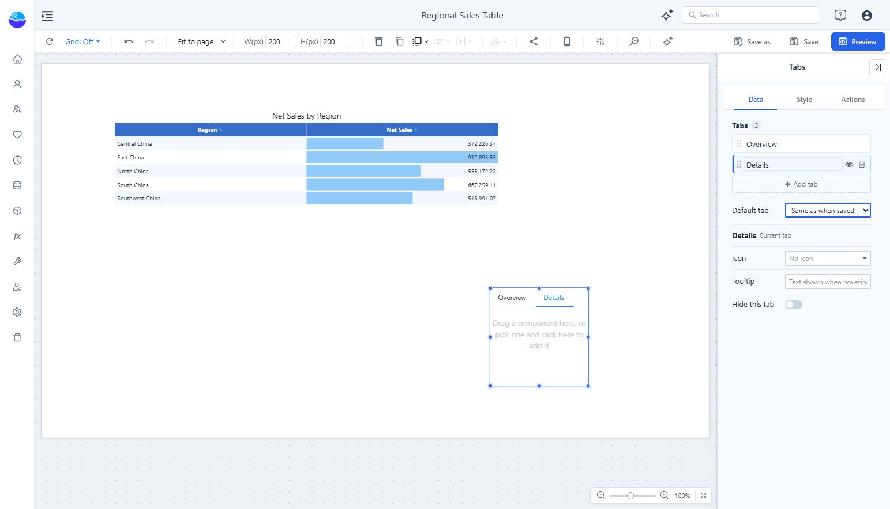
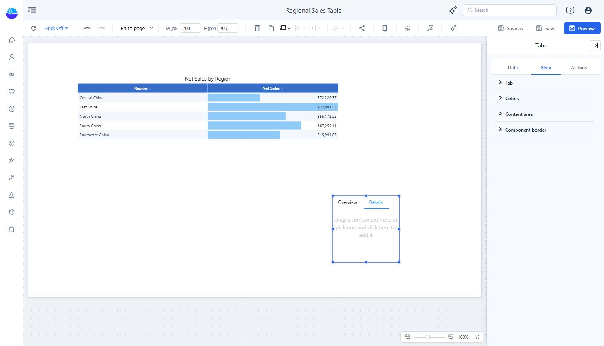

# Tabs

Use **Tabs** to keep several views on one report page. Each tab has its own content area.

## Create the tabs

1. Add **Components → Assists → Tabs** and size the container.
2. In **Data**, use **Add tab** to create more tabs.
3. Edit names in the list, and use its drag handles to arrange the order.
4. Select a **Default tab**, or keep **Same as when saved**.
5. For an individual tab, configure its icon, tooltip, or visibility. At least one tab must remain visible.

## Put components inside

Select the destination tab. Drag a component into its content area, or choose a component from the catalog and click inside that area. The editor shows **Editing "…"** while editing the tab's content. Click **Done** to return to the surrounding page.

Check the active tab before adding components. A component placed outside the container remains on the report page.

## Style the navigation

In **Style → Tab**, configure the style, position, size, tab width, spacing, and overflow behavior. **Colors**, **Content area**, and **Component border** control the other parts of the container.

Keep tab labels short. If you hide the tab header, provide a tested alternative such as an action button that switches tabs.

Preview every tab, then save and reopen the report to check its starting tab and contents.
