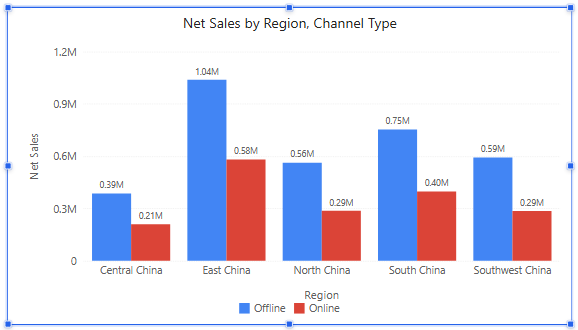
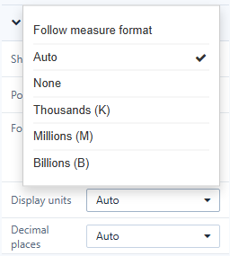

# Display Units and Decimal Places

**Display units** and **Decimal places** change how a component writes its numbers, for example 1,037,979.98 as *1.04M*, without changing the measure's format in the model or on other components. Tooltips keep showing the full formatted value.

## Where to find them

| Component | Path |
| --- | --- |
| Column, bar, line, area, combo, pie, grouped donuts, funnel, treemap, Sankey and heat matrix charts | Style → **Data labels** |
| Box plot | Style → **Outliers** |
| Measure card | Style → **Main value**, **Comparison #1 settings**, **Comparison #2 settings** |
| Gauge | Style → **Measure value**, **Target value**, **Scale axis** |
| Filled map | Style → **Data picker** |
| Reference lines | **Analytics** → select the line → **Label** |

The KPI trend card has its own **Unit** and **Decimal places** under Style → **Marker value**. 100% charts, Waterfall, Scatter, Range column, Histogram, Bullet, Radar and tables have no display-unit setting; use the measure's **Format** instead.

## Options

| Display units | Result |
| --- | --- |
| **Follow measure format** | Writes the value exactly as the measure's format does. |
| **Auto** | Keeps a unit that the measure format already has (for example M from the model's display scale). Otherwise picks one from the size of the largest value: K from 1,000, M from 1,000,000, B from 1,000,000,000. |
| **None** | Full numbers, no unit. |
| **Thousands (K)**, **Millions (M)**, **Billions (B)** | Always that unit. |

**Decimal places**: **Auto** or 0–4. With **Auto** and a unit, data labels get about three significant digits (*1.04M*, *0.58M*, *12.5K*); cards, gauges and maps show up to two decimals. Without a unit, **Auto** uses the measure format's decimals.

Percentages are never scaled. Chinese and Japanese interfaces also offer 万, 百万 and 亿, and **Auto** uses 万 and 亿 there.

Data labels choose one unit per measure, so in a combo chart a quantity of 35 and sales of 2.5M are each written readably. All gauges in one component share a unit.

## Defaults

- New charts, measure cards, gauges, filled maps and reference lines start with **Auto**. Exception: new Grouped donuts start with **Follow measure format**.
- Components in reports created before 9.04.6 keep **Follow measure format**, so they look as before.
- The KPI trend card unit starts with **None**.

## Value axis units

Axes have a separate setting: Style → **Y axis → Scale** (on bar charts **X axis → Scale**; on combo charts **Left axis unit** and **Right axis unit**). Options: **Auto** (default), **K**, **M**, **B**, **T**, **%**.

With **Auto**, the unit follows the tick interval: an axis from 0 to 2 million with 500K steps reads *0, 0.5M, 1.0M, 1.5M, 2.0M*. With a fixed unit every tick has the same number of decimals. A percent axis is used only when every measure on the axis is a percentage.

## Display units or measure format?

| Use | When |
| --- | --- |
| **Display units** on the component | You want compact labels on one chart or card. |
| **Format** on the measure (Data → ⋮ → Format) | You need a prefix, suffix, a fixed number of decimals or the same look in tables. |
| **Display scale** in the model | Every report should show the measure in K, M or B by default. See [Units and Display Scale](/documentation/Model/Units-and-Display-Scale/). |

Related: [Page Settings](/documentation/Visualization/Size-Display/) · [Tooltips](/documentation/Visualization/Tooltips-for-Chart-Components/)
