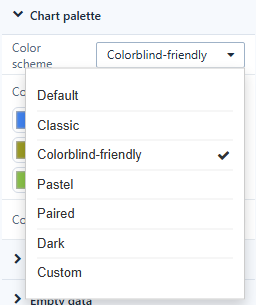
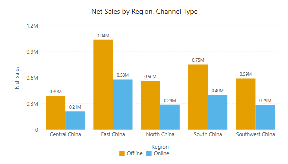
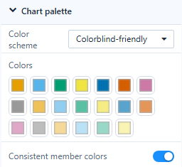

# Colors and Color Schemes

Chart colours come from the page palette: **Page → Style → Chart palette**. A chart uses the palette in order, unless it has its own series colours, a **Color** field or conditional colours.

## Color scheme

| Scheme | Colours | Use it for |
| --- | --- | --- |
| **Default** | 20 | The standard Datafor palette. |
| **Classic** | 10 | Familiar, balanced hues. |
| **Colorblind-friendly** | 8 | Colours that stay distinguishable for readers with colour-vision deficiency. |
| **Pastel** | 12 | Light, low-contrast pages. |
| **Paired** | 12 | Pairs of light and dark shades, for related series. |
| **Dark** | 8 | Saturated colours. It does not make the page dark. |
| **Custom** | – | Shown when you edit the colours by hand. |

Choosing a scheme fills the **Colors** palette (20 swatches; shorter schemes are extended with lighter shades). You can still change single swatches afterwards.

 

In 10.00 the swatches can keep showing the previous scheme until you reopen the report; the charts already use the new colours.

New reports start with the scheme set in **Settings › General › System configuration › Reports › Default color scheme**.

## Consistent member colors

With **Consistent member colors** on, a member keeps the same colour in every chart on the page, also after filtering and sorting: *Online* is the same blue in the column chart, the pie and the line chart.

- On by default in new reports, off in reports created before 10.00.
- Colours are recorded while you edit, in the order members first appear, up to 50 members per field. Members beyond that get a fixed colour derived from their name, which also stays the same when filters change.
- After you change the scheme or a swatch, recorded members are moved to the new colour at the same position.
- Colours set on the component itself, a **Color** field and conditional colours take priority.

## Gradient presets

The conditional colour dialogs have a **Preset** list for gradients: Blues, Greens, Oranges and Purples, plus four diverging presets in tables and pivot tables. See [Conditional Formatting](/documentation/Visualization/Conditional-Colors/).

Related: [Page Settings](/documentation/Visualization/Size-Display/) · [Legends](/documentation/Visualization/Legends/)
