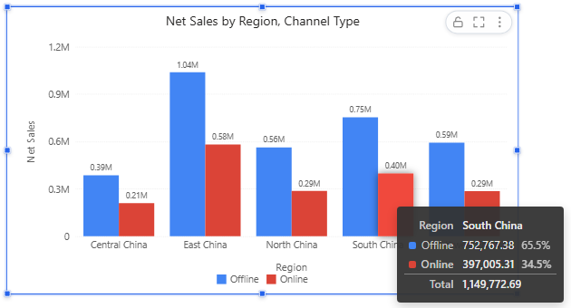
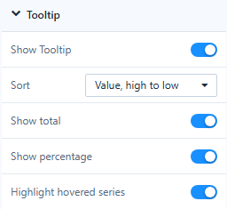

# Tooltips

A data tooltip appears when a reader rests the pointer on a bar, point, slice or region for half a second. It shows the category, the series and the formatted values.

## Component settings

Select the chart and open **Style → Tooltip**.

| Setting | Default | What it does |
| --- | --- | --- |
| **Show Tooltip** | On | Turns the data tooltip on or off. |
| **Sort** | Series order | **Value, high to low** lists the series of the hovered category by value. |
| **Show total** | Off | Adds a *Total* row for the category. |
| **Show percentage** | Off | Adds each series' share of the category total. |
| **Highlight hovered series** | On | Shows the hovered series in bold when all series are listed. |

**Sort**, **Show total**, **Show percentage** and **Highlight hovered series** are available on Clustered column, Clustered bar, Stacked column, Stacked bar, Line, Area and Stacked area. Total and share need series that are members of one measure, that is, a field in **Legend**. When one of them is on, column and bar tooltips list every series of the category, up to 12 rows. Negative values count with their absolute value in shares.

Gauge, Ring progress and Word cloud have no **Show Tooltip** switch. On Table and Pivot table the Tooltip group has **Show full text on hover** instead, which shows the complete text of a cut-off cell.

### Add fields to the tooltip

Put extra fields in **Data → Tooltips** to list them under the values, for example *Order Count* and *Gross Margin Rate* on a sales chart. They are added to every tooltip of the chart. On a phone a tooltip appears only when the reader taps a data point, so keep anything readers must see on the chart itself.

## Page tooltip style

The look of all data tooltips on the page is set in **Page → Style → Tooltip**:

| Setting | Options |
| --- | --- |
| **Style** | **Dark** (default), **Light**, or **Custom** when you change a colour |
| **Background**, **Label text**, **Value text** | Colours of the box, the field names and the values |
| **Font size** | 10–16 px, default 12 |

Tooltips use the report default font and have rounded corners and a shadow; the Light style adds a thin border. New reports start with the style set in **System configuration › Reports › Default tooltip style**.

Related: [Display Units and Decimal Places](/documentation/Visualization/Display-Units/) · [Legends](/documentation/Visualization/Legends/) · [Page Settings](/documentation/Visualization/Size-Display/)
