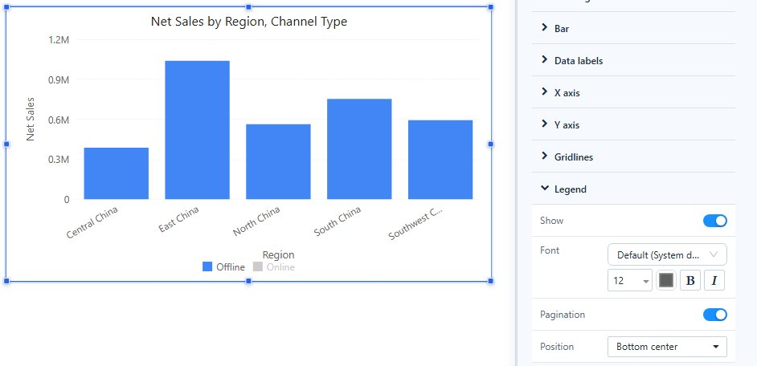

# Legends

A legend names the series of a chart. Series come from the **Legend** field (for example *Channel Type*) or from several measures.

## Reader actions

| Action | Result |
| --- | --- |
| Click an item | Hides or shows that series. |
| Double-click an item | Shows only that series. Double-click it again to show all. |

Value axes rescale to the series that remain, unless the axis has a fixed minimum or maximum. Stack totals are recalculated. Hidden series stay hidden when filters change or the chart is resized, but the report always opens with all series shown.

## Settings

Select the chart and open **Style → Legend**:

| Setting | What it does |
| --- | --- |
| **Show** | Shows or hides the legend. |
| **Font** | Font, size and colour of the items. |
| **Pagination** | On (default): items that do not fit are paged with arrows. Off: the legend wraps onto several lines. |
| **Position** | Where the legend sits around the plot. |

On a pie chart, long legend names are shortened to fit and shown in full in the tooltip. If a wrapped legend would take more than half of the pie, it is paged instead.

Legend colours come from the page palette. Turn on **Consistent member colors** to give each member the same colour in every chart; see [Colors and Color Schemes](/documentation/Visualization/Colors/).

Related: [Tooltips](/documentation/Visualization/Tooltips-for-Chart-Components/) · [Adding Components](/documentation/Visualization/Adding-Charts/)
