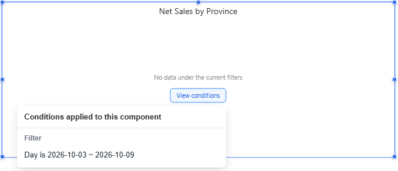
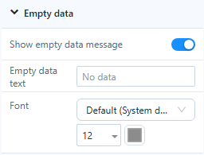

# Empty Data and Error Messages

A component that has nothing to draw says why, in grey text in the middle of the component.

## Empty results

| Message | Cause | Buttons |
| --- | --- | --- |
| *No data under the current filters* | A filter, a parameter or a value passed in the URL leaves no rows. | **View conditions** lists the conditions. |
| *No data under the current link conditions* | A click on another chart (cross-filtering) leaves no rows. | **Clear links**, **View conditions** |
| *No data* (or your own text) | The query returns no rows without any condition. | – |

Some charts have their own empty state: a pie whose values are all 0 shows a grey ring *All values are 0*; a gauge or ring progress without data shows the message instead of an empty scale.

## Set the empty-data message

| Level | Where | Applies to |
| --- | --- | --- |
| Component | Style → **Empty data** | This component |
| Page | Page → Style → **Empty data** | Components that have no setting of their own |
| System | Settings › General › System configuration › Reports › **Empty data message** | New reports |

- **Show empty data message**: when off, the component stays blank for readers (authors still see a faint message).
- **Empty data text**: leave empty for *No data* in the reader's language.
- **Font**: size and colour of the message.

A Measure card can show a placeholder instead: Style → Empty data → **Show blank main value as**.

## Errors

| Message | Cause | What to do |
| --- | --- | --- |
| *The query timed out. Narrow the filters and try again* | The query took longer than the engine's query timeout. | Narrow the filters, or ask an administrator to check the model or the timeout. |
| *You don't have permission to view this data* | The user may not read the model or its data. | Ask for access. |
| *A field used by this component no longer exists* | A field or member was renamed or removed in the model. | Replace the field on the Data tab. |
| *Failed to load data* | Any other error. | Click **Retry**. |

**Retry** appears for time-outs and other errors. Authors also get **Details**, which shows the server's error text; readers never see it.

## Truncated results

When a query returns more rows than the page's **Max query records** (Page → Settings → Performance, default 5,000), the component shows the first rows and a warning icon in its bottom-right corner: *Showing the first {shown} of {total} rows*. Add a filter or a row limit, or raise the limit.

## Which setting do I need?

| Situation | Setting |
| --- | --- |
| The whole result is empty | Empty data message (this page) |
| Some cells are empty | **Empty values as** on the measure, see [Table](/documentation/Visualization/Table/) |
| Members without data should still appear | [Show Items with No Data](/documentation/Analysis/Show-Items-with-No-Data/) |

Related: [Page Settings](/documentation/Visualization/Size-Display/) · [Component Filters](/documentation/Analysis/Component-Level-Filtering/)
