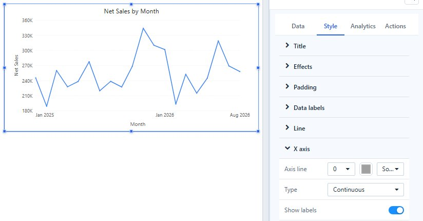

# X Axis Type Settings

**Style → X axis → Type** decides how dates on the X axis are spaced. It does not change the query or the measure's aggregation.

| Type | Spacing | Default |
| --- | --- | --- |
| **Continuous** | Each date sits at its position in time. Labels are chosen automatically along the time scale. | Yes |
| **Categorical** | Each returned member gets one equally wide slot, in the sort order of the field. | |

## When the control appears

**Type** is shown only when the X-axis field is a date or time level (Year, Quarter, Month, Day and so on). For text fields and numeric fields it is hidden, and the axis always uses categorical spacing.

It is available on **Clustered column**, **Stacked column**, **100% stacked column**, **Line**, **Area**, **Stacked area**, **100% stacked area** and **Combo** charts. Bar charts, **Waterfall**, **Box plot**, **Heat matrix**, **Histogram** and **Range column** always use a categorical axis.

## What you see

Example: monthly Net Sales where March has no sales.

- **Categorical**: March is not returned, so February and April sit side by side. The axis does not show that a month is missing.
- **Continuous**: the axis keeps the space for March, so the gap is visible; a column chart leaves an empty slot. An empty month is not drawn as zero.

To keep a month without data on a categorical axis, provided the month exists in the model's date table, turn on [Show items with no data](/documentation/Analysis/Show-Items-with-No-Data/) for the date field.

## Effects of a continuous date axis

- **Zoom slider**: the horizontal slider works only on a continuous axis. With **Categorical**, **Zoom direction → Horizontal only** shows no slider. See [Line chart](/documentation/Visualization/Line-Chart/#zoom-slider).
- **Sorting**: the dates stay in time order. Sorting the categories by a measure is not available, and a **Descending** sort on the date field reverses the axis. See [Sorting](/documentation/Analysis/Sorting/).
- **Reference lines**: a fixed-value line drawn across the X axis takes a date. See [Reference lines](/documentation/Analysis/Chart-Reference-Lines/).

Use **Categorical** when every period should get an equal slot, for example to compare a short list of fiscal periods, or when you need to sort the periods by a measure.
