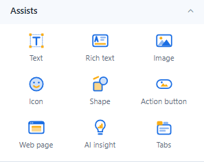

# Assist Components

Assist components add titles, explanations, decoration and navigation to a report. They need no data model, except the Action button and Web page when you bind them to data.

| Component | Use it for | Default size (px) |
| --- | --- | --- |
| [Text](/documentation/Visualization/Text/) | Headings and short text, with dynamic values | 240 × 60 |
| [Rich text](/documentation/Visualization/TextBox/) | Formatted paragraphs, lists and live measure values | 200 × 200 |
| [Image](/documentation/Visualization/Image/) | Logos and fixed pictures | 240 × 160 |
| [Icon](/documentation/Visualization/Icon/) | Font icons or an uploaded SVG | 64 × 64 |
| [Shape](/documentation/Visualization/Shapes/) | Rectangles, lines, arrows, callouts and more, with text | 160 × 100 |
| [Action button](/documentation/Visualization/Action-Button/) | Navigation and actions such as reset filters | 120 × 36 |
| [Web page](/documentation/Visualization/Web-Page/) | An embedded web page | 480 × 300 |
| [AI insight](/documentation/AI-Agent/Insight-Component/) | One click opens an automatic reading of the data | 400 × 240 |
| [Tabs](/documentation/Visualization/Multi-Tabbed-Page/) | Groups of content on one page | 200 × 200 |

## What they share

- **Style → Effects**: background (**Solid** or **Gradient** with start colour, end colour and angle), border, corner radius, shadow, **Padding**, **Opacity** (of the content, not the background) and **Hover effect** (**None**, **Lighten**, **Raise (shadow)**). Shapes have Opacity and Hover effect only; the Action button and Tabs have their own style settings.
- **Actions → Click action**: go to a report, open a link, switch a tab, reset or clear filters and more. See [Click Actions and Visibility](/documentation/Visualization/Click-Actions-and-Visibility/).
- **Actions → Visibility**: show the component always, never in the report, or only for some parameter values, users or roles.
- **Dynamic values** such as `{{param.Region}}` or `{{date}}` in Text, Shape text, Rich text, Image URLs and Web page addresses. See [Dynamic Values](/documentation/Visualization/Dynamic-Values/).

## Names in earlier versions

| Before 10.00 | Now |
| --- | --- |
| Text Box | **Rich text** |
| Image file | **Image** |
| Font icon, SVG | **Icon** |
| Rectangle, Line, Ellipse | **Shape** |
| Image Button | **Action button** |
| Iframe | **Web page** |
| Insight | **AI insight** |
| Image (in Charts) | **Dynamic image** (Charts → Other) |

Old Rectangle, Line, Ellipse and SVG components in existing reports still work. They are no longer in the palette; a Rectangle, Line or Ellipse can be converted with **Style → Shape → Convert to shape**.
