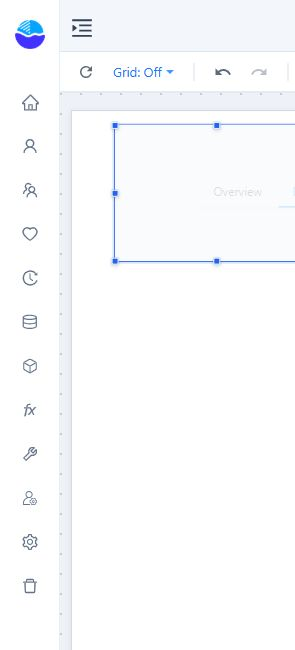

# Image

**Image** shows a fixed picture, such as a logo. To show a picture from query data, for example a product photo per row, use **Dynamic image** in **Charts → Other**.

## Add an image

1. In **Components → Assists**, click **Image**, then click the canvas.
2. In **Data → Image file**, choose **Image source**:
   - **Upload → Select file**: the image is saved inside the report. Large files make the report larger.
   - **URL → Image URL**: an `http` or `https` address, loaded each time the report opens. It can contain [dynamic values](/documentation/Visualization/Dynamic-Values/), for example `https://cdn.example.com/logos/{{param.Brand}}.png`.
3. Set **Style → Image**.

## Style → Image

| Setting | Options |
| --- | --- |
| **Fit** | **Original size**, **Fit (show whole image)** (default for new images), **Stretch**, **Fill (crop edges)**, **Tile** |
| **Position** | Where the image sits when it does not fill the frame (nine positions) |
| **Clip to border** | Cuts off anything outside the frame and rounds the image with the corner radius. On for new images. |
| **Alt text** | Text for screen readers |

**Style → Border** sets the frame, corner radius, background and effects. If a URL cannot be loaded, the component shows *Loading error*; check that readers can reach the address.

## Actions

**Click action** (for example **Go to report** or **Switch tab**), **Visibility** and a click script under **Events**. See [Click Actions and Visibility](/documentation/Visualization/Click-Actions-and-Visibility/).
