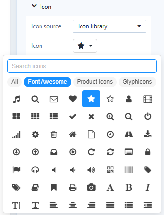

# Icon

**Icon** shows a font icon or an SVG file. It replaces the *Font icon* and *SVG* components of earlier versions.

1. In **Components → Assists**, click **Icon**, then click the canvas. A new icon is a star, 64 × 64 px.
2. In **Style → Icon**, choose **Icon source**:
   - **Icon library**: click **Icon** to open the picker, then **Search icons** or browse **All**, **Font Awesome**, **Product icons** and **Glyphicons** (862 icons).
   - **Upload SVG**: choose an **SVG file**. Scripts and event attributes are removed; the file is saved with the report.

   

3. Set the look:

| Setting | Options |
| --- | --- |
| **Color** | **Single color** or, for SVG, **Original colors** |
| **Size&Color** | Size and colour of the icon |
| **Scale with component** | The icon grows with the component (on for new icons) |
| **Position**, **Rotate**, **Flip** | Placement in the frame, rotation, flip horizontally, vertically or both |
| **Background shape** | **None**, **Circle** or **Rounded square**, with **Shape color** |

## Tooltip

**Style → Tooltips** holds a formatted tooltip, shown when readers rest the pointer on the icon. Readers can move into the tooltip and click its links; HTML scripts are removed. Use it for definitions next to a KPI, such as *Net Sales excludes returns*.

## Actions

**Click action** and **Visibility**. See [Click Actions and Visibility](/documentation/Visualization/Click-Actions-and-Visibility/).

Old SVG components keep working; they are no longer in the palette.
