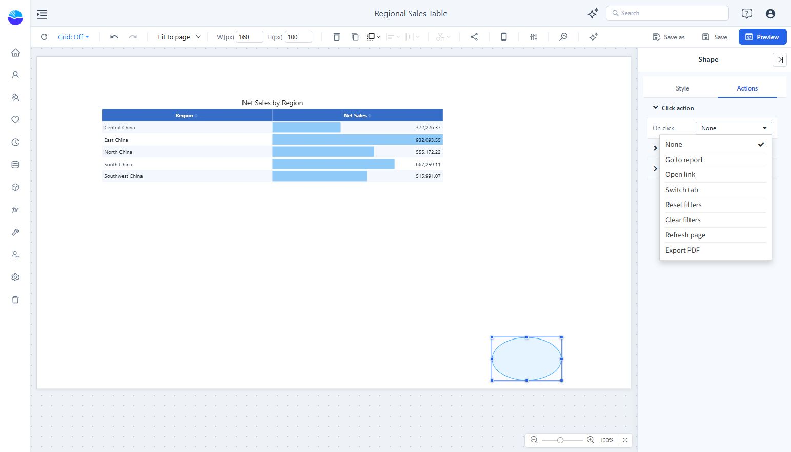

# Shapes

Add labeled blocks, dividers, arrows, and callouts from one component.

1. Choose **Components → Assists → Shape**, then place it on the canvas.
2. Under **Style → Shape**, choose a **Type** and optional **Style preset** or **Rotate** value.
3. Set the appearance under **Fill and line** and the content under **Text**.
4. If the shape should perform an action, open **Actions → Click action → On click**.

Types include Rectangle, Rounded rectangle, Ellipse, Line, Arrow, Double arrow, Triangle, Right triangle, Diamond, Pentagon, Hexagon, Star, and Callout.

Click actions include Go to report, Open link, Switch tab, Reset filters, Clear filters, Refresh page, Export PDF, Full screen, and Open AI insight. Select the action, complete its settings, then test it in Preview.

