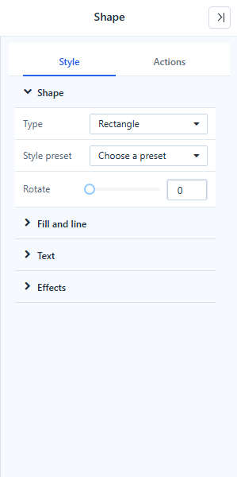
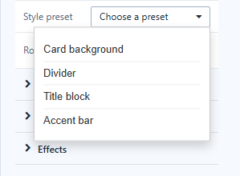

# Shapes

**Shape** draws background panels, title blocks, dividers, arrows and callouts. It replaces the separate Rectangle, Line and Ellipse components.

## Style → Shape

| Setting | Options |
| --- | --- |
| **Type** | Rectangle (default), Rounded rectangle, Ellipse, Line, Arrow, Double arrow, Triangle, Right triangle, Diamond, Pentagon, Hexagon, Star, Callout |
| **Style preset** | **Card background**, **Divider**, **Title block**, **Accent bar**: sets type, fill and line in one step |
| **Direction** | Lines and arrows: Horizontal, Vertical, Top left to bottom right, Bottom left to top right |
| **Pointer** | Callouts: Top, Bottom (default), Left, Right |
| **Corner radius** | Rounded rectangle and callout, 0–100 px |
| **Rotate** | 0–360° |

### Common shapes

Add a shape with **Components → Assists → Shape** and a click on the canvas, then:

| Shape | Steps |
| --- | --- |
| Line or arrow | **Type → Line**, **Arrow** or **Double arrow** (the **Divider** preset gives a thin grey line), then a **Direction**. Resize the component to change the length and angle. |
| Circle or ellipse | **Type → Ellipse**. Give the component the same width and height for a circle. |
| Panel or card | **Type → Rectangle** or **Rounded rectangle**, or the **Card background** or **Title block** preset. Put it behind the charts with **Move layer → Move to bottom** in the toolbar or the right-click menu. |

## Style → Fill and line

**Fill**: None, Solid (default) or Gradient, with **Fill color** and **End color**. **Line width** (0 = no outline), **Line color**, **Line style** (Solid, Dashed, Dotted), **Line ends** for lines (Flat, Round, Square) and **Shadow**.

## Style → Text

Type a **Text** to show inside the shape; it wraps inside the shape. Set **Font**, **Align**, **Vertical alignment** and **Padding**. **Insert dynamic value** adds a value such as `{{filter.Region}}` at the end of the text. See [Dynamic Values](/documentation/Visualization/Dynamic-Values/).

**Style → Effects** has **Opacity** and **Hover effect**.

## Actions

- **Click action** turns the shape into a button: **Go to report**, **Open link**, **Switch tab**, **Reset filters**, **Clear filters**, **Refresh data**, **Export PDF**, **Full screen**, **Open AI insight**.
- **Visibility** and a **Click script** under **Events**.
- A shape with no action and no script lets clicks through to the components below, so a background panel does not block the charts on it.

See [Click Actions and Visibility](/documentation/Visualization/Click-Actions-and-Visibility/).

## Convert old shapes

Rectangle, Line and Ellipse components from earlier versions still work. Select one and click **Style → Shape → Convert to shape → Convert** to replace it with a Shape that keeps its position, size, style, click action and visibility.

Related: [Assist Components](/documentation/Visualization/Assist-Components/)
