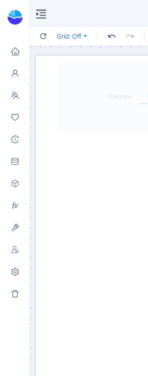

# Text

Use **Text** for a short title, label, or note with consistent formatting. Use **Rich text** for paragraphs with mixed formatting.

## Add and format text

1. Add **Components → Assists → Text**.
2. Edit the text on the canvas.
3. In **Style → Content**, set alignment, vertical alignment, font, line height, and letter spacing.
4. Choose whether to **Wrap text** and how to handle **Overflow**.

Resize the component and preview the report to check wrapping and clipping. A label that looks correct in the editor can still be too small at the report's viewing scale.

## Insert a dynamic value

Use **Insert dynamic value** to choose a supported value. Parameters in text use the form `{{param.name}}`; for example, `{{param.GrowthRate}}` refers to the GrowthRate parameter.

Change the parameter during preview and check the displayed text. A placeholder displays a value; it does not by itself calculate or format a percentage.
