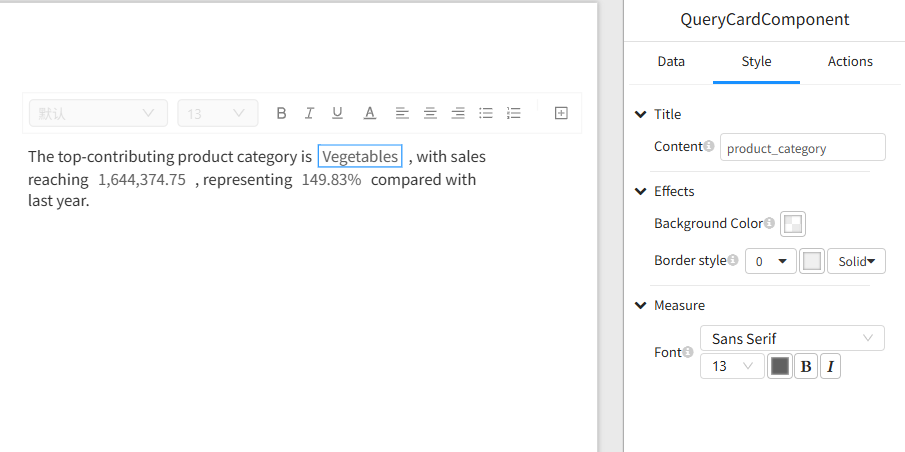

# **Text Box Component**

## **Overview**

The Text Box component is a newly added rich text capability in Datafor, allowing users to flexibly display explanatory text, data insights, or business conclusions within dashboards.

In addition to standard rich text editing, the Text Box component also supports inserting **Data Cards**, which display real-time dimension or measure values. It also supports Datafor’s standard component features, including:

* **Filter context**
* **Conditional color formatting**
* **Measure aggregation**
* **Drill-through**

The Text Box component helps users build natural-language **data narratives**, making dashboards more readable and more interpretable.

<div align="left"></div>

# **1. Adding a Text Box Component**

In the dashboard design interface:

1. Click **“+ Add Component”**
2. Select **“Text Box Component”**
3. An editable rich text box will appear on the canvas


# **2. Inserting a “Custom Block” into the Text Box**

A Data Card (custom block) allows you to insert dynamic data (dimension or measure values) into the text, automatically updating with filter selections and data context.

### **Step 1: Place the cursor inside the Text Box**

### **Step 2: Click “+ Insert Custom Block” in the toolbar**

### **Step 3: Select the following in the Data Card panel on the right:**

* Analysis model
* Field (dimension or measure)

After insertion, a clickable Data Card placeholder appears in the text box, representing a dynamic value.


# **3. Custom Block Settings**

Click a Data Card inside the Text Box to open the full configuration panel on the right.


## **3.1 Data Settings**

<div align="left"></div>

### **Analysis Model**

Select the model to use (e.g., `workshop-model`).

### **Field (Dimension or Measure)**

* **Dimension field** → Displays the contextual text value
* **Measure field** → Displays the numeric value calculated using the configured aggregation method


## **3.2 Style Settings**

<div align="left"></div>

You can adjust:

* Font and size
* Number formatting (decimal places, percentage, thousands separator)
* Text and background color
* Border style
* Alignment

### **Conditional Color Formatting**

Apply color rules to Data Card values, such as:

* Green when value > 0
* Red when value < 0
* Different colors for different numeric ranges

This is particularly useful for business KPIs such as growth rate, profit, or inventory changes.


## **3.3 Behavior Settings: Drill-through**

Data Cards support Drill-through behavior:

* Click a Data Card to open a target report or page
* Filter context is automatically carried over
* Multiple drill-through targets are supported

This allows the Text Box component to function not only as descriptive content but also as a navigation element.


# **4. Rich Text Editing Features**

<div align="left"></div>

The Text Box component supports full rich-text editing, including:

* Font, size, and color
* Bold, italic, underline
* Left/center/right alignment and justified text
* Bulleted and numbered lists
* Line spacing and paragraph indentation
* Insert line breaks and paragraphs
* Resize the component via drag-and-drop

---

# **5. Example: Creating a Dynamic Data Narrative**

Example content:

```
The highest performing category is [product_category],
with total sales of [store_sales], representing [growth_rate]
compared to last year.
```

Real-time dashboard rendering (example):

> The highest performing category is **Vegetables**,
> with total sales of **1,644,374.75**, representing **149.83%** compared to last year.

All values automatically update based on filter selections.
