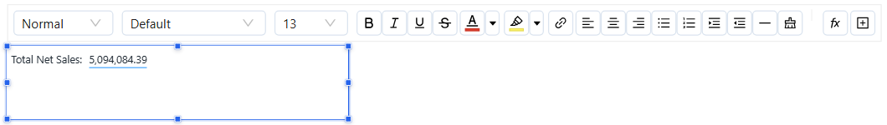

# Rich text

**Rich text** (called *Text Box* before 10.00) holds formatted paragraphs, headings, lists, links and live values, for example *Net Sales this year: 5.09M (+8.2%)*.

## Edit

1. In **Components → Assists**, click **Rich text**, then click the canvas.
2. The first click selects the component (you can drag it, even over the text). Click the text again, or double-click, to edit; the cursor goes where you clicked.
3. Use the toolbar above the component, then click outside to finish.

While you edit, page shortcuts such as Delete, arrow keys and Ctrl+C/V/Z act on the text, not on the component.

## Toolbar

| Group | Buttons |
| --- | --- |
| Paragraph | **Paragraph style** (Normal, Heading 1–3), alignment, bulleted and numbered lists, **Increase indent** / **Decrease indent**, **Divider** |
| Characters | Font and size, **Bold**, **Italic**, **Underline**, **Strikethrough**, **Text color**, **Highlight**, **Clear formatting** |
| Links | **Link**: `http`, `https`, `mailto` and site addresses, optionally **Open in new window** |
| Values | **Insert dynamic value** (date, user, report name, parameter, filter selection), **Insert value block** (a live measure value) |

**Text color** and **Highlight** remember the last colour: click the left part to apply it again.

## Value blocks

**Insert value block** adds a measure value calculated by a query, such as total Net Sales under the current filters. Choose its measure in the block settings. With **Match surrounding text** (on for new blocks) it takes the font, size and colour of the paragraph. An empty block shows *Select data* in the editor and nothing in the report.

Copying a Rich text component copies its value blocks; copying selected text copies the values as they are displayed.

## Style

- **Default text**: **Default font** (13 px), **Line height** (1.4), **Vertical alignment**, **Overflow** (**Show outside**, **Scroll bars**, **Clip**).
- **Effects**: background, border, padding (default 5 px), opacity, hover effect.

When you paste from Word or a web page, paragraph colours, sizes, fonts and bold/italic/underline/strikethrough are kept; tables become one paragraph per row.

## Actions

**Click action** (clicking anywhere on the text) and **Visibility**. See [Click Actions and Visibility](/documentation/Visualization/Click-Actions-and-Visibility/).

For one-style labels, [Text](/documentation/Visualization/Text/) is simpler.
