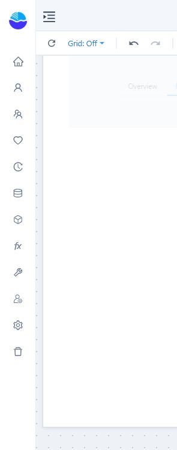

# Action button

Provide an explicit control for navigation or a report action.

1. Add **Components → Assists → Action button**.
2. Under **Style → Content**, set the button text and optional icon. Use a specific label such as **Reset filters** or **Open details**.
3. Configure **Style type & states** so the button remains readable in each state.
4. Open **Actions → Click action**, choose **On click**, and complete the selected action’s settings.
5. Test the button in Preview.

The Data panel also offers **Data binding**, **Analysis model**, **Field**, and **Filters** for buttons whose content depends on data. Start with a fixed label unless data-driven content is needed.

Keep action labels distinct. Readers should know whether a button opens another report, changes the current tab, or resets a selection.
