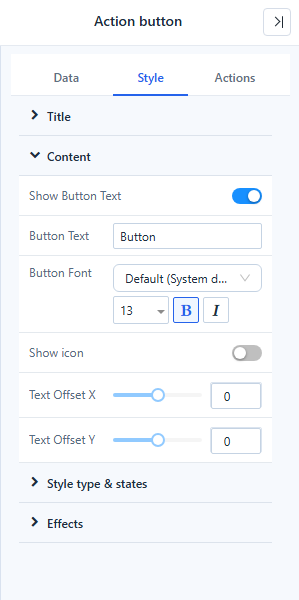
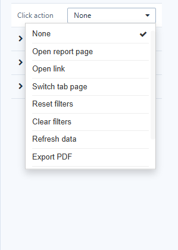

# Action button

An **Action button** (called *Image Button* before 10.00) is a button that does one thing when clicked: open a report, switch a tab, reset filters, export the page and more.

## Add a button

1. In **Components → Assists**, click **Action button**, then click the canvas. A new button is 120 × 36 px with the text *Button*.
2. On **Style → Content**, set the **Button Text**, font and an optional icon.
3. On **Actions → Action**, choose the **Click action** and fill its settings.
4. Test the button in **Preview**: in the editor a click only selects it.

## Style

| Group | Settings |
| --- | --- |
| **Content** | **Show Button Text**, **Button Text**, **Button Font**, **Show icon**, **Icon** (from the icon library), **Icon position** (Left, Right, Top, Bottom), **Icon size**, **Text Offset X/Y** |
| **Style type & states** | **Style type**: **Fill**, **Outline**, **Text** or **Image**. With **Follow primary color** on, the hover, pressed and disabled colours are derived from one colour. Turn it off to set **Background**, **Text color** and **Border** for each **State**: Default, Hover, Pressed, Disabled. |
| **Effects** | Border, corner radius, shadow |

Buttons from earlier versions show the style type **Legacy style** and keep their look.

## Actions

| Group | Settings |
| --- | --- |
| **Action** | **Click action**: None, Go to report, Open link, Switch tab, Reset filters, Clear filters, Refresh data, Export PDF, Full screen, Open AI insight |
| **Disable condition** | **Never**, **When there is no data**, **By report parameter** |
| **Visibility** | Always, Hidden in preview, by report parameter, user or role |
| **Custom script** | Runs on click; return `false` to cancel the action |

Details of each action and rule: [Click Actions and Visibility](/documentation/Visualization/Click-Actions-and-Visibility/).

## Bind the button to data

New buttons need no data. Turn on **Data → Data binding** to show a value from the model on the button: choose **Analysis model**, **Field** and **Filters**. The first member of the field becomes the button text, can be mapped to an image, and is passed as a parameter when the button opens a report. **Disable condition → When there is no data** then greys the button out when the query returns nothing.

Use labels that say what happens, such as *Reset filters* or *Open store details*.
