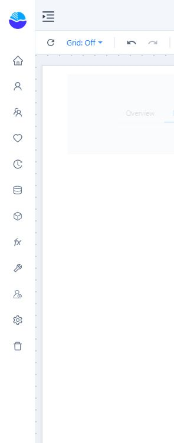

# Web page

**Web page** (called *Iframe* before 10.00) embeds another page in the report, such as a map service, a form or an internal portal.

## Set the address

1. In **Components → Assists**, click **Web page**, then click the canvas.
2. On **Data**, set the address in one of three ways:
   - **Custom Hyperlink**: type the URL.
   - **From repository**: pick a file or report from the repository.
   - **Analysis model** and **URL field**: take the address from data.
3. **Insert dynamic value** appends a value such as `{{param.Region}}` to the address; values are URL-encoded. See [Dynamic Values](/documentation/Visualization/Dynamic-Values/).
4. **Append filter values** (on by default) adds the selections of linked filters as `field=value` to the address.

The page reloads when parameters or filters in the address change. Only `http`, `https` and relative addresses are used.

## Style → Web page behavior

| Setting | Default | What it does |
| --- | --- | --- |
| **Auto refresh** | 0 (off) | Reloads the page every 5–600 s in the report. Skipped while the browser tab is in the background. |
| **Scroll bars** | Auto | **Hidden** removes the page's scroll bars. |
| **Allow full screen** | On for new components | Lets the embedded page go full screen. |
| **Click through** | Off | Clicks pass to the components below, for example when the page is only a background. |

## Actions

**Visibility**, and **Events → Pre-change**, a script that can change the address before the page loads.

## If the page stays blank

Many sites refuse to be embedded, or need their own sign-in. The browser then shows its own error page inside the frame; after 20 s without loading the component says *The page did not load: the address may be invalid, or the site does not allow embedding*. Use an **Open link** click action on a button instead.
