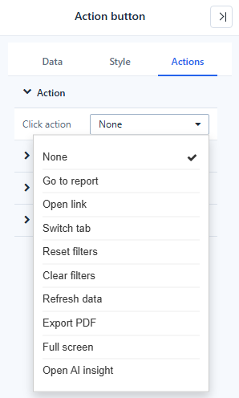
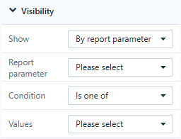
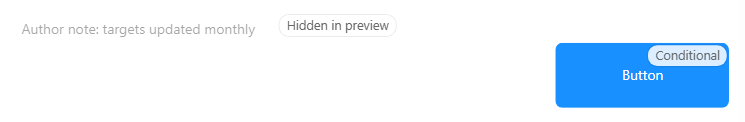

# Click Actions and Visibility

## Click actions

Text, Rich text, Image, Icon and Shape have **Actions → Click action → On click**. The Action button has the same actions, with the same names, under **Actions → Action → Click action**.

| Action | What it does | Settings |
| --- | --- | --- |
| **Go to report** | Opens another report or a URL | **Drill-through settings**: target, how it opens, parameters |
| **Open link** | Opens a web address | **Link URL**, **Open in**: Current tab, New tab (default), Tooltip, Pop-up |
| **Switch tab** | Shows a tab of a Tabs component | **Tabs component**, **Switch to** |
| **Reset filters** | Returns all filters to their opening values | – |
| **Clear filters** | Sets clearable filters to All | – |
| **Refresh data** | Re-queries all data components; the page is not reloaded | – |
| **Export PDF** | Exports the page | – |
| **Full screen** | Shows the page full screen; click again to leave | – |
| **Open AI insight** | Opens an AI reading of the data | **Analysis scope**: Whole page, Current tab page, Selected components |

- Actions run in the report (Preview and view mode). In the editor a click selects the component.
- The pointer turns into a hand only when the action is complete, for example **Open link** with a URL.
- Links, inputs and buttons inside the component keep their own behaviour.
- A Shape without an action lets clicks pass through to the components below, so it can be used as a background panel.

**Reset filters** and **Clear filters** work like the [Filter button](/documentation/Visualization/Filter-Button/).

## Visibility

**Actions → Visibility → Show** is available on Text, Rich text, Image, Icon, Shape, Action button, Web page and AI insight.

| Show | The component is visible |
| --- | --- |
| **Always** (default) | Always |
| **Hidden in preview** | Only in the editor, for notes to other authors |
| **By report parameter** | When **Report parameter** meets the **Condition** for the **Values** |
| **By current user** | For the users you list |
| **By current role** | For the roles you list |

**Condition**: **Is one of**, **Is not any of**, **Is empty**, **Is not empty**. A rule that is not complete has no effect. The parameter value comes from a filter bound to the parameter, then the URL, then the parameter's default; components show and hide as it changes.

In the editor, hidden components are drawn semi-transparent and marked *Hidden in preview* or *Conditional*.

Visibility is a layout tool, not security: hidden components still belong to the report. Use permissions and row-level security for data access.

## Disable an Action button

The Action button also has **Actions → Disable condition → Disable**: **Never** (default), **When there is no data** (when the button is bound to data and the result is empty), or **By report parameter**. A disabled button shows its disabled style and does nothing.

Related: [Assist Components](/documentation/Visualization/Assist-Components/) · [Dynamic Values](/documentation/Visualization/Dynamic-Values/) · [Tabs](/documentation/Visualization/Multi-Tabbed-Page/)
