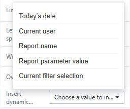

# Dynamic Values

A dynamic value is a placeholder in double braces that the report replaces when it opens and whenever filters or parameters change: `Sales report for {{filter.Region}}, {{date:YYYY-MM-DD}}`.

## Insert one

In Text and Shape, use **Style → Content (or Text) → Insert dynamic value**; in Rich text, the toolbar's **Insert dynamic value**. Or type the placeholder.

| Placeholder | Becomes | Menu item |
| --- | --- | --- |
| `{{param.NAME}}` | The value of a report or global parameter, or a system variable such as `{{param.system.username}}` | **Report parameter value** |
| `{{filter.NAME}}` | The selection of the filter component whose title or field is NAME; *All* when nothing is selected | **Current filter selection** |
| `{{date}}`, `{{date:FORMAT}}` | The date and time the report was opened or refreshed; default format `YYYY-MM-DD` | **Today's date** |
| `{{user.name}}` | The signed-in user | **Current user** |
| `{{page.title}}` | The report name | **Report name** |

Date format codes: `YYYY`, `YY`, `MM`, `M`, `DD`, `D`, `HH`, `H`, `mm`, `ss`. Example: `{{date:DD/MM/YYYY HH:mm}}`.

If the report has parameters or filters, the menu lists each by name. Otherwise the inserted placeholder has no name (`{{param.}}`); type the name after the dot.

## How they are shown

- In the editor you see the placeholders; in the report you see the values.
- An unknown parameter or filter name stays visible in the editor and is blank in the report.
- Several selected filter values are joined into one text.
- A parameter's value comes from a filter bound to it, then the URL (`?NAME=value`), then its default.
- In Image URLs and Web page addresses the values are URL-encoded.

## Where they work

Text, Shape text, Rich text, Image URL, Web page address, and the rules of [Visibility](/documentation/Visualization/Click-Actions-and-Visibility/). Component titles use a different syntax, `${NAME}`; see [Parameters in component titles](/documentation/Analysis/Creating-Parameters/#component-titles).

Related: [Creating Parameters](/documentation/Analysis/Creating-Parameters/) · [Text](/documentation/Visualization/Text/)
