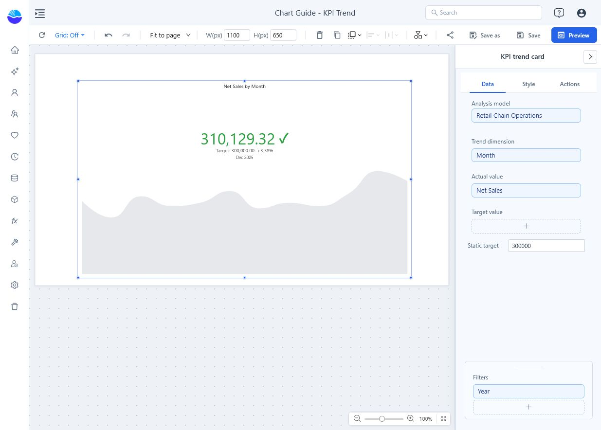
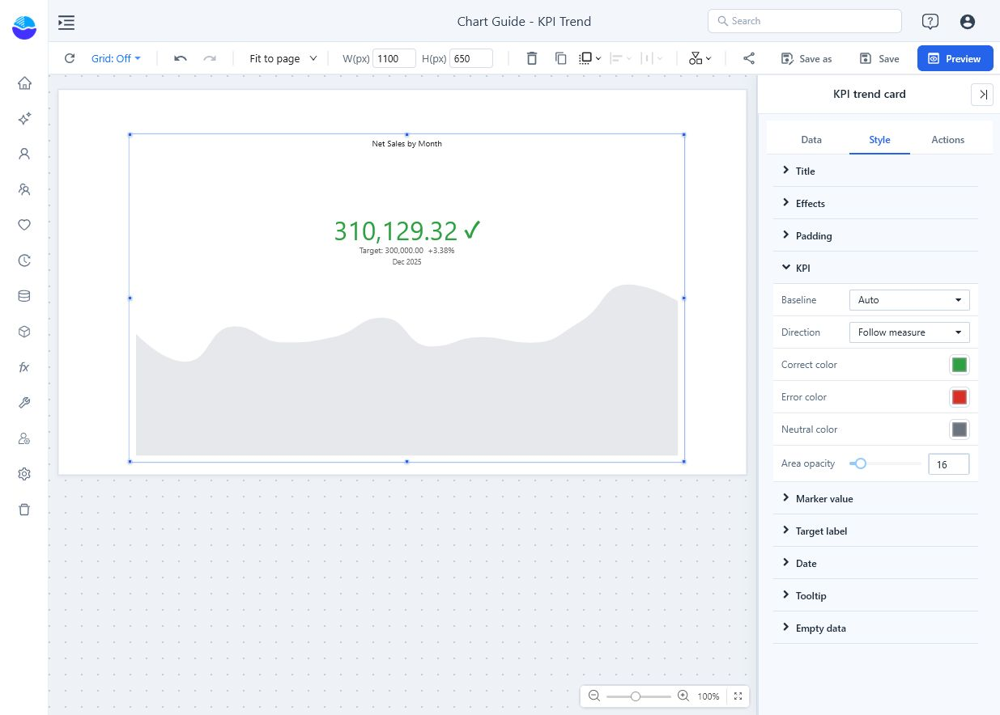

# KPI trend card

Combine a current value, a trend and a status comparison. Use it for a metric tracked over ordered periods, such as daily sales or monthly response time. Its highlighted value is the last valid actual value in the returned sequence, not the sum of the trend.

## Build a monthly KPI

1. Add **Components → Charts → Cards & KPI → KPI trend card** (a new card is 320 × 220 px) and select an **Analysis model** in **Data**.
2. Bind **Trend dimension** to a month or date field and **Actual value** to the metric.
3. Bind **Target value** to a target measure when targets vary by period. Otherwise enter a **Static target** for a fixed benchmark.
4. Set **Filters** and keep the trend in chronological order. Include the year in the period context.
5. Check that actual and target use the same unit and aggregation grain.

| Field group | Holds |
| --- | --- |
| **Trend dimension** | The periods (or categories) of the trend area. |
| **Actual value** | The measure. The automatic title names only this measure, for example *Net Sales by Month*. |
| **Target value** | Optional target measure, read at the same period as the highlighted actual. |
| **Static target** | Optional fixed number, used when no target measure is bound. |
| **Filters** | Component filters. |

For a sales example, each point should represent one month's sales and that month's target. A full-year target is not an appropriate direct comparison with a single month's actual.

The retail example uses **Month**, **Net Sales**, **Static target = 300000**, and **Year = 2025**. December sales are **310,129.32**, so the second line reads *Target: 300,000.00 +3.38%*.

## Choose the status rule

Open **Style → KPI**:

| Option | Effect | Default |
| --- | --- | --- |
| **Baseline** | **Auto**: the target if there is one, otherwise the previous valid actual. **Target value**: the latest actual against the target. **Previous value**: change from the previous valid actual. | **Auto** |
| **Direction** | **Follow measure** (the measure's **Direction** in the model), **Higher is better**, **Lower is better**. | **Follow measure** for new cards, **Higher is better** in older reports |
| **Correct color**, **Error color**, **Neutral color** | Colour of the value and status icon when the status is correct, wrong or neutral. The trend area always uses **Neutral color**. | Green, red, grey |
| **Area opacity** | Opacity of the trend area, 0–100%. | 16% |

The status icon is ✓ (correct), ✕ (wrong) or • (neutral: equal values, no baseline, or a measure whose model direction is Neutral). The card itself has no Neutral option, and with **Follow measure** a measure without a direction counts as **Higher is better**. See [Measures](/documentation/Model/Measures-and-Calculated-Measures/) for the model's **Direction**.

With the same example, **Previous value** compares December with November and the second line reads *Previous: 343,807.18 -9.80%*. The headline actual remains **310,129.32**; changing the baseline changes the comparison, not the actual.

Lower response time should not receive the same favorable direction as higher sales. Equal or unavailable comparisons should not be read as a success just because a trend is visible.

## Format the headline and the second line

| Group | Options | Defaults |
| --- | --- | --- |
| **Marker value** | **Font**, **Marker alignment** (also aligns the second line and the date), **Unit** (**None**, **Thousand**, **Million**, **Billion**, **Trillion**; Chinese and Japanese interfaces add `万` and `亿`), **Decimal places** (0–8), **Show status icon**, **Status icon size** (10–120). | 52 px, center, None, 2, on, 44 |
| **Target label** | **Show**, **Label text**, **Font**. | On, *Target*, 16 px |
| **Date** | **Show date** (date of the last returned period), **Font**. | On, 14 px |
| **Tooltip** | **Show Tooltip** for the trend area: period, actual and target. | On |
| **Padding** | Space around the trend area. Without it, the area starts below the value, second line and date, so peaks do not run behind the text. | Automatic |

The second line has two forms, both formatted with the marker's **Unit** and **Decimal places**:

- *Target: 317,333.60 -18.80%*: the target and the gap to it. **Label text** replaces the word *Target*.
- *Previous: 268,883.46 -4.17%*: used when the baseline is the previous value. The change is (latest − previous) ÷ \|previous\|, with at most four decimals, and is omitted when the previous value is 0; "-" means there is no previous value. **Label text** does not apply to this line; **Show** and **Font** do.

The KPI trend card has its own unit setting and does not use the shared **Display units** control; see [Display units and decimal places](/documentation/Visualization/Display-Units/).

## Interaction

The card does not react to clicks: it cannot cross-filter other components, drill or open **View details**, and it has no data point menu. **Actions** has only **Data refresh** and **Events** (before fetch, before execution); there are no **Interactions** settings.

## Reports from earlier versions

- **Direction** stays **Higher is better**.
- Saved style settings and the **Static target** are now applied when the report is opened. Earlier versions reset them to the defaults on reopening, so such cards can look different now.
- A card that never stored its own **Label text** now shows *Target* instead of *Target label*.
- Click actions saved under **Actions** are kept but never run.

## Check before sharing

Save and open **Preview**. Compare the highlighted value with the final valid observation in a table at the same time grain. Check the target or previous value used as the baseline.

**Current limitation with missing final-period data:** when the last returned period has a target but no actual, the card can display an earlier actual and its target while labeling them with the final period's date. Verify the date and actual together in the component's **More → Data preview**. Filter to completed periods or use a table to show the missing value explicitly; do not treat the headline as the final period's result. A partially loaded current month is also not directly comparable with a completed month unless that is the intended question.

Use a [Measure card](/documentation/Visualization/Measure/) for an aggregate over the entire selected period, and a [Line](/documentation/Visualization/Line-Chart/) chart when readers need a full axis and precise trend inspection.
