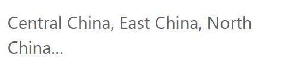

# Dimension field

Display a dimension value as text, such as the selected region, store or product. Use it to make report context visible. This component displays data; it is not an input control for selecting a filter.

## Show the selected region

1. Add **Components → Charts → Cards & KPI → Dimension field** to the canvas. A new one is 200 × 100 px with its title hidden.
2. Select an **Analysis model** in **Data** and put Region in **Field**.
3. Set **Filters** to a single region for a fixed context label, or configure the report's filter interaction so the component receives the intended selection.
4. Inspect the result with one, several and no matching members before styling.

| Field group | Holds |
| --- | --- |
| **Field** | One dimension field. |
| **Time axis** | Optional date field for a page **Date** filter that filters by time axis; see [Date](/documentation/Visualization/Datepicker/). |
| **Filters** | Component filters. |

For a dynamically selected label, use the same business field as the controlling filter. Matching captions are not enough if they belong to different hierarchies or models. See [linked components](/documentation/Visualization/Filter-Subscriptions/).

## What it shows

| Result | Display |
| --- | --- |
| One member | The member name. |
| Two or three members | The names separated by commas, for example *North China, East China*. |
| More than three members | The first three names followed by "…", for example *North China, East China, South China…*. The total is not shown. |
| No rows | The empty-data message, see [Empty data and errors](/documentation/Visualization/Empty-Data-and-Errors/). |

Hovering the text shows the listed names. Names are shown as plain text, even if they contain HTML. When the component cross-filters other components or links to another page, it passes only the first member.

## Format for the available space

| Option | Effect | Default |
| --- | --- | --- |
| **Title → Show** | Shows a caption such as *Selected region* above the value. | Off for new components, on in older reports |
| **Main value → Font** | Size, colour, bold, italic of the value. | 28 px |
| **Main value → Align** | Horizontal alignment. | Left |
| **Main value → Text wrap** | Wraps long names onto several lines. | On |
| **Empty data** | Message when no row matches. | Page setting |

Give long product or store names enough width. Do not design the report as though a single value is guaranteed unless the filters enforce that. Avoid a specific region name as the empty-data text, because it could imply that a filter is active when no data matches.

## When the text is wrong

A label that changes while the related charts stay unchanged misleads readers: when you change the controlling filter, both the text and the charts must update, so check the interactions for every target component.

If the component shows several values or ends with "…", narrow its filters or the controlling selection to one member. If it shows an unexpected value, check the model, exact field and filter subscriptions. For a fixed heading or a sentence assembled with dynamic values, use **Assists → Text** instead.
