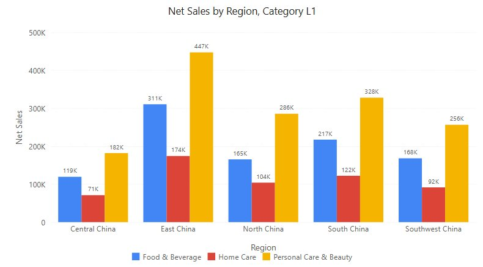
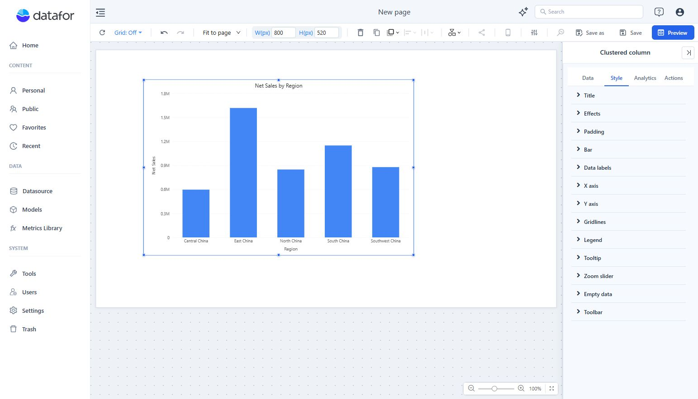

# Clustered column

Vertical columns, side by side, measured from a common zero baseline. Use it to compare a measure across a handful of categories or periods, for example net sales by region, optionally split into series such as product category.

Use a [Clustered bar](/documentation/Visualization/Clustered-Bar-Chart/) when category names are long or there are many categories, a [Stacked column](/documentation/Visualization/Stacked-Column-Chart/) when the total matters, and a [Line](/documentation/Visualization/Line-Chart/) for a trend over many periods.

This page also describes the behaviour that all six column and bar charts share: [value axis](#value-axis), [data labels](#data-labels) and [switching between column and bar charts](#switch-between-column-and-bar-charts).

## Build a sales comparison

1. In **Components → Charts → Column & bar**, click **Clustered column**, then click the canvas. A new chart is 400 × 300 px.
2. In **Data**, choose an **Analysis model**. Click **+** under each field group, choose fields and click **Back**.
3. Set **Filters** to a defined period, such as Year = 2025.

| Field group | Example | Purpose |
| --- | --- | --- |
| **X-axis** | Region | One group of columns per member. A hierarchy can be [drilled down](/documentation/Analysis/Drill-down/). |
| **Legend** | Product Category | Optional. One column per member inside each group. |
| **Measures** | Net Sales | One or more measures to compare. |
| **Tooltips** | Order Count | Extra values in the tooltip; not drawn. |
| **Color** | Optional field | Colours the columns by a dimension or measure; single measure only. |

- With several measures, **Legend** and **Color** are not available: each measure is a series with its own colour, set in the measure's **Color** menu. Keep the units compatible; use a [Combo](/documentation/Visualization/Combo-Chart/) for an amount and a rate.
- Measures without an **X-axis** field give one column per measure, each in its own palette colour.
- Drag a field between **X-axis** and **Legend** to swap the roles; see [Adding Components](/documentation/Visualization/Adding-Charts/).
- The automatic title reads *Net Sales by Region, Product Category* (X-axis field before Legend). After a drill-down it names only the current level.
- The X-axis name defaults to the **X-axis** field, at the current drill level. It appears as grey placeholder text in **X-axis name** until you type your own.
- To rank, sort with the X-axis field's **More function** menu; see [Sorting](/documentation/Analysis/Sorting/).

## Style settings

| Group → option | Effect | Default |
| --- | --- | --- |
| **Bar → Space (%)** | Gap between column groups, as a share of the category width (0–90). | 20 |
| **Bar → Round corners** | **None**, 2px … 64px. All four corners of each column. | **None** |
| **Data labels → Show** | Values on the columns. | Off |
| **Data labels → Position** | **Top**, **Inside top**, **Center**, **Inside bottom**. | **Top** |
| **Data labels → Font** | Size, colour, bold, italic. | – |
| **Data labels → Display units**, **Decimal places** | Label number format, for example 1.85M. See [Display Units](/documentation/Visualization/Display-Units/). | **Auto** for new charts; **Follow measure format** in older reports |
| **X axis → Type** | **Categorical** or **Continuous** for a date or numeric field. See [X axis type](/documentation/Visualization/X-Axis-Type-Settings/). | Depends on the field |
| **X axis → Rotate labels** | Angle of the category labels. When never set, labels that do not fit are rotated 30°, 45° or 60° (the first that leaves a gap), otherwise 90°; the slider shows the applied angle. | Automatic |
| **X axis → Show axis name**, **X-axis name** | Axis title. Empty = the X-axis field. | On |
| **Y axis → Scale** | Tick unit: **Auto**, **K**, **M**, **B**, **T**, **%**. | **Auto** |
| **Y axis → Y-axis min value**, **Y-axis max value** | Fixed bounds. Empty = automatic. | Empty |
| **Y axis → Show axis name**, **Axis name** | Axis title. Empty = the measure names. | On |
| **Tooltip** | **Show Tooltip**, **Sort**, **Show total**, **Show percentage**, **Highlight hovered series**. See [Tooltips](/documentation/Visualization/Tooltips-for-Chart-Components/). | **Show Tooltip** on |
| **Zoom slider → Zoom** | Sliders for zooming into a continuous axis (a date or numeric X axis, the value axis). | Off |

Legend options (**Show**, **Pagination**, position) are described in [Legends](/documentation/Visualization/Legends/); colours in [Colors](/documentation/Visualization/Colors/) and [Conditional colors](/documentation/Visualization/Conditional-Colors/).

## Value axis

These rules apply to Clustered column, Stacked column, Clustered bar and Stacked bar. The 100% charts keep a 0–100% axis; see their pages.

- **The automatic range always includes 0.** Column length encodes the value, so all-positive data starts at 0, all-negative data ends at 0, and mixed data spans both. An axis that started near the smallest value would make a 2.8× difference look like 18×.
- **Fixed bounds** in **Y-axis min value** / **Y-axis max value** (on bar charts **X-axis min value** / **X-axis max value**) override the automatic range. If the minimum is not less than the maximum, both are ignored and the axis stays automatic.
- **Scale → Auto** picks the unit from the tick interval: an axis from 0 to 2 million in 500K steps reads 0, 0.5M, 1.0M, 1.5M, 2.0M. A fixed unit gives every tick the same number of decimals. See [Value axis units](/documentation/Visualization/Display-Units/#value-axis-units).
- **Percent axis only for percentages.** The axis shows % only when every measure on it is formatted as a percentage. An amount and a rate on one axis show plain numbers, and the rate stays close to zero: use a [Combo](/documentation/Visualization/Combo-Chart/) with two axes instead.
- **Hiding a series** in the legend rescales the automatic axis to the remaining series (still from 0). Fixed bounds are kept. Showing all series restores the original range.

## Data labels

Turn on **Style → Data labels → Show**. The **Position** options depend on the chart; the first one is the default:

| Chart | Position options |
| --- | --- |
| Clustered column | **Top**, **Inside top**, **Center**, **Inside bottom** |
| Stacked column, 100% stacked column | **Inside top**, **Center**, **Inside bottom** |
| Clustered bar | **Inside left**, **Center**, **Inside right**, **Right** |
| Stacked bar, 100% stacked bar | **Inside left**, **Center**, **Inside right** |

- **Labels that do not fit are hidden.** A label inside a column or segment (every position except **Top** and **Right**) is not drawn when its text is wider or taller than the column. It reappears when the chart is enlarged. Use **Display units** for shorter numbers, or **Top** / **Right** to place labels outside.
- **Automatic contrast (new charts).** Labels inside columns get dark or light text to suit the column colour, as long as the label colour in **Font** is unchanged. Pick a colour in **Font** to fix it. There is no switch for this; older reports keep their fixed colour.
- **Units per measure.** **Display units** picks one unit per measure. With a unit and **Decimal places** = **Auto**, labels get about three significant digits (1.85M, 0.97M, 0.50M).
- Stacked column and Stacked bar add **Show total** and **Hide labels below (%)**; see [Stacked column](/documentation/Visualization/Stacked-Column-Chart/#totals-and-segment-labels).
- 100% stacked charts show shares and have no **Display units**; see [100% stacked column](/documentation/Visualization/100-Stacked-Column-Chart/#labels-tooltips-and-copied-values).

## Switch between column and bar charts

Switching with **Chart switch** in the toolbar between a vertical chart (Clustered, Stacked or 100% stacked column, Line, Area, Stacked area, 100% stacked area) and a bar chart (Clustered, Stacked or 100% stacked bar) moves the axis settings by role, not by letter:

- The category-axis name, axis line, **Show scale labels**, label font and label width, **Show axis name**, value-axis minimum and maximum, **Scale** and gridlines move between X axis and Y axis.
- Data label **Position** maps **Top** ↔ **Right**, **Inside top** ↔ **Inside right**, **Inside bottom** ↔ **Inside left**, **Center** ↔ **Center**.
- Settings that exist on only one side are kept for switching back.

Switching to Combo or to other chart types, or within the same orientation, is unchanged.

## Interaction

- **Tooltip**: rest the pointer on a column. **Sort**, **Show total** and **Show percentage** list all series of the category; see [Tooltips](/documentation/Visualization/Tooltips-for-Chart-Components/).
- **Legend**: click to hide a series, double-click to show only that series; see [Legends](/documentation/Visualization/Legends/).
- **Click a column** to [cross-filter](/documentation/Analysis/Cross-Filtering/) other components (**Actions → Interactions**) or [drill down](/documentation/Analysis/Drill-down/). Right-click for the [data point menu](/documentation/Analysis/Exploratory-Analysis/); **Actions → View details** adds a detail table to it.
- **Analytics** adds target and average lines and bands; see [Reference lines](/documentation/Analysis/Chart-Reference-Lines/).

## Common symptoms

| Symptom | Check |
| --- | --- |
| Some labels are missing | Inside labels that do not fit are hidden. Enlarge the chart, set **Display units**, or use **Top**. |
| Differences look small | The axis starts at 0 by design. A fixed **Y-axis min value** zooms in, but tell readers the axis does not start at 0. |
| Fixed bounds have no effect | The minimum must be less than the maximum; otherwise both are ignored. |
| The axis shows plain numbers for a percentage | Another measure on the same axis is not a percentage. |
| Categories are missing | Check filters and any [row limit](/documentation/Analysis/Top-Bottom-N/); see also [Empty data and errors](/documentation/Visualization/Empty-Data-and-Errors/). |
| **Legend** or **Color** is missing | Several measures are assigned. |

If the values themselves look wrong, see [Resolve common data problems](/documentation/Visualization/Choose-a-Chart/#resolve-common-data-problems).

::: details Opening reports made before 10.00
- Automatic value axes now include 0, so a chart whose axis started near the smallest value is redrawn from 0 when opened. Charts where the old **Zero align** switch (no longer in the panel) was saved off keep the data range.
- Labels inside columns that do not fit are now hidden.
- The default X-axis name is now always the X-axis field at the current drill level. Before, it could show the Legend field or the top drill level.
:::

Related: [Stacked column and bar](/documentation/Visualization/Stacked-Column-Chart/) · [100% stacked column and bar](/documentation/Visualization/100-Stacked-Column-Chart/) · [Clustered bar](/documentation/Visualization/Clustered-Bar-Chart/) · [Component filters](/documentation/Analysis/Component-Level-Filtering/)
