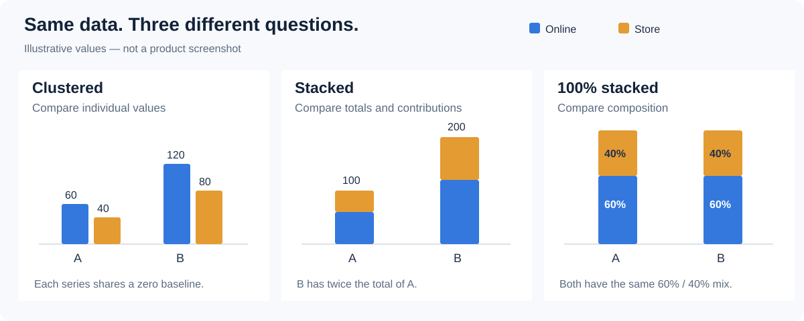

# 100% stacked column

Use vertical columns to compare the composition of categories whose totals differ. Every non-empty category is normalized to a whole. Equal bar lengths do not mean equal sales.

## Build a sales-mix chart

1. Add **Components → Charts → 100% stacked column**, select it, and choose an **Analysis model** in **Data**.
2. Use **+** to choose the fields below. Click **Back** after each selection.

| Slot | Example | Purpose |
| --- | --- | --- |
| **X-axis** | Month | One position per category or period. |
| **Measures** | Net Sales | Value used to calculate each contribution. |
| **Legend** | Region | Segments within each column. |
| **Tooltips** | Optional order count or quantity | Context without adding another plotted measure. |

3. Set **Filters** to a defined period, such as Year = 2025. Keep months in chronological order; include year when comparing more than one year.
4. Check the category and series values before opening **Style**.

Use either one measure split by a **Legend** dimension, or multiple compatible measures representing separate parts. Do not stack an overall total together with its own components: that counts the same value twice. The **Legend** and **Color** slots can disappear when several measures are assigned; the measure names then identify the series.

## Read and format the chart

Read each segment as a share of its category total. For example, 30 sales out of a total of 100 and 300 out of 1,000 both occupy 30%. Keep a raw-value tooltip or a separate total chart when volume matters.

- **Bar** controls the mark presentation and spacing. Increase the chart size before squeezing many categories into it.
- **Data labels** are useful for a small number of values; use **Tooltip** for a dense chart.
- **Y axis** is the value axis. Keep its percentage meaning clear.
- **X axis** contains category labels. Check label spacing and rotation, especially for dates.
- Keep the **Legend** visible for multiple series. Use the same series colors across related charts.

## Validate and troubleshoot

Save and open **Preview**. Hover at least one category and compare its values with the source or a table using the same filters.

- If every category looks equally important, inspect raw totals: normalization deliberately removes volume differences.
- If a share is unexpected, check the included series, nulls and filters. Prefer non-negative, additive values for a part-to-whole comparison.
- If series disappear after a chart-type change, recheck the data slots.

Choose a stacked chart when absolute totals matter. See [component filters](/documentation/Analysis/Component-Level-Filtering/).
