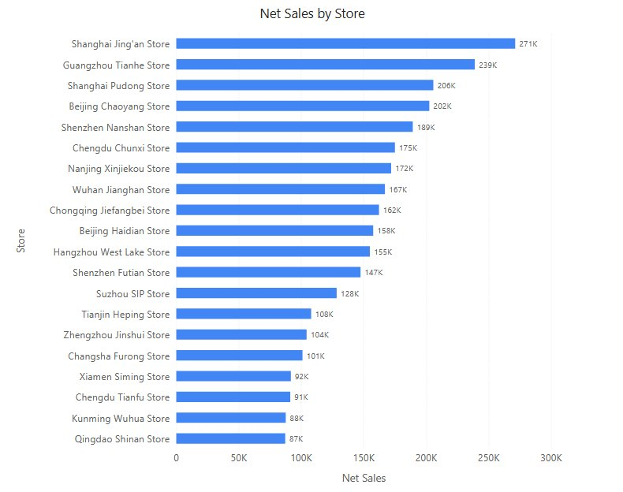

# Clustered bar

Horizontal bars, side by side, measured from a common zero baseline. Use it for rankings and for categories with long names or many members, for example net sales by store. Use a [Clustered column](/documentation/Visualization/Clustered-Column-Chart/) when there are few categories with short names, or a period axis.

## Build a sales ranking

1. In **Components → Charts → Column & bar**, click **Clustered bar**, then click the canvas. A new chart is 400 × 300 px.
2. In **Data**, choose an **Analysis model** and fill the field groups. Click **Back** after each selection.
3. Set **Filters** to a defined period, such as Year = 2025.
4. Sort with the Y-axis field's **More function** menu so the largest value appears where readers expect it; see [Sorting](/documentation/Analysis/Sorting/).

| Field group | Example | Purpose |
| --- | --- | --- |
| **Y-axis** | Region | One row of bars per member. |
| **Legend** | Product Category | Optional. One bar per member inside each row. |
| **Measures** | Net Sales | One or more measures to compare. |
| **Tooltips** | Order Count | Extra values in the tooltip; not drawn. |

With several measures, **Legend** and **Color** are not available; each measure gets its own colour. Use a [Combo](/documentation/Visualization/Combo-Chart/) for an amount and a rate.

## Settings specific to bars

On bar charts the **X axis** is the value axis and the **Y axis** holds the category names.

| Group → option | Effect | Default |
| --- | --- | --- |
| **Bar → Space (%)** | Gap between rows, as a share of the row height (5–90). | 50 |
| **Bar → Round corners** | **None**, 2px … 64px. | **None** |
| **Bar → Right margin** | Space in px to the right of the plot. Empty = automatic; **0** = no margin. | Empty (**Auto**) |
| **Data labels → Position** | **Inside left**, **Center**, **Inside right**, **Right**. | **Inside left** |
| **X axis → Scale** | Tick unit: **Auto**, **K**, **M**, **B**, **T**, **%**. | **Auto** |
| **X axis → X-axis min value**, **X-axis max value** | Fixed bounds. Empty = automatic, from 0. | Empty |
| **Y axis → Label width** | Width of the category labels (40–800 px); longer names are cut off with "..."; increase it or the chart width. | 50 px |
| **Y axis → Show axis name**, **Axis name** | Category-axis title. Empty = the Y-axis field. | On |

- With **Position** = **Right**, the automatic right margin is sized from the widest formatted label, so long labels are not cut off at the edge. If labels overlap the right edge or the scrollbar, clear **Right margin** so it is sized automatically.
- Labels inside bars that do not fit are hidden. With the default **Inside left**, labels of short bars can disappear; choose **Right** when many bars are short.
- **Data labels → Display units** is **Auto** for new charts. Font, decimals and the remaining options are as on the [Clustered column](/documentation/Visualization/Clustered-Column-Chart/#style-settings).

The value axis always includes 0, fixed bounds are ignored when the minimum is not less than the maximum, and hiding a series rescales the axis; see [Value axis](/documentation/Visualization/Clustered-Column-Chart/#value-axis). Switching to a column chart moves the axis settings to the matching axis; see [Switch between column and bar charts](/documentation/Visualization/Clustered-Column-Chart/#switch-between-column-and-bar-charts).

::: details Opening reports made before 10.00
- **X axis → Scale** used to be ignored on bar charts; a unit saved in an old report now takes effect.
- **Right margin** = 0 now removes the margin, and clearing the box returns to automatic spacing immediately.
- Automatic value axes now start at 0, and labels inside bars that do not fit are hidden.
:::

Related: [Stacked column and bar](/documentation/Visualization/Stacked-Column-Chart/) · [100% stacked column and bar](/documentation/Visualization/100-Stacked-Column-Chart/) · [Clustered column](/documentation/Visualization/Clustered-Column-Chart/) · [Component filters](/documentation/Analysis/Component-Level-Filtering/)
