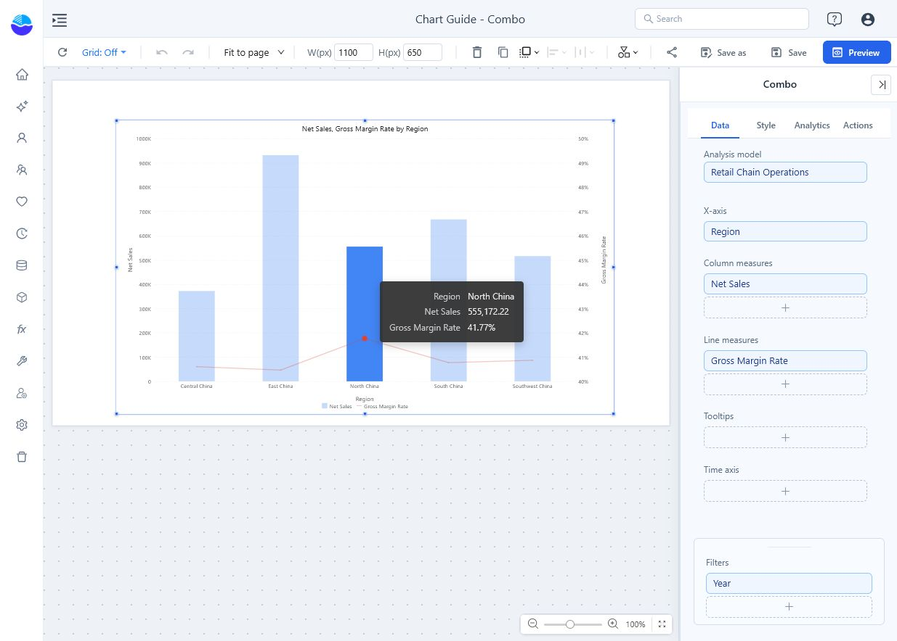
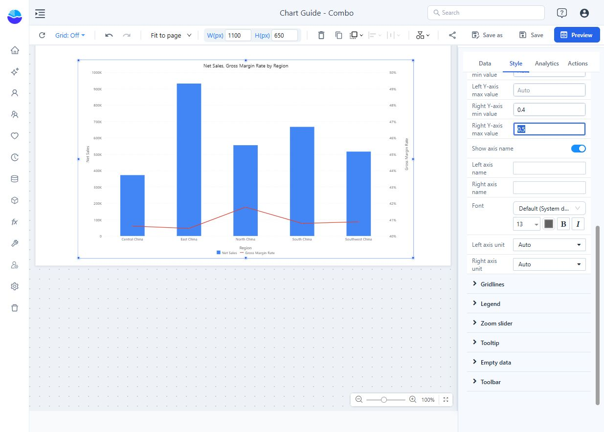

# Combo

Columns and lines on the same categories, each with its own value axis. Use it for related measures with different units or scales: sales and margin rate, orders and average order value, actual and target. Use a [Line](/documentation/Visualization/Line-Chart/) or [Clustered column](/documentation/Visualization/Clustered-Column-Chart/) when every series has the same role.

## Build sales and margin by region

1. In **Components → Charts → Line & area**, click **Combo**, then click the canvas. A new chart is 400 × 300 px.
2. Select it, open **Data**, and choose an **Analysis model**.
3. Click **+** in each field group, choose a field, then click **Back**:

| Field group | Example | Result |
| --- | --- | --- |
| **X-axis** | Region | One position per region, shared by columns and lines. |
| **Column measures** | Net Sales | Sales columns. |
| **Line measures** | Gross Margin Rate | A percentage line across the same regions. |
| **Tooltips** | Optional supporting measures | Extra detail on hover without another series. |
| **Filters** | Year = 2025 | The same period for both measures. |

Drag a measure between **Column measures** and **Line measures** to change how it is drawn. The order is kept when you switch to another chart type and back, and the automatic title, export file name and default measure for reference lines and row limits list the column measures first.

Gross margin rate should divide aggregated gross margin by aggregated sales; averaging individual transaction percentages can give a different result.

The example has separate sales and percentage axes. East China has the largest sales column; North China has the highest margin rate. A line point cannot be compared directly with a column on a different scale.

## Configure the two axes

Open **Style → Y axis**.

| Setting | Effect | Default |
| --- | --- | --- |
| **Merge left and right axis** | Draws columns and lines on one shared value axis. When the measures use different units (amount and percentage), the axis shows plain numbers without %, and the smaller measure stays close to zero. Merge only when the measures share a unit and scale. | Off |
| **Y-axis (line chart) position** | **Left** or **Right**: side of the line axis. Switching moves the axis name, minimum, maximum and unit with the measures, in one undo step. | **Right** |
| **Left Y-axis min value**, **Left Y-axis max value**, **Right Y-axis min value**, **Right Y-axis max value** | Fixed bounds, in the measure's stored units. Empty = automatic. If a minimum is not less than its maximum, both are ignored. | Empty |
| **Show axis name**, **Left axis name**, **Right axis name** | Axis titles. Empty = the names of the measures on that side. | On |
| **Left axis unit**, **Right axis unit** | Tick unit: **Auto**, **K**, **M**, **B**, **T**, **%**. On a merged axis **Left axis unit** applies. | **Auto** |

How the automatic ranges work:

- The **column axis includes 0**; the **line axis follows the data range**. A merged axis includes 0. Older reports in which the former **Align Column Zeros** switch was saved off keep the previous range.
- When the axes are not merged, both include 0, at least one has negative values and neither has fixed bounds, the zero lines of both axes are aligned and the right-axis ticks sit on the gridlines.
- With only line measures (and axes not merged), the line axis is drawn on the left like a Line chart, even with position **Right**; it still uses the right-side name, bounds and unit. Adding a column measure moves it back.
- Hiding a series in the legend rescales its axis, and the default axis names list only the visible measures.

**Merged axis name**: the left-side part, "and", then the right-side part, for example *Net Sales,Cost and Orders,Avg Order Value* when the line axis is on the right (columns Net Sales and Cost, lines Orders and Avg Order Value). Each part uses that side's custom name if set. If only **Left axis name** is filled, it names the whole merged axis. A side without series is left out.

Enter bounds in the measure's stored units. For a rate stored as a decimal, **0.4** to **0.5** displays **40%** to **50%**, as shown below; entering 40 and 50 would produce the wrong scale. A narrow percentage range emphasises small differences: make the displayed bounds clear.

## Control the columns, lines and labels

| Group → option | Effect | Default |
| --- | --- | --- |
| **Column type → Stacked** | Stacks the column measures; lines are not stacked. The column axis then covers the per-category sums of positive and negative values. | Off |
| **Column type → Space (%)**, **Round corners** | Gap between columns; with **Stacked**, only the outer end of each stack is rounded. | 20, **None** |
| **Line → Line width**, **Symbol size**, **Line type** | Line appearance: **Straight**, **Smooth** or **Step**. | 2, 1, **Straight** |
| **Data labels → Show** | Values on columns and points. | Off |
| **Data labels → Data labels on** | **All**, **Columns** or **Lines**: which measures show labels. | **All** |
| **Data labels → Display units**, **Decimal places** | Label number format; one unit per measure, so a quantity of 35 next to sales of 2.5M is written readably. See [Display Units](/documentation/Visualization/Display-Units/). | **Auto** for new charts |

- Labels of negative columns are placed at the negative end of the column, not at the zero line.
- Stack only additive parts of the same total. Combo has no **Show total**.
- Use visible points (**Symbol size**) when there are few categories; avoid **Smooth** if it would imply unobserved values.
- An **Analytics** reference line has an **Axis** choice: **Bar axis** or **Line axis**. A sales target belongs to the bar axis; a margin target belongs to the line axis. See [Reference lines](/documentation/Analysis/Chart-Reference-Lines/).

## Zoom, tooltip and clicks

- **Zoom slider → Zoom** with **Zoom direction** **Both**, **Horizontal only** or **Vertical only** (new charts: **Horizontal only**; older reports: **Both**). A horizontal slider appears only on a continuous (date or numeric) X axis: with a categorical X axis such as Region, **Horizontal only** shows nothing; **Both** or **Vertical only** add sliders for the value axes.
- The tooltip also appears in the blank space between and above columns, for the category under the pointer. Rows without a value show "-", or the text set in the measure's **Empty values as**. **Style → Tooltip** has only **Show Tooltip**.
- Clicking a line point, or within 8 px of it, cross-filters, drills, jumps or opens the data point menu for that point. During cross-filtering, lines are dimmed too and the selected point stays opaque.

## Reports from earlier versions

- **Display units** stays **Follow measure format** and **Zoom direction** stays **Both**.
- Column axes now include 0 unless the old **Align Column Zeros** was saved off; zero lines of the two axes may now be aligned.
- The **Stacked** switch was missing from the panel; it is back under **Column type**.
- A merged axis no longer shows values such as 35000000% when an amount and a rate are merged.

## Check the result

Save, then open **Preview**. Hover a category and confirm both values and units. Apply a report filter and check both series again.

| Symptom | Check |
| --- | --- |
| Line is almost flat | Check units, axis merging and fixed bounds before changing the data. |
| Fixed bounds have no effect | Each minimum must be less than its maximum; otherwise both are ignored. |
| A measure is drawn in the wrong form | Drag it to **Column measures** or **Line measures**. |
| Percentage is 100 times too large | Check whether the source stores 0.42 or 42 and whether its measure format is a percentage. |
| No zoom slider | The X axis is categorical and **Zoom direction** is **Horizontal only**. |
| Color field group is missing | With several measures it is not available; each measure gets its own colour. |
| Result differs from another chart | Match the measure definition, category grain and [component filters](/documentation/Analysis/Component-Level-Filtering/). |

Related: [Line](/documentation/Visualization/Line-Chart/) · [Clustered column](/documentation/Visualization/Clustered-Column-Chart/) · [Legends](/documentation/Visualization/Legends/) · [Cross-filtering](/documentation/Analysis/Cross-Filtering/)
