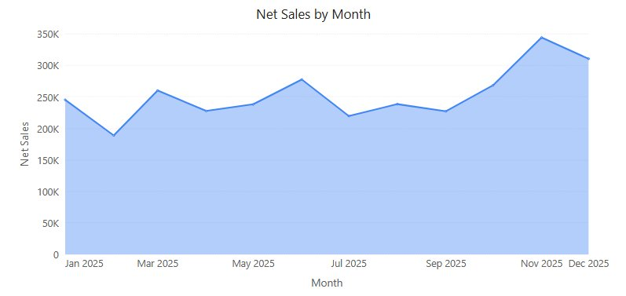
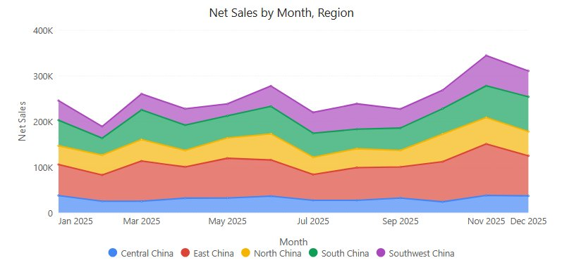
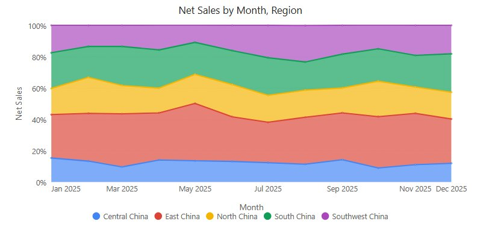

# Area charts

Three line-based charts with the area below the line filled, in **Components → Charts → Line & area**:

- **Area** emphasises volume over time. Use **Line** when several overlapping series must be compared precisely.
- **Stacked area** shows how additive parts and their combined total change over time. The top edge is the total; the thickness of a band is that series' contribution.
- **100% stacked area** shows how the share of each series changes. Every period that has data is scaled to 100%, so differences in total volume are hidden. Earlier versions called it *Stacked ratio chart*.

## Choose the variant

| | **Area** | **Stacked area** | **100% stacked area** |
| --- | --- | --- | --- |
| A series has no value in a period | The area breaks. | Stacked as 0: the band continues at zero thickness. | Counts as 0. |
| **Area transparency** default | 60 % for new charts, 32 % for charts that never set it | 32 % | 32 % |
| Value axis | Automatic range including 0, or **Y-axis min value** / **Y-axis max value**; **Scale** | As Area; covers the positive and the negative sums of each period | Fixed 0–100 %, extended below 0 for negative values; no **Scale**, minimum or maximum |
| Data labels | Value at each point, grey; **Display units** and **Decimal places** | Value of each band; lower layers near-white, the top layer grey; **Display units** and **Decimal places** | Share with one decimal, for example *10.7%*, inside its own band; no **Display units** or **Decimal places** |
| **Tooltip** options | **Show Tooltip**, **Sort**, **Show total**, **Show percentage**, **Highlight hovered series** | As Area; total and percentage need a **Legend** field | **Show Tooltip** only |
| **Analytics** | Reference lines and bands | As Area; **Calculate over** defaults to **Category totals**, which match the top edge | Fixed lines (0–100), vertical lines and bands; no average or other statistic lines |

## Build the chart

1. In **Components → Charts → Line & area**, add **Area**, **Stacked area** or **100% stacked area** and select an **Analysis model** in **Data**.
2. Set **X-axis** to Month and **Measures** to Net Sales.
3. On an **Area**, start without a **Legend** field and add Region only if the overlapping areas stay readable. On the stacked variants, set **Legend** to Region to get one band per region. For several measures, use compatible units; **Color** takes a field only while there is one measure.
4. Set **Filters**, for example Year = 2025, and check that the months are in order.
5. Add context to **Tooltips**, such as order count. On a 100% stacked area, add raw values so readers can see volume as well as share.

On the stacked variants each series must be a distinct part of the whole. Do not stack total sales on top of regional sales. Rates and averages are usually unsuitable, because their sum has no meaning.

A new chart is placed at 400 × 300 px. A new Area or Stacked area has data-label **Display units** set to **Auto**.

The same 2025 data in the three variants:

## Settings that matter

All in the **Style** tab. Variant differences are listed in [Choose the variant](#choose-the-variant).

| Setting | Effect | Default |
| --- | --- | --- |
| **Plot area → Line width** | Width of the line along the top of each area or band. | 2 px |
| **Plot area → Gradient** | Fills the area with a gradient instead of a flat colour. | Off |
| **Plot area → Area transparency** | 0 % is opaque; higher values let overlapping series or layers show through. Not used when **Gradient** is on. | See variants |
| **Plot area → Line type** | **Straight**, **Smooth** or **Step**. | Straight |
| **Data labels → Show**, **Font** | Labels at the points; content and colour per variant as above. On an Area, labels stay inside the plot area and labels that would overlap are hidden. A font colour you set is used for all layers. | Off |
| **Data labels → Display units**, **Decimal places** | Compact numbers such as 1.2M (not on 100% stacked area). See [Display Units and Decimal Places](/documentation/Visualization/Display-Units/). | Auto for new charts, otherwise Follow measure format |
| **Y axis → Y-axis min value**, **Y-axis max value**, **Scale** | Fixed bounds and tick unit (**Auto**, K, M, B, T, %), not on 100% stacked area. Empty bounds = automatic range, which always includes 0. | Empty, Auto |
| **Zoom slider → Zoom** | Adds a zoom slider for long series. | Off |
| **Tooltip** | **Sort**, **Show total**, **Show percentage**, **Highlight hovered series** (100% stacked area: **Show Tooltip** only). See [Tooltips](/documentation/Visualization/Tooltips-for-Chart-Components/). | Series order, off, off, on |

With several measures, the default Y-axis name joins them with "and", for example *Net Sales and Cost*. Reference lines and bands are added in the **Analytics** tab; see [Reference lines](/documentation/Analysis/Chart-Reference-Lines/). There is no **Show total** or **Hide labels below (%)** under Data labels; those exist on [stacked column and bar](/documentation/Visualization/Stacked-Column-Chart/) charts.

## How the area behaves

- **Zero baseline.** The automatic Y-axis range starts at 0 for positive data (ends at 0 for negative data), so the filled area represents magnitude. Type a minimum or maximum to override it.
- **Clicking points.** A click within about 8 px of a point selects that point for [cross-filtering](/documentation/Analysis/Cross-Filtering/), [drill down](/documentation/Analysis/Drill-down/), jumps and the [data point menu](/documentation/Analysis/Exploratory-Analysis/). A click far from every point clears the selection.
- **Single point.** When filters leave one point, it is drawn as a 6 px dot.
- **Category X axis.** The area runs from one edge of the plot to the other. See [X axis type](/documentation/Visualization/X-Axis-Type-Settings/).
- **Gaps.** On an **Area**, a period without a value breaks the area; tell absent data apart from an actual zero before reading a gap as a fall.
- **Overlap.** Transparency helps visibility but does not make overlapping areas additive. If one area hides another, reduce the number of series or switch to **Line**.

## How stacking behaves

These points apply to **Stacked area**; missing values and order also apply to **100% stacked area**.

- **Missing values are stacked as 0.** If a series has no value in a period, the band continues at zero thickness instead of breaking or collapsing onto the layer below. These filled points have no label and no tooltip row, and cannot be clicked. Confirm in a table whether a value is missing or really zero.
- **Negative values.** Series are added in series order, so the top edge is the net total, the same figure as the tooltip total. A negative band overlaps the layer below it. The Y axis covers both the positive and the negative sums of each period.
- **Shares with negative values.** **Show percentage** divides by the sum of absolute values; negative rows read, for example, *-16.5% of the absolute total*. The total row stays the net total.
- **Percentage measures.** A measure formatted as a percentage gets a percent axis, but only when every measure on the axis is a percentage.
- **Label colour after hiding a series.** If you hide the top series with the legend, the labels of the new top layer turn grey only at the next redraw, for example after a filter change.
- **Order.** The tooltip and legend list the series in series order, which is the reverse of the visual stack (the first series is at the bottom).
- **Reading bands.** Read a band's thickness, not its top edge, as the series value. Inner bands do not share a baseline; compare close values with **Line** or a clustered chart.

## How 100% shares are calculated

| Data | Result |
| --- | --- |
| Positive values | Share of the period total. |
| Negative values | Share of the sum of absolute values. Negative bands are drawn below 0. The tooltip reads, for example, *-33.3% of the absolute total (-50)*. |
| All values of a period are 0 | The tooltip reads *All values are 0*. |
| A series has no value, others do | The missing value counts as 0. It has no label or tooltip row and cannot be clicked. |
| The whole period is empty | The period is left blank and the bands are joined across it. |

- Hiding a series with the legend does **not** rescale the others to 100%: the remaining shares stay as calculated over all series.
- Right-click a point and choose **Copy value** to copy the share shown, for example *10.7%*. See [Data point menu](/documentation/Analysis/Exploratory-Analysis/).
- Read band thickness as the share in that period. A region can gain share while its sales fall, if the total falls faster. Pair the chart with a total-sales chart or keep raw values in the tooltip.

If the chart looks wrong, see [Resolve common data problems](/documentation/Visualization/Choose-a-Chart/#resolve-common-data-problems).

::: details Opening reports made before 10.00
- The automatic Y-axis range of Area and Stacked area now includes 0, so existing charts can change shape. Area charts that had the older zero-alignment option switched off keep their range.
- Stacked area: bands that used to break at missing values now continue as zero, and stacks that mix positive and negative values are drawn in series order, with the net total on top.
- Stacked area: with the default label colour, the top layer's labels turn grey.
- 100% stacked area: a Y-axis unit, minimum or maximum saved in the chart (including a unit carried over from switching from **Stacked area**) is ignored; the axis always runs 0–100%. Negative values are now drawn below 0 instead of being cut off at 0%.
:::

Related: [Line](/documentation/Visualization/Line-Chart/) · [100% stacked column and bar](/documentation/Visualization/100-Stacked-Column-Chart/) · [Legends](/documentation/Visualization/Legends/) · [Colors](/documentation/Visualization/Colors/)
