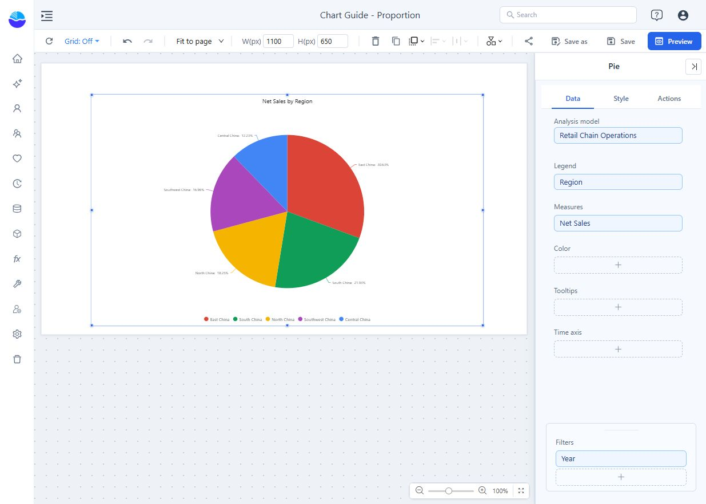
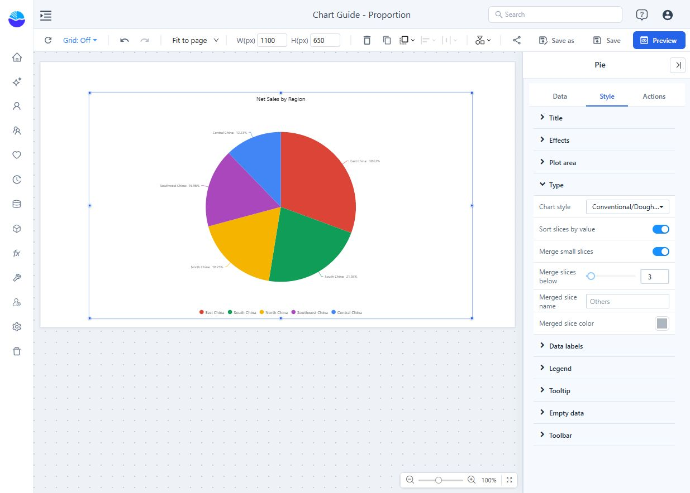

# Pie

Show how a small number of categories contribute to a whole. Use non-negative, additive values such as sales or units. A bar chart is easier to read when categories are numerous or their values are similar.

## Build sales share by region

1. Add **Components → Charts → Pie** and select an **Analysis model** in **Data**.
2. Put Region in **Legend** and Net Sales in **Measures**. Each region becomes one slice.
3. Set **Filters**, for example Year = 2025. Add supporting values to **Tooltips** if needed.
4. Check the slice names and values before styling.

There are two data arrangements:

| Arrangement | What becomes a slice |
| --- | --- |
| A **Legend** field and one measure | Each member of the Legend field. |
| No Legend field and several measures | Each measure. Use only measures that are distinct parts of the same whole. |

With a Legend field, the chart accepts one measure. Do not add revenue and profit as separate slices of a single total: they overlap conceptually. To configure member colors through the **Color** field, bind the same category field there.

## Choose the appearance

In **Style → Type**, **Chart style** offers **Conventional/Doughnut**, **Radius rose**, and **Area rose**. Use the conventional form for a straightforward part-to-whole comparison. Rose styles also vary radial size, so do not read them like ordinary equal-radius slices.

In **Plot area**, adjust **Diameter** to fit the component and **Ring width** to make a doughnut. A smaller ring width makes a thinner ring; 100% makes a solid pie.

- **Sort slices by value** arranges large slices first. A data-panel sort or row limit takes precedence; a merged slice remains last.
- **Merge small slices** combines slices below the chosen threshold. Set **Merge slices below**, **Merged slice name**, and **Merged slice color**. Use an explicit name such as Other regions.
- **Data labels → Label contents** chooses name, value, percentage, or a combination. Use **Min. proportion** to hide labels on tiny slices; hiding a label does not remove its slice.
- Use **Percentage decimal places** for readable percentages and **Legend** when labels cannot all fit.

## Understand the denominator

The visible result follows the chart's filters and data limits. A share of the slices shown may differ from a share of the complete business total. Merging small slices combines visible contributions; filtering removes contributions from the result. Label the scope clearly.

In the example, East China accounts for 30.63% of the displayed 2025 sales. Save and use **Preview** to hover slices and verify the values and percentage basis. If negative values are present, do not describe an absolute-total share as ordinary revenue share; use a bar or waterfall chart instead.

For composition across several groups, use **Grouped donuts**. For nested categories, use **Treemap** or **Sunburst**.
