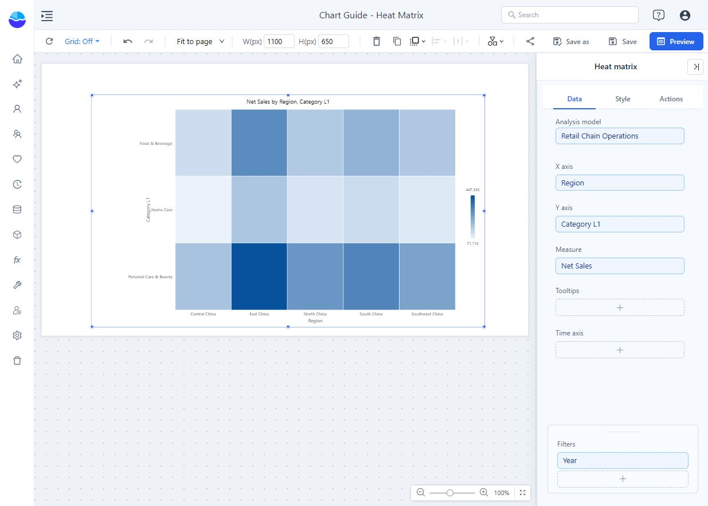
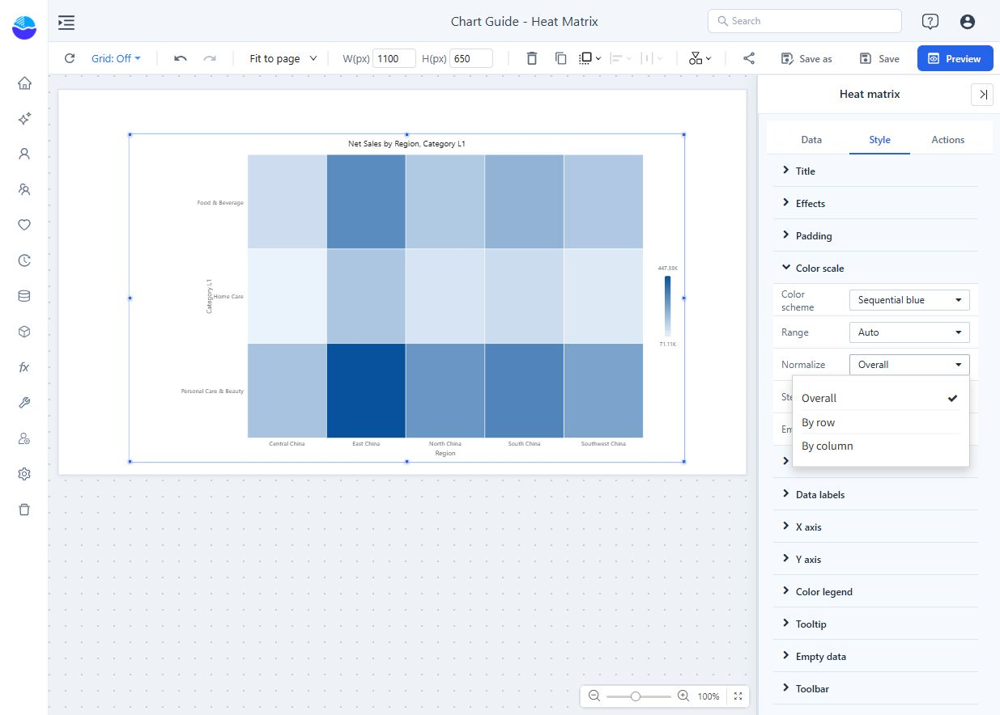

# Heat matrix

Cross two dimensions and use cell colour to compare a measure. A heat matrix helps find patterns across region and product, day and hour, or team and metric category. It is new in 9.04.6.

## Build regional category sales

1. In **Components → Charts → Distribution & correlation**, add **Heat matrix** and select an **Analysis model** in **Data**.
2. Set **X axis** to Region, **Y axis** to Category L1 and **Measure** to Net Sales. Use equivalent fields in your model.
3. Set **Filters** to Year = 2025. Each cell now holds sales for one region and category.
4. Add optional fields to **Tooltips**. Check the values before choosing the colour scale.

Each slot takes one field. There is no **Color** slot: colour always comes from the measure and the colour scale. The X axis supports [drill down](/documentation/Analysis/Drill-down/); the Y axis does not. Prefer a row limit on X: a row limit on Y keeps the top items within each X member and leaves the matrix ragged.

A new heat matrix is placed at 400 × 300 px, shows the X-axis name, and has data-label **Display units** set to **Auto**.

## Choose what colours compare

Open **Style → Color scale → Normalize**.

| Mode | Meaning of the darkest cell |
| --- | --- |
| **Overall** (default) | High relative to all cells. Use for absolute comparisons. |
| **By row** | High within its own row. In this example, the strongest region for each category. |
| **By column** | High within its own column. In this example, the strongest category within each region. |

Normalisation changes colours only: with **By row** or **By column**, two equally dark cells need not have equal values, the colour legend reads **Low**–**High**, and the tooltip still shows the raw value.

## Color scale settings

| Setting | Effect | Default |
| --- | --- | --- |
| **Color scheme** | **Sequential blue**, **Sequential green**, **Sequential orange**, **Sequential purple**, **Diverging (blue–white–red)**, **Diverging (red–yellow–green)** or **Custom**. | Sequential blue |
| **Minimum color**, **Middle color**, **Maximum color** | Shown for **Custom**. A transparent middle colour gives a two-colour gradient. | Light blue, transparent, dark blue |
| **Range** | **Auto**: data minimum to maximum. **Fixed**: the **Minimum** and **Maximum** you enter (swapped if reversed). Shown only with **Normalize → Overall**. | Auto |
| **Midpoint** | Value that gets the middle colour. Shown for diverging schemes (or Custom with a middle colour) with **Normalize → Overall**; also used with a fixed range. Empty = halfway between the data minimum and maximum. | Empty |
| **Steps** | **Continuous**, or 3–9 colour steps. Automatic step boundaries are rounded to readable numbers (1, 1.5, 2, 2.5, 3, 4, 5, 6 or 8 times a power of ten). | Continuous |
| **Empty cell color** | Background of cells without a value, drawn with light diagonal stripes. | White |

Use **Fixed** to keep colours comparable across charts or filter states. Use a diverging scheme only when values spread around a meaningful midpoint, such as zero variance. Do not rely on red and green alone to communicate status.

## Make cells readable

| Setting | Effect | Default |
| --- | --- | --- |
| **Cells → Gap** | Space between cells, 0–8 px. | 1 px |
| **Cells → Corner radius** | 0–8 px. | 0 px |
| **Data labels → Show** | Values in the cells. Labels that do not fit their cell are not drawn. | Off |
| **Data labels → Font size** | 8–20 px. | 11 px |
| **Data labels → Display units**, **Decimal places** | See [Display Units and Decimal Places](/documentation/Visualization/Display-Units/). | Auto for new charts |
| **Data labels → Auto contrast** | White text on dark cells, dark text on light cells, following the step colours. | On |
| **X axis order**, **Y axis order** | **Query order**, **Name ascending**, **Name descending**, **Total ascending**, **Total descending**. The total is the row or column sum and is used only for sorting. | Query order |
| **Color legend → Show color legend** | Shows how colours map to values. | On |
| **Color legend → Position** | **Right** or **Bottom**. | Right |
| **Tooltip → Show Tooltip** | Turns the hover tooltip on or off. | On |

The Y axis runs from top to bottom. Overlapping X labels are hidden; for long names use **X axis → Rotate labels**.

## How it behaves

- The tooltip lists the X member, the Y member, the measure value and any **Tooltips** fields.
- Cells without a value show *(Blank)* in the tooltip and cannot be clicked. They differ from a measured zero.
- The axes never scroll: with many members the cells get smaller. The data point limit counts cells.
- There is no **Analytics** tab, so no reference lines.

## Verify the comparison

Save and open **Preview**. Hover a cell and check its row, column and value. Change normalisation only when you mean to change the comparison question. If a dark cell seems unexpectedly small, check the normalisation mode before assuming a calculation error.

Related: [Calendar chart](/documentation/Visualization/Calendar-Chart/) · [Top/Bottom N](/documentation/Analysis/Top-Bottom-N/) · [Tooltips](/documentation/Visualization/Tooltips-for-Chart-Components/) · [Empty Data and Error Messages](/documentation/Visualization/Empty-Data-and-Errors/)
