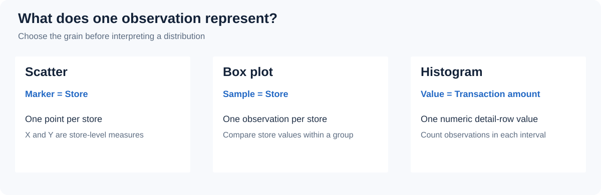
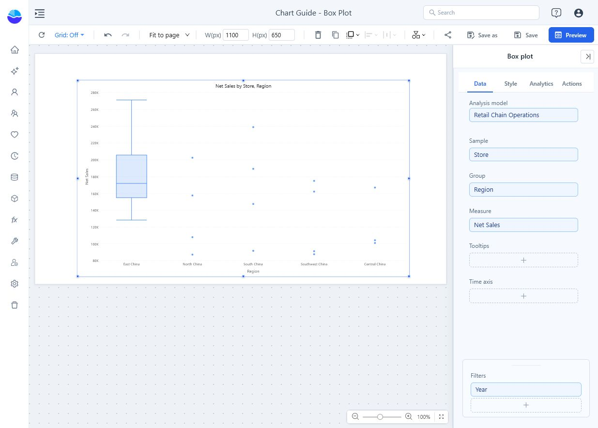
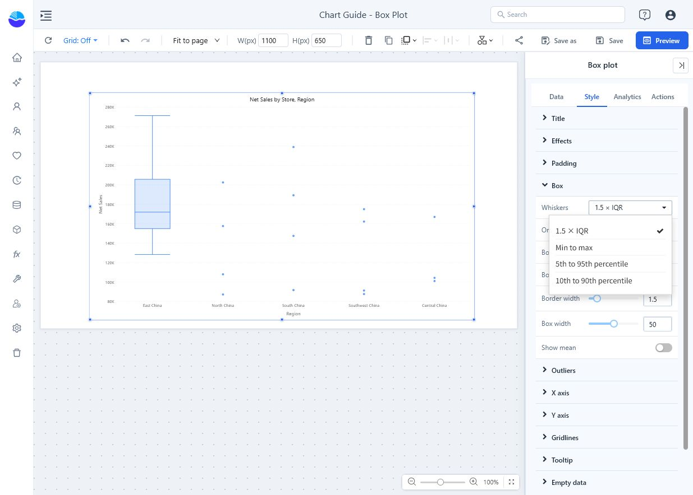
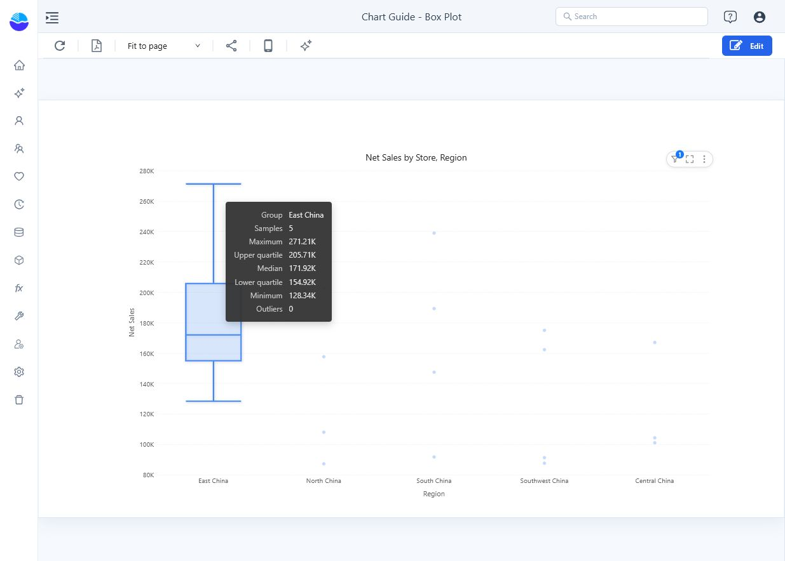

# Box plot

Compare the spread of a measure across observations, optionally separated into groups. For example, compare the distribution of store sales in each region rather than only each region's total. Box plot is new in 10.00.

## Choose the observation first

1. In **Components → Charts → Distribution & correlation**, add **Box plot** and select an **Analysis model** in **Data**.
2. Bind **Sample** to Store, **Group** to Region and **Measure** to Net Sales.
3. Set **Filters**, such as Year = 2025. Each store contributes its sales for that period as one observation.
4. Add supporting fields to **Tooltips** if needed. Omit **Group** for a single box.

| Slot | Takes | Notes |
| --- | --- | --- |
| **Sample** | Dimension, required | Each member is one observation. Until it is filled the chart stays unconfigured and runs no query. |
| **Group** | Dimension, optional | One box per member. Not drillable. |
| **Measure** | One measure | The value of each sample. |
| **Tooltips** | Optional fields | Shown on outlier and point tooltips only, not on the box tooltip. |

There is no **Color** slot. **Sample** defines the observation grain: Store gives a distribution of store-level values, an order identifier gives a different one. The chart does not use individual source rows unless the Sample field is that fine. Avoid a row limit on Sample: it silently removes observations and changes the distribution.

The example below uses **Retail Chain Operations**, **Store** as Sample, **Region** as Group, **Net Sales** as Measure and **Year = 2025**. Each point is one store's total for the year. East China has enough observations for a box; the smaller regions appear as individual points, which are not outliers.

A new box plot is placed at 400 × 300 px, with **Display units** set to **Auto**.

## Read the box

The box spans the lower to the upper quartile, covering the middle half of the observations; the line inside marks the median. Quartiles use linear interpolation (the method of Excel's QUARTILE.INC). Empty samples are ignored. A group with fewer than **5** samples is drawn as points only, and its tooltip says *Fewer than 5 samples; shown as points only*.

Open **Style → Box → Whiskers**:

| Rule | Whiskers end at | Outliers |
| --- | --- | --- |
| **1.5 × IQR** (default) | The most extreme samples within 1.5 × the interquartile range beyond the quartiles. | Samples beyond that. |
| **Min to max** | The smallest and largest samples. | None. |
| **5th to 95th percentile** | The 5th and 95th percentiles: a central 90% range. | The samples beyond, so there are almost always some. |
| **10th to 90th percentile** | The 10th and 90th percentiles: a central 80% range. | As above. |

Keep the same rule across the groups you compare. A point marked as an outlier is not automatically a data error.

## Settings that matter

All in the **Style** tab.

| Setting | Effect | Default |
| --- | --- | --- |
| **Box → Orientation** | **Vertical** or **Horizontal** boxes. In horizontal mode **Y-axis min value** and **Y-axis max value** set the horizontal value axis. | Vertical |
| **Box → Box color**, **Border color** | Fill, and the colour of the box outline, median line and whiskers. Fixed colours, not the page palette. | Light blue, blue |
| **Box → Border width** | 1–4 px. | 1.5 px |
| **Box → Box width** | Share of each group's slot, 10–90%. | 50% |
| **Box → Show mean** | Marks the mean with a diamond. | Off |
| **Outliers → Show outliers** | Draws samples beyond the whiskers as points. Hiding them does not change the statistics. | On |
| **Outliers → Outlier size**, **Outlier color** | 3–14 px; colour of the points. | 6 px, red |
| **Outliers → Display units**, **Decimal places** | Format of every number in the tooltips: box statistics, outliers and points of small groups. See [Display Units and Decimal Places](/documentation/Visualization/Display-Units/). | Auto for new charts |

In the **Analytics** tab you can add fixed lines and bands; statistic lines are not available. See [Reference lines](/documentation/Analysis/Chart-Reference-Lines/).

## Tooltips

| Hovered | Shows |
| --- | --- |
| A box | Group, **Samples**, **Maximum**, **Upper quartile**, **Median**, **Lower quartile**, **Minimum**, **Mean** (when shown) and **Outliers** (count). |
| An outlier or a point | Group, Sample, **Value** and the **Tooltips** fields. |

**Maximum** and **Minimum** are the largest and smallest samples, not the whisker ends; the whisker ends are not listed. Clicking a box keeps that group's outliers and mean highlighted.

## Example result

In the saved example, the box tooltip of East China shows **5 samples**, a median of **171.92K**, lower and upper quartiles of **154.92K / 205.71K** and **0 outliers**. These are the chart's rounded display values.

- Small groups appear as points instead of a box; check the sample count before comparing their spread.
- Every box collapses to a line: check whether the observations really are identical, or whether the Sample field is too coarse.
- Many groups crowd the axis: there is no scrollbar, and the data point limit counts boxes plus points. Filter to fewer groups.

Related: [Histogram](/documentation/Visualization/Histogram-Chart/) for the shape of one distribution · [Scatter](/documentation/Visualization/Scatter-Plot/) to compare two measures observation by observation · [Tooltips](/documentation/Visualization/Tooltips-for-Chart-Components/)
