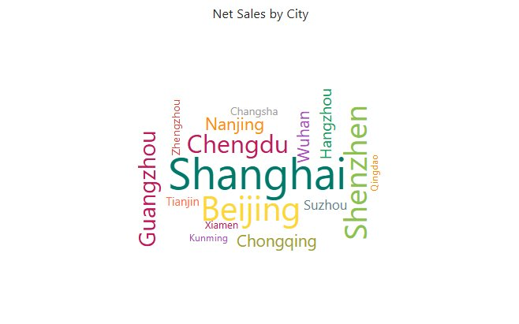

# Word cloud

Use word size to give a quick impression of category weight, such as frequently mentioned topics or high-volume product names. Use a bar chart when readers need an exact ranking. Earlier versions called this component *WordArt*.

## Map words and weights

1. In **Components → Charts → Other**, add **Word cloud** and select an **Analysis model** in **Data**.
2. Put a short text category in **Word** and a non-negative weight in **Measure**, for example Topic and Mention Count.
3. Apply **Filters** to the relevant period or population.
4. Hover a few words, or check a companion table, to confirm their values before styling.

The Word field must already contain the categories you want to show. Binding a paragraph does not extract topics or count individual words; prepare that grouping in your source or model. To show only the top words, set a [row limit](/documentation/Analysis/Top-Bottom-N/) on **Word**; a grouped "Others" word is drawn in neutral grey.

## Fit the cloud

All in **Style → Words**.

| Setting | Effect | Default |
| --- | --- | --- |
| **Shape** | Outline of the cloud: **Circle**, **Cardioid**, **Diamond**, **Triangle**, **Star** or **Pentagon**. Shapes keep their proportions and are centred; words are placed only inside the shape, so a star or diamond holds fewer words than a circle. | Circle |
| **Text orientation** | **Horizontal and vertical**: words are horizontal or vertical (0° or 90°), about a third vertical. **Horizontal**: easier to read. | Horizontal and vertical |
| **Min font** | Font size of the word with the smallest value: 6, 8, 10, 12, 14 or 16 px. Words that do not fit shrink down to this size. | 10 px |
| **Max font** | Font size of the word with the largest value: 18 to 106 px. | 24 px |

Word size scales between **Min font** and **Max font** over the positive values. Long names take more space than short ones; keep labels concise and give the component room. Visual area is not a precise numeric scale.

## How the layout works

- The highest-ranked words are placed first. A word that fits nowhere is retried at three quarters of its size, down to **Min font**. If it still does not fit, it is left out; only lower-ranked words are dropped, and there is no notice of how many.
- The same data always gives the same layout, and each word keeps its direction when the chart redraws or filters change.
- Clicking a word to cross-filter only dims the other words; the cloud is not laid out again.
- Resizing the component lays the words out again, centred in the new size.
- Colours are per member. With **Consistent member colors** on, a word has the same colour as that member in other charts; otherwise each member still keeps a stable colour. See [Colors](/documentation/Visualization/Colors/).
- The hover tooltip has no **Show Tooltip** switch and no **Tooltips** fields, and values use the measure's format (no display units).

## Missing or unreadable words

Words with no value, zero or a negative value are not shown. If an expected word is absent, check its weight and the component filters first, then the available space and the font range.

If important words cannot be read at the report's intended size, give the cloud more space or reduce the number of words. Raising **Min font** makes small words larger, but fewer words fit. Keep a table or ranked bar chart available when users need exact values.

::: details Opening reports made before 10.00
- Words are no longer rotated at random angles: **Horizontal and vertical** uses only 0° and 90°, so existing clouds look different.
:::

Related: [Cross-filtering](/documentation/Analysis/Cross-Filtering/) · [Adding Components](/documentation/Visualization/Adding-Charts/)
